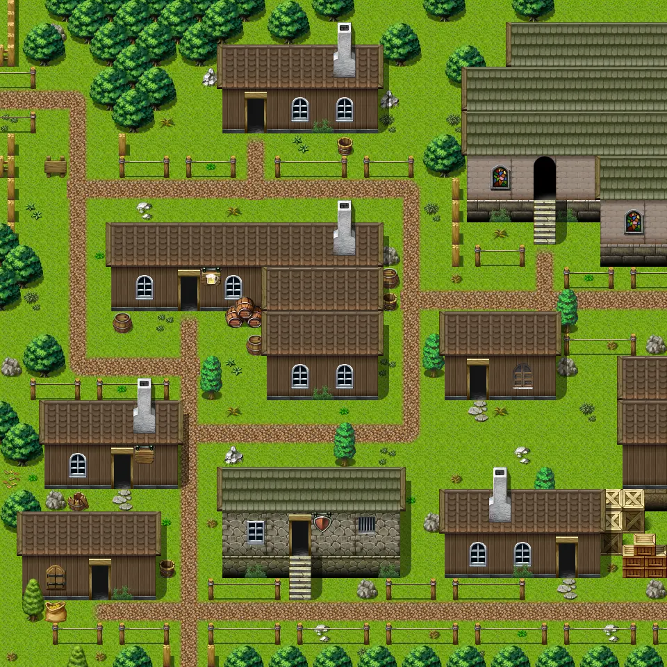

# Fallhaven nw

30×30 tiles · outdoors · part of [World1](index.md)

<label class="lg"><input type="checkbox" data-t="spawn" checked><b>Red</b>&nbsp;Monsters / NPCs</label><label class="lg"><input type="checkbox" data-t="mapchange" checked><b>Blue</b>&nbsp;Exit to another map</label><label class="lg"><input type="checkbox" data-t="container" checked><b>Yellow</b>&nbsp;Container (click to see contents)</label><label class="lg"><input type="checkbox" data-t="sign" checked><b>Purple</b>&nbsp;Sign</label><label class="lg"><input type="checkbox" data-t="rest" checked><b>Green</b>&nbsp;Resting place</label><label class="lg"><input type="checkbox" data-t="key" checked><b>Orange dashed</b>&nbsp;Blocked until a quest step / item</label><label class="lg"><input type="checkbox" data-t="script"><b>Grey dotted</b>&nbsp;Scripted event</label><label class="lg"><input type="checkbox" data-t="replace"><b>White dotted</b>&nbsp;Changes during a quest</label>

## Exits

- [Fallhaven arcir](fallhaven_arcir.md)
- [Fallhaven athamyr](fallhaven_athamyr.md)
- [Fallhaven church](fallhaven_church.md)
- [Fallhaven derelict](fallhaven_derelict.md)
- [Fallhaven ne](fallhaven_ne.md)
- [Fallhaven nocmar](fallhaven_nocmar.md)
- [Fallhaven prison](fallhaven_prison.md)
- [Fallhaven rigmor](fallhaven_rigmor.md)
- [Fallhaven sw](fallhaven_sw.md)
- [Fallhaven tavern](fallhaven_tavern.md)
- [Gapfiller4](gapfiller4.md)

## Monsters & NPCs here

| Name | HP |
|---|---|
| [Drunkard](../monsters/drunkard.md) | 0 |
| [Acolyte](../monsters/acolyte.md) | 0 |
| [Bearded citizen](../monsters/bearded_citizen.md) | 0 |
| [Tired citizen](../monsters/tired_citizen.md) | 0 |
| [Old citizen](../monsters/old_citizen.md) | 0 |
| [Rain](../monsters/rain.md) | 0 |
| [Old man](../monsters/old_man.md) | 0 |
| [Guard](../monsters/guard.md) | 0 |

<small>Map ID: `fallhaven_nw` · Data from v0.8.18</small>
