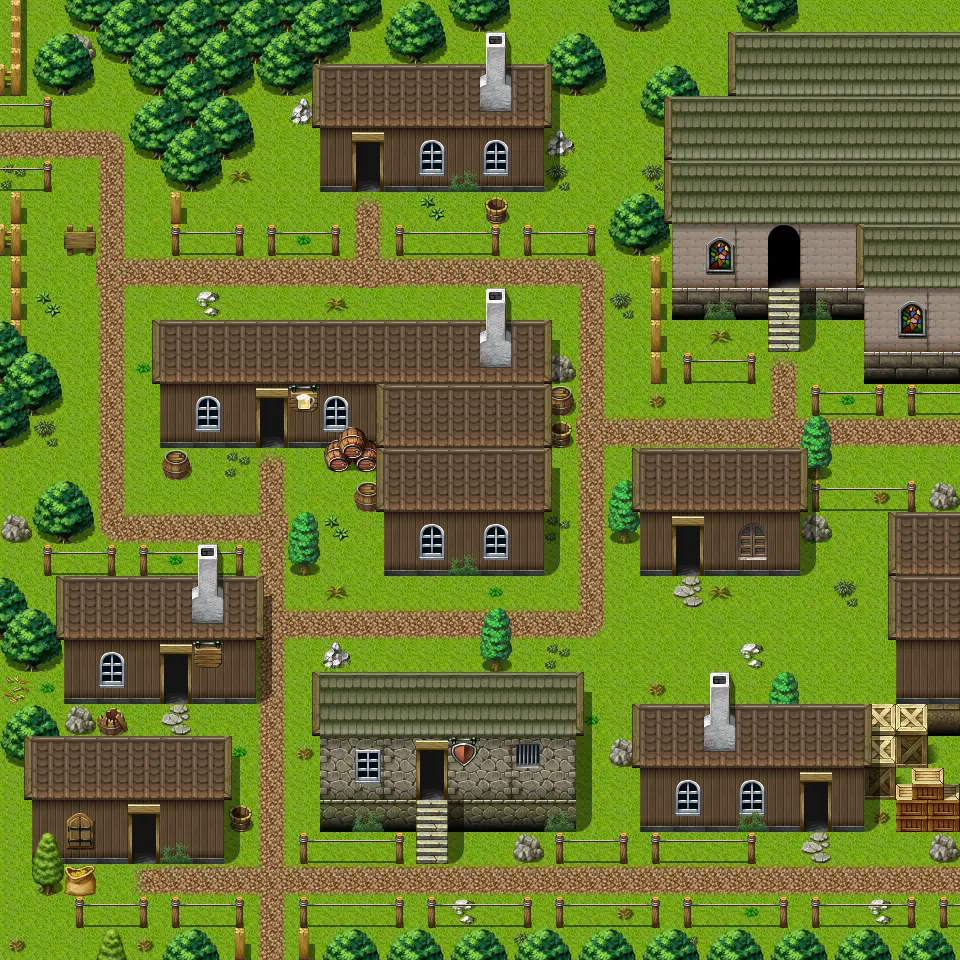

# Fallhaven north-west

| | |
|---|---|
| **Map ID** | `fallhaven_nw` |
| **Region** | In Fallhaven (settlement) |
| **Type** | Outdoors |
| **Size** | 30×30 tiles |
| **World map** | [World1](index.md) |
| **Introduced** | v0.7.0 or earlier |
| **NPCs** | 8 |
| **Quests** | 5 |

**Fallhaven north-west** is an outdoor map, in Fallhaven (settlement). It has 8 NPCs, and no enemies. Exits lead to Fallhaven north-east, Fallhaven south-west, Gapfiller4, Fallhaven arcir and 7 more.

## Map

<label class="lg"><input type="checkbox" data-t="spawn" checked><b>Red</b>&nbsp;Monsters / NPCs</label><label class="lg"><input type="checkbox" data-t="mapchange" checked><b>Blue</b>&nbsp;Exit to another map</label><label class="lg"><input type="checkbox" data-t="container" checked><b>Yellow</b>&nbsp;Container (click to see contents)</label><label class="lg"><input type="checkbox" data-t="sign" checked><b>Purple</b>&nbsp;Sign</label><label class="lg"><input type="checkbox" data-t="rest" checked><b>Green</b>&nbsp;Resting place</label><label class="lg"><input type="checkbox" data-t="key" checked><b>Orange dashed</b>&nbsp;Blocked until a quest step / item</label><label class="lg"><input type="checkbox" data-t="script"><b>Grey dotted</b>&nbsp;Scripted event</label><label class="lg"><input type="checkbox" data-t="replace"><b>White dotted</b>&nbsp;Changes during a quest</label><label class="lg"><input type="checkbox" data-t="pin" checked><b>Numbers</b>&nbsp;Numbered key points (see the key below the map)</label>

<a class="pin pin-exit" href="#key-1" style="left:98.333%;top:91.667%" title="Exit (east): to [Fallhaven north-east](../fallhaven_ne.md)">1</a><a class="pin pin-exit" href="#key-1" style="left:98.333%;top:46.667%" title="Exit (east): to [Fallhaven north-east](../fallhaven_ne.md)">1</a><a class="pin pin-exit" href="#key-2" style="left:28.333%;top:98.333%" title="Exit (south): to [Fallhaven south-west](../fallhaven_sw.md)">2</a><a class="pin pin-exit" href="#key-3" style="left:1.667%;top:15.000%" title="Exit (west): to [Gapfiller4](../gapfiller4.md)">3</a><a class="pin pin-exit" href="#key-3" style="left:1.667%;top:50.000%" title="Exit (west): to [Gapfiller4](../gapfiller4.md)">3</a><a class="pin pin-exit" href="#key-4" style="left:85.000%;top:85.000%" title="Exit (door): to [Fallhaven arcir](../fallhaven_arcir.md)">4</a><a class="pin pin-exit" href="#key-5" style="left:71.667%;top:58.333%" title="Exit (door): to [Fallhaven athamyr](../fallhaven_athamyr.md)">5</a><a class="pin pin-exit" href="#key-6" style="left:81.667%;top:28.333%" title="Exit (door): to [Fallhaven church](../fallhaven_church.md)">6</a><a class="pin pin-exit" href="#key-7" style="left:15.000%;top:88.333%" title="Exit (door): to [Fallhaven derelict](../fallhaven_derelict.md)">7</a><a class="pin pin-exit" href="#key-8" style="left:18.333%;top:71.667%" title="Exit (door): to [Fallhaven nocmar](../fallhaven_nocmar.md)">8</a><a class="pin pin-exit" href="#key-9" style="left:45.000%;top:81.667%" title="Exit (door): to [Fallhaven prison](../fallhaven_prison.md)">9</a><a class="pin pin-exit" href="#key-10" style="left:38.333%;top:18.333%" title="Exit (door): to [Fallhaven rigmor](../fallhaven_rigmor.md)">10</a><a class="pin pin-exit" href="#key-11" style="left:28.333%;top:45.000%" title="Exit (door): to [Fallhaven tavern](../fallhaven_tavern.md)">11</a><a class="pin pin-npc" href="#key-12" style="left:75.000%;top:35.000%" title="[Acolyte](../../monsters/acolyte.md): NPC">12</a><a class="pin pin-npc" href="#key-13" style="left:61.667%;top:41.667%" title="[Bearded citizen](../../monsters/bearded_citizen.md): NPC">13</a><a class="pin pin-npc" href="#key-14" style="left:35.000%;top:51.667%" title="[Drunkard](../../monsters/drunkard.md): 2 quests">14</a><a class="pin pin-npc" href="#key-15" style="left:48.333%;top:88.333%" title="[Guard](../../monsters/guard.md): NPC">15</a><a class="pin pin-npc" href="#key-16" style="left:28.333%;top:51.667%" title="[Old citizen](../../monsters/old_citizen.md): NPC">16</a><a class="pin pin-npc" href="#key-17" style="left:91.667%;top:65.000%" title="[Old man](../../monsters/old_man.md): 2 quests">17</a><a class="pin pin-npc" href="#key-18" style="left:38.333%;top:61.667%" title="[Rain](../../monsters/rain.md): NPC">18</a><a class="pin pin-npc" href="#key-19" style="left:65.000%;top:45.000%" title="[Tired citizen](../../monsters/tired_citizen.md): NPC">19</a><a class="pin pin-sign" href="#key-20" style="left:8.333%;top:25.000%" title="Sign: “Welcome to Fallhaven. Watch out for pickpockets!”">20</a><a class="pin pin-script" href="#key-21" style="left:28.333%;top:48.333%" title="Quest trigger: Scripted event: advances the quest: hidden story flag “quest_burhczyd_nd” to stage 52 (“52=show oven in Fallhaven”)">21</a><a class="pin pin-script" href="#key-22" style="left:81.667%;top:41.667%" title="Quest trigger: Scripted event: advances the quest: hidden story flag “feygard_nondisplayed” to stage 69 (“69=closed”)">22</a><a class="pin pin-key" href="#key-23" style="left:1.886%;top:12.500%" title="Blocked passage: Unlocked during the quest: The ruthless Crackshot (stage 3: “I am now fully rested, so I should go back to Umar.”)">23</a><a class="pin pin-key" href="#key-23" style="left:1.886%;top:47.500%" title="Blocked passage: Unlocked during the quest: The ruthless Crackshot (stage 3: “I am now fully rested, so I should go back to Umar.”)">23</a><a class="pin pin-key" href="#key-23" style="left:28.553%;top:95.834%" title="Blocked passage: Unlocked during the quest: The ruthless Crackshot (stage 3: “I am now fully rested, so I should go back to Umar.”)">23</a><a class="pin pin-key" href="#key-23" style="left:38.333%;top:21.667%" title="Blocked passage: Unlocked during the quest: The ruthless Crackshot (stage 3: “I am now fully rested, so I should go back to Umar.”)">23</a><a class="pin pin-key" href="#key-23" style="left:81.667%;top:31.667%" title="Blocked passage: Unlocked during the quest: The ruthless Crackshot (stage 3: “I am now fully rested, so I should go back to Umar.”)">23</a><a class="pin pin-key" href="#key-23" style="left:18.333%;top:75.000%" title="Blocked passage: Unlocked during the quest: The ruthless Crackshot (stage 3: “I am now fully rested, so I should go back to Umar.”)">23</a><a class="pin pin-key" href="#key-23" style="left:85.000%;top:88.333%" title="Blocked passage: Unlocked during the quest: The ruthless Crackshot (stage 3: “I am now fully rested, so I should go back to Umar.”)">23</a><a class="pin pin-key" href="#key-23" style="left:71.667%;top:61.667%" title="Blocked passage: Unlocked during the quest: The ruthless Crackshot (stage 3: “I am now fully rested, so I should go back to Umar.”)">23</a><a class="pin pin-key" href="#key-23" style="left:98.553%;top:89.167%" title="Blocked passage: Unlocked during the quest: The ruthless Crackshot (stage 3: “I am now fully rested, so I should go back to Umar.”)">23</a><a class="pin pin-key" href="#key-23" style="left:45.000%;top:86.667%" title="Blocked passage: Unlocked during the quest: The ruthless Crackshot (stage 3: “I am now fully rested, so I should go back to Umar.”)">23</a><a class="pin pin-key" href="#key-23" style="left:98.553%;top:44.167%" title="Blocked passage: Unlocked during the quest: The ruthless Crackshot (stage 3: “I am now fully rested, so I should go back to Umar.”)">23</a>

??? abstract "Key to the numbers on the map"

    | # | What | Details |
    |---|---|---|
    | 1 | Exit (east) | to [Fallhaven north-east](../fallhaven_ne.md) |
    | 2 | Exit (south) | to [Fallhaven south-west](../fallhaven_sw.md) |
    | 3 | Exit (west) | to [Gapfiller4](../gapfiller4.md) |
    | 4 | Exit (door) | to [Fallhaven arcir](../fallhaven_arcir.md) |
    | 5 | Exit (door) | to [Fallhaven athamyr](../fallhaven_athamyr.md) |
    | 6 | Exit (door) | to [Fallhaven church](../fallhaven_church.md) |
    | 7 | Exit (door) | to [Fallhaven derelict](../fallhaven_derelict.md) |
    | 8 | Exit (door) | to [Fallhaven nocmar](../fallhaven_nocmar.md) |
    | 9 | Exit (door) | to [Fallhaven prison](../fallhaven_prison.md) |
    | 10 | Exit (door) | to [Fallhaven rigmor](../fallhaven_rigmor.md) |
    | 11 | Exit (door) | to [Fallhaven tavern](../fallhaven_tavern.md) |
    | 12 | [Acolyte](../monsters/acolyte.md) | NPC |
    | 13 | [Bearded citizen](../monsters/bearded_citizen.md) | NPC |
    | 14 | [Drunkard](../monsters/drunkard.md) | 2 quests |
    | 15 | [Guard](../monsters/guard.md) | NPC |
    | 16 | [Old citizen](../monsters/old_citizen.md) | NPC |
    | 17 | [Old man](../monsters/old_man.md) | 2 quests |
    | 18 | [Rain](../monsters/rain.md) | NPC |
    | 19 | [Tired citizen](../monsters/tired_citizen.md) | NPC |
    | 20 | Sign | “Welcome to Fallhaven. Watch out for pickpockets!” |
    | 21 | Quest trigger | Scripted event: advances the quest: hidden story flag “quest_burhczyd_nd” to stage 52 (“52=show oven in Fallhaven”) |
    | 22 | Quest trigger | Scripted event: advances the quest: hidden story flag “feygard_nondisplayed” to stage 69 (“69=closed”) |
    | 23 | Blocked passage | Unlocked during the quest: The ruthless Crackshot (stage 3: “I am now fully rested, so I should go back to Umar.”) |

Verified against v0.8.18 map data.

## Connections

| Direction | Leads to | Region there | Map # |
|---|---|---|---|
| East | [Fallhaven north-east](fallhaven_ne.md) | Fallhaven | 1 |
| South | [Fallhaven south-west](fallhaven_sw.md) | Fallhaven | 2 |
| West | [Gapfiller4](gapfiller4.md) | Fallhaven | 3 |
| Door | [Fallhaven arcir](fallhaven_arcir.md) | Fallhaven | 4 |
| Door | [Fallhaven athamyr](fallhaven_athamyr.md) | Fallhaven | 5 |
| Door | [Fallhaven church](fallhaven_church.md) | Fallhaven | 6 |
| Door | [Fallhaven derelict](fallhaven_derelict.md) | Fallhaven | 7 |
| Door | [Fallhaven nocmar](fallhaven_nocmar.md) | Fallhaven | 8 |
| Door | [Fallhaven prison](fallhaven_prison.md) | Fallhaven | 9 |
| Door | [Fallhaven rigmor](fallhaven_rigmor.md) | Fallhaven | 10 |
| Door | [Fallhaven tavern](fallhaven_tavern.md) | Fallhaven | 11 |

## NPCs

- [Acolyte](../monsters/acolyte.md) (#12)
- [Bearded citizen](../monsters/bearded_citizen.md) (#13)
- [Drunkard](../monsters/drunkard.md) — quests: [Drunken tale](../quests/fallhavendrunk.md), [You shall pass](../quests/undertell_barricades.md) (#14)
- [Guard](../monsters/guard.md) (#15)
- [Old citizen](../monsters/old_citizen.md) (#16)
- [Old man](../monsters/old_man.md) — quests: [Calomyran secrets](../quests/calomyran.md), [Darkness in the Daylight](../quests/darkness_in_daylight.md) (#17)
- [Rain](../monsters/rain.md) (#18)
- [Tired citizen](../monsters/tired_citizen.md) (#19)

## Quests

- [Calomyran secrets](../quests/calomyran.md): [Old man](../monsters/old_man.md) is involved
- [Darkness in the Daylight](../quests/darkness_in_daylight.md): [Old man](../monsters/old_man.md) is involved
- [Drunken tale](../quests/fallhavendrunk.md): [Drunkard](../monsters/drunkard.md) is involved
- [The ruthless Crackshot](../quests/Thieves03.md): blocked passage opens at stage 3
- [You shall pass](../quests/undertell_barricades.md): [Drunkard](../monsters/drunkard.md) is involved
- [feygard_nondisplayed (hidden flag)](../quests/feygard_nondisplayed.md): something on this map advances it; stepping on a trigger here sets stage 69
- [hidden_undertell (hidden flag)](../quests/undertell_hidden.md): [Drunkard](../monsters/drunkard.md) is involved
- [Young merchant Non-displayed (hidden flag)](../quests/quest_burhczyd_nd.md): something on this map advances it; stepping on a trigger here sets stage 52

## Points of interest

- **Sign** (#20): “Welcome to Fallhaven. Watch out for pickpockets!”
- **Quest trigger** (#21): Scripted event: advances the quest: hidden story flag “quest_burhczyd_nd” to stage 52 (“52=show oven in Fallhaven”)
- **Quest trigger** (#22): Scripted event: advances the quest: hidden story flag “feygard_nondisplayed” to stage 69 (“69=closed”)
- **Blocked passage** (#23): Unlocked during the quest: The ruthless Crackshot (stage 3: “I am now fully rested, so I should go back to Umar.”)

## Version history

| Version | Change |
|---|---|
| [v0.7.0](../versions/0.7.0.md) | Present in v0.7.0 (earliest release tracked) |
| [v0.7.1](../versions/0.7.1.md) | map layout or objects changed |
| [v0.7.2](../versions/0.7.2.md) | map layout or objects changed |
| [v0.7.8](../versions/0.7.8.md) | map layout or objects changed |
| [v0.7.11](../versions/0.7.11.md) | map layout or objects changed |
| [v0.8.2](../versions/0.8.2.md) | map layout or objects changed |
| [v0.8.12.1](../versions/0.8.12.1.md) | map layout or objects changed |
| [v0.8.18](../versions/0.8.18.md) | map layout or objects changed |

Verified against v0.8.18 and every earlier release back to v0.7.0 (game data compared release by release).

## Community notes

<small>Written by players, not generated from game data. **Observations**: what players notice in-game · **Lore**: the in-world story · **Trivia**: real-world facts, references, development history · **Theory / speculation**: unconfirmed ideas; may just be unfinished content</small>

### Observations

*Nothing here yet. Know something? [Add it](https://github.com/asdfghjkl628/Andor-s-Trail-Wikiiii/new/main/notes/maps?filename=fallhaven_nw.md&value=%23%23%20Observations%0A%0A%3C%21--%20what%20players%20notice%20in-game%20--%3E%0A%0A%23%23%20Lore%0A%0A%3C%21--%20the%20in-world%20story%20--%3E%0A%0A%23%23%20Trivia%0A%0A%3C%21--%20real-world%20facts%2C%20references%2C%20development%20history%20--%3E%0A%0A%23%23%20Theory%20/%20speculation%0A%0A%3C%21--%20unconfirmed%20ideas%3B%20may%20just%20be%20unfinished%20content%20--%3E%0A).*

### Lore

*Nothing here yet. Know something? [Add it](https://github.com/asdfghjkl628/Andor-s-Trail-Wikiiii/new/main/notes/maps?filename=fallhaven_nw.md&value=%23%23%20Observations%0A%0A%3C%21--%20what%20players%20notice%20in-game%20--%3E%0A%0A%23%23%20Lore%0A%0A%3C%21--%20the%20in-world%20story%20--%3E%0A%0A%23%23%20Trivia%0A%0A%3C%21--%20real-world%20facts%2C%20references%2C%20development%20history%20--%3E%0A%0A%23%23%20Theory%20/%20speculation%0A%0A%3C%21--%20unconfirmed%20ideas%3B%20may%20just%20be%20unfinished%20content%20--%3E%0A).*

### Trivia

*Nothing here yet. Know something? [Add it](https://github.com/asdfghjkl628/Andor-s-Trail-Wikiiii/new/main/notes/maps?filename=fallhaven_nw.md&value=%23%23%20Observations%0A%0A%3C%21--%20what%20players%20notice%20in-game%20--%3E%0A%0A%23%23%20Lore%0A%0A%3C%21--%20the%20in-world%20story%20--%3E%0A%0A%23%23%20Trivia%0A%0A%3C%21--%20real-world%20facts%2C%20references%2C%20development%20history%20--%3E%0A%0A%23%23%20Theory%20/%20speculation%0A%0A%3C%21--%20unconfirmed%20ideas%3B%20may%20just%20be%20unfinished%20content%20--%3E%0A).*

### Theory / speculation

*Nothing here yet. Know something? [Add it](https://github.com/asdfghjkl628/Andor-s-Trail-Wikiiii/new/main/notes/maps?filename=fallhaven_nw.md&value=%23%23%20Observations%0A%0A%3C%21--%20what%20players%20notice%20in-game%20--%3E%0A%0A%23%23%20Lore%0A%0A%3C%21--%20the%20in-world%20story%20--%3E%0A%0A%23%23%20Trivia%0A%0A%3C%21--%20real-world%20facts%2C%20references%2C%20development%20history%20--%3E%0A%0A%23%23%20Theory%20/%20speculation%0A%0A%3C%21--%20unconfirmed%20ideas%3B%20may%20just%20be%20unfinished%20content%20--%3E%0A).*

??? info "Technical information"

    | | |
    |---|---|
    | Map ID | `fallhaven_nw` |
    | File | `res/xml/fallhaven_nw.tmx` |
    | Size | 30×30 tiles (960×960 px) |
    | outdoors property | 1 |
    | Layers drawn | ground, objects, above |
    | Tilesets | map_bed_1, map_border_1, map_bridge_1, map_bridge_2, map_broken_1, map_cavewall_1, map_cavewall_2, map_cavewall_3, map_cavewall_4, map_chair_table_1, map_chair_table_2, map_crate_1, map_cupboard_1, map_curtain_1, map_entrance_1, map_entrance_2, map_fence_1, map_fence_2, map_fence_3, map_fence_4, map_ground_1, map_ground_2, map_ground_3, map_ground_4, map_ground_5, map_ground_6, map_ground_7, map_ground_8, map_house_1, map_house_2, map_indoor_1, map_indoor_2, map_kitchen_1, map_outdoor_1, map_pillar_1, map_pillar_2, map_plant_1, map_plant_2, map_rock_1, map_rock_2, map_roof_1, map_roof_2, map_roof_3, map_shop_1, map_sign_ladder_1, map_table_1, map_trail_1, map_transition_1, map_transition_2, map_transition_3, map_transition_4, map_transition_5, map_tree_1, map_tree_2, map_wall_1, map_wall_2, map_wall_3, map_wall_4, map_window_1, map_window_2 |
    | Map objects | mapchange: 13, key: 11, spawn: 8, script: 2, sign: 1 |
    | World map position | segment `world1`, x 210, y 382 |

<small>Data from v0.8.18</small>
