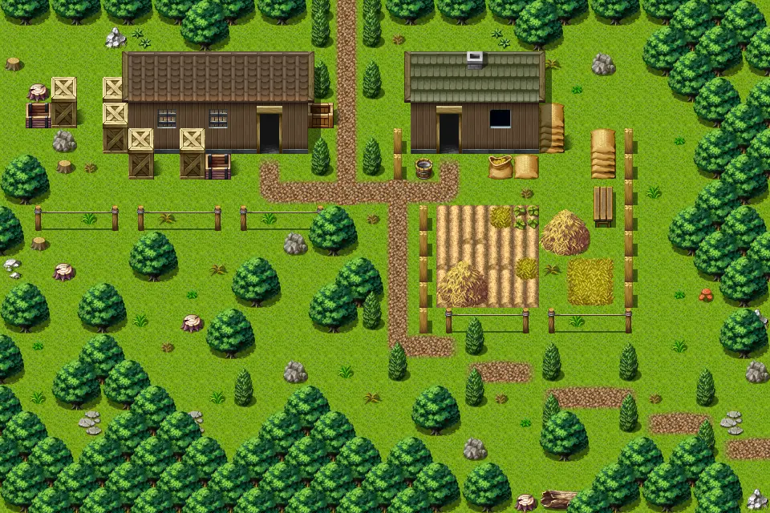

# Fallhaven se

30×20 tiles · outdoors · part of [World1](index.md)

<label class="lg lg-spawn"><input type="checkbox" data-t="spawn" checked> Monsters / NPCs</label><label class="lg lg-mapchange"><input type="checkbox" data-t="mapchange" checked> Exit to another map</label><label class="lg lg-container"><input type="checkbox" data-t="container" checked> Container</label><label class="lg lg-sign"><input type="checkbox" data-t="sign" checked> Sign</label><label class="lg lg-rest"><input type="checkbox" data-t="rest" checked> Resting place</label><label class="lg lg-key"><input type="checkbox" data-t="key" checked> Blocked / needs key or quest</label><label class="lg lg-script"><input type="checkbox" data-t="script"> Scripted event</label><label class="lg lg-replace"><input type="checkbox" data-t="replace"> Changes after a quest</label>

## Exits

- [Fallhaven farmer](fallhaven_farmer.md)
- [Fallhaven ne](fallhaven_ne.md)
- [Fallhaven storage](fallhaven_storage.md)
- [Fallhaven sw](fallhaven_sw.md)
- [Wild12](wild12.md)

## Monsters & NPCs here

| Name | HP |
|---|---|
| [Tired citizen](../monsters/tired_citizen.md) | 0 |
| [Busy farmer](../monsters/fallhaven_outdoor_farmer.md) | 0 |
| [Busy farmer](../monsters/busy_farmer.md) | 0 |
| [Forest ant](../monsters/forest_ant.md) | 4 |
| [Yellow forest ant](../monsters/yellow_forest_ant.md) | 5 |
| [Shady bandit](../monsters/shady_bandit.md) | 45 |

<small>Map ID: `fallhaven_se` · Data from v0.8.18</small>
