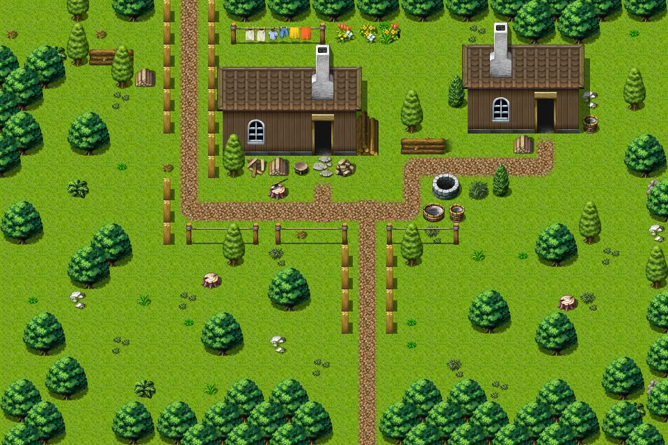

# Fallhaven sw

30×20 tiles · outdoors · part of [World1](index.md)

<label class="lg lg-spawn"><input type="checkbox" data-t="spawn" checked> Monsters / NPCs</label><label class="lg lg-mapchange"><input type="checkbox" data-t="mapchange" checked> Exit to another map</label><label class="lg lg-container"><input type="checkbox" data-t="container" checked> Container</label><label class="lg lg-sign"><input type="checkbox" data-t="sign" checked> Sign</label><label class="lg lg-rest"><input type="checkbox" data-t="rest" checked> Resting place</label><label class="lg lg-key"><input type="checkbox" data-t="key" checked> Blocked / needs key or quest</label><label class="lg lg-script"><input type="checkbox" data-t="script"> Scripted event</label><label class="lg lg-replace"><input type="checkbox" data-t="replace"> Changes after a quest</label>

## Exits

- [Fallhaven alaun](fallhaven_alaun.md)
- [Fallhaven lumberjack](fallhaven_lumberjack.md)
- [Fallhaven nw](fallhaven_nw.md)
- [Fallhaven se](fallhaven_se.md)
- [Gapfiller2](gapfiller2.md)
- [Wild10](wild10.md)
- [Wild9](wild9.md)

## Monsters & NPCs here

| Name | HP |
|---|---|
| [Jakrar](../monsters/jakrar.md) | 0 |
| [Arensia](../monsters/arensia.md) | 0 |
| [Citizen](../monsters/citizen.md) | 0 |
| [Forest ant](../monsters/forest_ant.md) | 4 |
| [Yellow forest ant](../monsters/yellow_forest_ant.md) | 5 |
| [Vacor](../monsters/vacor.md) | 72 |

<small>Map ID: `fallhaven_sw` · Data from v0.8.18</small>
