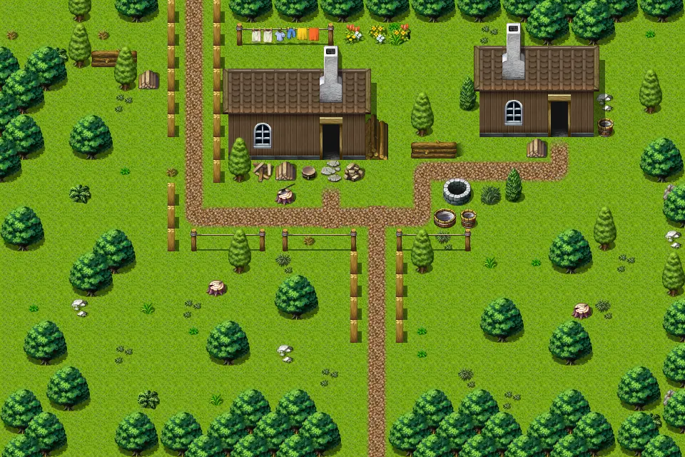

# Fallhaven south-west

| | |
|---|---|
| **Map ID** | `fallhaven_sw` |
| **Region** | In Fallhaven (settlement) |
| **Type** | Outdoors |
| **Size** | 30×20 tiles |
| **World map** | [World1](index.md) |
| **Introduced** | v0.7.0 or earlier |
| **NPCs** | 4 |
| **Enemy types** | 2 |
| **Quests** | 7 |

**Fallhaven south-west** is an outdoor map, in Fallhaven (settlement). It has 4 NPCs and 2 kinds of enemy. Exits lead to Fallhaven north-west, Fallhaven south-east, Wild10, Wild9 and 3 more.

## Map

<label class="lg"><input type="checkbox" data-t="spawn" checked><b>Red</b>&nbsp;Monsters / NPCs</label><label class="lg"><input type="checkbox" data-t="mapchange" checked><b>Blue</b>&nbsp;Exit to another map</label><label class="lg"><input type="checkbox" data-t="container" checked><b>Yellow</b>&nbsp;Container (click to see contents)</label><label class="lg"><input type="checkbox" data-t="sign" checked><b>Purple</b>&nbsp;Sign</label><label class="lg"><input type="checkbox" data-t="rest" checked><b>Green</b>&nbsp;Resting place</label><label class="lg"><input type="checkbox" data-t="key" checked><b>Orange dashed</b>&nbsp;Blocked until a quest step / item</label><label class="lg"><input type="checkbox" data-t="script"><b>Grey dotted</b>&nbsp;Scripted event</label><label class="lg"><input type="checkbox" data-t="replace"><b>White dotted</b>&nbsp;Changes during a quest</label><label class="lg"><input type="checkbox" data-t="pin" checked><b>Numbers</b>&nbsp;Numbered key points (see the key below the map)</label>

<a class="pin pin-exit" href="#key-1" style="left:28.333%;top:2.500%" title="Exit (north): to [Fallhaven north-west](../fallhaven_nw.md)">1</a><a class="pin pin-exit" href="#key-2" style="left:98.333%;top:20.000%" title="Exit (east): to [Fallhaven south-east](../fallhaven_se.md)">2</a><a class="pin pin-exit" href="#key-2" style="left:98.333%;top:55.000%" title="Exit (east): to [Fallhaven south-east](../fallhaven_se.md)">2</a><a class="pin pin-exit" href="#key-2" style="left:98.333%;top:67.500%" title="Exit (east): to [Fallhaven south-east](../fallhaven_se.md)">2</a><a class="pin pin-exit" href="#key-2" style="left:98.333%;top:77.500%" title="Exit (east): to [Fallhaven south-east](../fallhaven_se.md)">2</a><a class="pin pin-exit" href="#key-3" style="left:53.333%;top:97.500%" title="Exit (south): to [Wild10](../wild10.md)">3</a><a class="pin pin-exit" href="#key-4" style="left:13.333%;top:97.500%" title="Exit (south): to [Wild9](../wild9.md)">4</a><a class="pin pin-exit" href="#key-5" style="left:1.667%;top:45.000%" title="Exit (west): to [Gapfiller2](../gapfiller2.md)">5</a><a class="pin pin-exit" href="#key-5" style="left:1.667%;top:72.500%" title="Exit (west): to [Gapfiller2](../gapfiller2.md)">5</a><a class="pin pin-exit" href="#key-6" style="left:81.667%;top:27.500%" title="Exit (door): to [Fallhaven alaun](../fallhaven_alaun.md)">6</a><a class="pin pin-exit" href="#key-7" style="left:48.333%;top:32.500%" title="Exit (door): to [Fallhaven lumberjack](../fallhaven_lumberjack.md)">7</a><a class="pin pin-npc" href="#key-8" style="left:28.333%;top:57.500%" title="[Arensia](../../monsters/arensia.md): 2 quests">8</a><a class="pin pin-npc" href="#key-9" style="left:81.667%;top:37.500%" title="[Citizen](../../monsters/citizen.md): NPC">9</a><a class="pin pin-npc" href="#key-10" style="left:45.000%;top:42.500%" title="[Jakrar](../../monsters/jakrar.md): shopkeeper, 2 quests">10</a><a class="pin pin-npc" href="#key-11" style="left:15.000%;top:22.500%" title="[Vacor](../../monsters/vacor.md): 2 quests">11</a><a class="pin pin-key" href="#key-12" style="left:45.219%;top:38.750%" title="Blocked passage: Unlocked during the quest: Search for Andor (stage 1: “My father Mikhail says that Andor has not been home since yesterday. I should go look for him in the village.”)">12</a>

??? abstract "Key to the numbers on the map"

    | # | What | Details |
    |---|---|---|
    | 1 | Exit (north) | to [Fallhaven north-west](../fallhaven_nw.md) |
    | 2 | Exit (east) | to [Fallhaven south-east](../fallhaven_se.md) |
    | 3 | Exit (south) | to [Wild10](../wild10.md) |
    | 4 | Exit (south) | to [Wild9](../wild9.md) |
    | 5 | Exit (west) | to [Gapfiller2](../gapfiller2.md) |
    | 6 | Exit (door) | to [Fallhaven alaun](../fallhaven_alaun.md) |
    | 7 | Exit (door) | to [Fallhaven lumberjack](../fallhaven_lumberjack.md) |
    | 8 | [Arensia](../monsters/arensia.md) | 2 quests |
    | 9 | [Citizen](../monsters/citizen.md) | NPC |
    | 10 | [Jakrar](../monsters/jakrar.md) | shopkeeper, 2 quests |
    | 11 | [Vacor](../monsters/vacor.md) | 2 quests |
    | 12 | Blocked passage | Unlocked during the quest: Search for Andor (stage 1: “My father Mikhail says that Andor has not been home since yesterday. I should go look for him in the village.”) |

Verified against v0.8.18 map data.

## Connections

| Direction | Leads to | Region there | Map # |
|---|---|---|---|
| North | [Fallhaven north-west](fallhaven_nw.md) | Fallhaven | 1 |
| East | [Fallhaven south-east](fallhaven_se.md) | Fallhaven | 2 |
| South | [Wild10](wild10.md) | Fallhaven | 3 |
| South | [Wild9](wild9.md) | Fallhaven | 4 |
| West | [Gapfiller2](gapfiller2.md) | Fallhaven | 5 |
| Door | [Fallhaven alaun](fallhaven_alaun.md) | Fallhaven | 6 |
| Door | [Fallhaven lumberjack](fallhaven_lumberjack.md) | Fallhaven | 7 |

## NPCs

- [Arensia](../monsters/arensia.md) — quests: [It's knot funny](../quests/fallhaven_lytwings.md), [You're the postman](../quests/postman.md) (#8)
- [Citizen](../monsters/citizen.md) (#9)
- [Jakrar](../monsters/jakrar.md) — shopkeeper — quests: [A path to the Duleian Road](../quests/pathway_fallhaven.md), [It makes no fence](../quests/tunlon_fence.md) (#10)
- [Vacor](../monsters/vacor.md) — quests: [Missing pieces](../quests/vacor.md), [Old friends?](../quests/kaverin.md) (#11)

## Enemies

| Enemy | HP | Damage | Up to | Notes |
|---|---|---|---|---|
| [Forest ant](../monsters/forest_ant.md) | 4 | 1–2 | 4 | shares spawn with Yellow forest ant |
| [Yellow forest ant](../monsters/yellow_forest_ant.md) | 5 | 2–2 | 4 | shares spawn with Forest ant |

<small>“Up to” is the most that can be alive at once from the spawn areas on this map.</small>

## Items & containers

**Shops:** [Jakrar](../monsters/jakrar.md)

## Quests

- [A path to the Duleian Road](../quests/pathway_fallhaven.md): [Jakrar](../monsters/jakrar.md) is involved; something on this map advances it
- [It makes no fence](../quests/tunlon_fence.md): [Jakrar](../monsters/jakrar.md) is involved; something on this map advances it
- [It's knot funny](../quests/fallhaven_lytwings.md): [Arensia](../monsters/arensia.md) is involved
- [Missing pieces](../quests/vacor.md): [Vacor](../monsters/vacor.md) is involved
- [Old friends?](../quests/kaverin.md): [Vacor](../monsters/vacor.md) is involved
- [Search for Andor](../quests/andor.md): blocked passage opens at stage 1
- [You're the postman](../quests/postman.md): [Arensia](../monsters/arensia.md) is involved

## Points of interest

- **Blocked passage** (#12): Unlocked during the quest: Search for Andor (stage 1: “My father Mikhail says that Andor has not been home since yesterday. I should go look for him in the village.”)

## Version history

| Version | Change |
|---|---|
| [v0.7.0](../versions/0.7.0.md) | Present in v0.7.0 (earliest release tracked) |
| [v0.7.1](../versions/0.7.1.md) | map layout or objects changed |
| [v0.7.2](../versions/0.7.2.md) | map layout or objects changed |
| [v0.7.11](../versions/0.7.11.md) | map layout or objects changed |
| [v0.7.14](../versions/0.7.14.md) | map layout or objects changed |
| [v0.8.2](../versions/0.8.2.md) | map layout or objects changed |
| [v0.8.12.1](../versions/0.8.12.1.md) | map layout or objects changed |
| [v0.8.18](../versions/0.8.18.md) | map layout or objects changed |

Verified against v0.8.18 and every earlier release back to v0.7.0 (game data compared release by release).

## Community notes

<small>Written by players, not generated from game data. **Observations**: what players notice in-game · **Lore**: the in-world story · **Trivia**: real-world facts, references, development history · **Theory / speculation**: unconfirmed ideas; may just be unfinished content</small>

### Observations

*Nothing here yet. Know something? [Add it](https://github.com/asdfghjkl628/Andor-s-Trail-Wikiiii/new/main/notes/maps?filename=fallhaven_sw.md&value=%23%23%20Observations%0A%0A%3C%21--%20what%20players%20notice%20in-game%20--%3E%0A%0A%23%23%20Lore%0A%0A%3C%21--%20the%20in-world%20story%20--%3E%0A%0A%23%23%20Trivia%0A%0A%3C%21--%20real-world%20facts%2C%20references%2C%20development%20history%20--%3E%0A%0A%23%23%20Theory%20/%20speculation%0A%0A%3C%21--%20unconfirmed%20ideas%3B%20may%20just%20be%20unfinished%20content%20--%3E%0A).*

### Lore

*Nothing here yet. Know something? [Add it](https://github.com/asdfghjkl628/Andor-s-Trail-Wikiiii/new/main/notes/maps?filename=fallhaven_sw.md&value=%23%23%20Observations%0A%0A%3C%21--%20what%20players%20notice%20in-game%20--%3E%0A%0A%23%23%20Lore%0A%0A%3C%21--%20the%20in-world%20story%20--%3E%0A%0A%23%23%20Trivia%0A%0A%3C%21--%20real-world%20facts%2C%20references%2C%20development%20history%20--%3E%0A%0A%23%23%20Theory%20/%20speculation%0A%0A%3C%21--%20unconfirmed%20ideas%3B%20may%20just%20be%20unfinished%20content%20--%3E%0A).*

### Trivia

*Nothing here yet. Know something? [Add it](https://github.com/asdfghjkl628/Andor-s-Trail-Wikiiii/new/main/notes/maps?filename=fallhaven_sw.md&value=%23%23%20Observations%0A%0A%3C%21--%20what%20players%20notice%20in-game%20--%3E%0A%0A%23%23%20Lore%0A%0A%3C%21--%20the%20in-world%20story%20--%3E%0A%0A%23%23%20Trivia%0A%0A%3C%21--%20real-world%20facts%2C%20references%2C%20development%20history%20--%3E%0A%0A%23%23%20Theory%20/%20speculation%0A%0A%3C%21--%20unconfirmed%20ideas%3B%20may%20just%20be%20unfinished%20content%20--%3E%0A).*

### Theory / speculation

*Nothing here yet. Know something? [Add it](https://github.com/asdfghjkl628/Andor-s-Trail-Wikiiii/new/main/notes/maps?filename=fallhaven_sw.md&value=%23%23%20Observations%0A%0A%3C%21--%20what%20players%20notice%20in-game%20--%3E%0A%0A%23%23%20Lore%0A%0A%3C%21--%20the%20in-world%20story%20--%3E%0A%0A%23%23%20Trivia%0A%0A%3C%21--%20real-world%20facts%2C%20references%2C%20development%20history%20--%3E%0A%0A%23%23%20Theory%20/%20speculation%0A%0A%3C%21--%20unconfirmed%20ideas%3B%20may%20just%20be%20unfinished%20content%20--%3E%0A).*

??? info "Technical information"

    | | |
    |---|---|
    | Map ID | `fallhaven_sw` |
    | File | `res/xml/fallhaven_sw.tmx` |
    | Size | 30×20 tiles (960×640 px) |
    | outdoors property | 1 |
    | Layers drawn | ground, objects, above |
    | Tilesets | map_bed_1, map_border_1, map_bridge_1, map_bridge_2, map_broken_1, map_cavewall_1, map_cavewall_2, map_cavewall_3, map_cavewall_4, map_chair_table_1, map_chair_table_2, map_crate_1, map_cupboard_1, map_curtain_1, map_entrance_1, map_entrance_2, map_fence_1, map_fence_2, map_fence_3, map_fence_4, map_ground_1, map_ground_2, map_ground_3, map_ground_4, map_ground_5, map_ground_6, map_ground_7, map_ground_8, map_house_1, map_house_2, map_indoor_1, map_indoor_2, map_kitchen_1, map_outdoor_1, map_pillar_1, map_pillar_2, map_plant_1, map_plant_2, map_rock_1, map_rock_2, map_roof_1, map_roof_2, map_roof_3, map_shop_1, map_sign_ladder_1, map_table_1, map_trail_1, map_transition_1, map_transition_2, map_transition_3, map_transition_4, map_transition_5, map_tree_1, map_tree_2, map_wall_1, map_wall_2, map_wall_3, map_wall_4, map_window_1, map_window_2 |
    | Map objects | mapchange: 11, spawn: 6, key: 1 |
    | World map position | segment `world1`, x 210, y 413 |

<small>Data from v0.8.18</small>
