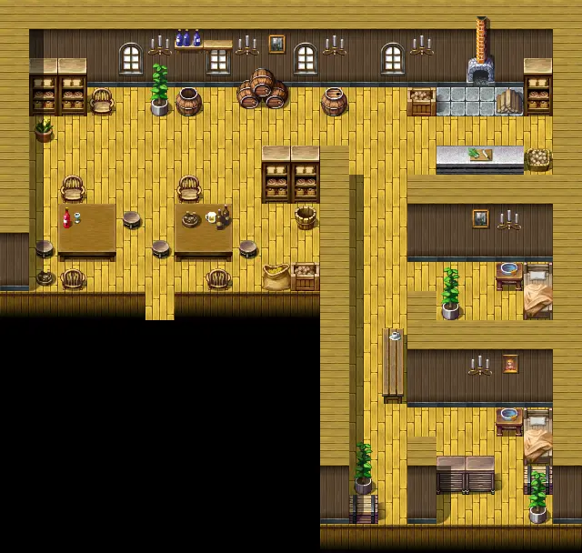

# Fallhaven tavern

| | |
|---|---|
| **Map ID** | `fallhaven_tavern` |
| **Region** | In Fallhaven (settlement) |
| **Type** | Indoors / underground |
| **Size** | 20×19 tiles |
| **Introduced** | v0.7.0 or earlier |
| **NPCs** | 3 |
| **Quests** | 2 |

**Fallhaven tavern** is an indoor map, in Fallhaven (settlement). It has 3 NPCs, and no enemies. Exits lead to Fallhaven north-west.

## Map

<label class="lg"><input type="checkbox" data-t="spawn" checked><b>Red</b>&nbsp;Monsters / NPCs</label><label class="lg"><input type="checkbox" data-t="mapchange" checked><b>Blue</b>&nbsp;Exit to another map</label><label class="lg"><input type="checkbox" data-t="container" checked><b>Yellow</b>&nbsp;Container (click to see contents)</label><label class="lg"><input type="checkbox" data-t="sign" checked><b>Purple</b>&nbsp;Sign</label><label class="lg"><input type="checkbox" data-t="rest" checked><b>Green</b>&nbsp;Resting place</label><label class="lg"><input type="checkbox" data-t="key" checked><b>Orange dashed</b>&nbsp;Blocked until a quest step / item</label><label class="lg"><input type="checkbox" data-t="script"><b>Grey dotted</b>&nbsp;Scripted event</label><label class="lg"><input type="checkbox" data-t="replace"><b>White dotted</b>&nbsp;Changes during a quest</label><label class="lg"><input type="checkbox" data-t="pin" checked><b>Numbers</b>&nbsp;Numbered key points (see the key below the map)</label>

<a class="pin pin-exit" href="#key-1" style="left:27.500%;top:55.263%" title="Exit (exit outside): to [Fallhaven north-west](../fallhaven_nw.md)">1</a><a class="pin pin-npc" href="#key-2" style="left:42.500%;top:44.737%" title="[Burhczyd](../../monsters/burhczyd2.md): 1 quest">2</a><a class="pin pin-npc" href="#key-3" style="left:22.500%;top:23.684%" title="[Drunk](../../monsters/drunk.md): NPC">3</a><a class="pin pin-npc" href="#key-4" style="left:42.829%;top:40.790%" title="[Knight of Elythom](../../monsters/burhczyd2e.md): 1 quest">4</a><a class="pin pin-rest" href="#key-5" style="left:92.500%;top:55.263%" title="Resting place: Rest here to heal and set your respawn point">5</a><a class="pin pin-rest" href="#key-5" style="left:92.500%;top:81.579%" title="Resting place: Rest here to heal and set your respawn point">5</a><a class="pin pin-script" href="#key-6" style="left:27.500%;top:50.000%" title="Quest trigger: Scripted event: advances the quest: hidden story flag “sutdover_hidden” to stage 8 (“xmas”)">6</a><a class="pin pin-key" href="#key-7" style="left:72.500%;top:50.000%" title="Blocked passage: Unlocked during the quest: hidden story flag “fallhaventavern” (stage 20)">7</a><a class="pin pin-key" href="#key-8" style="left:72.500%;top:76.316%" title="Blocked passage: Unlocked during the quest: hidden story flag “fallhaventavern” (stage 10)">8</a><a class="pin pin-key" href="#key-9" style="left:77.500%;top:78.947%" title="Blocked passage: Unlocked during the quest: The ruthless Crackshot (stage 3: “I am now fully rested, so I should go back to Umar.”)">9</a><a class="pin pin-script" href="#key-10" style="left:92.829%;top:75.000%" title="Quest trigger: Scripted event: advances the quest: The ruthless Crackshot to stage 3 (“I am now fully rested, so I should go back to Umar.”)">10</a><a class="pin pin-script" href="#key-11" style="left:87.500%;top:84.211%" title="Quest trigger: Scripted event: advances the quest: The ruthless Crackshot to stage 2 (“I really need to take a break ....”)">11</a>

??? abstract "Key to the numbers on the map"

    | # | What | Details |
    |---|---|---|
    | 1 | Exit (exit outside) | to [Fallhaven north-west](../fallhaven_nw.md) |
    | 2 | [Burhczyd](../monsters/burhczyd2.md) | 1 quest |
    | 3 | [Drunk](../monsters/drunk.md) | NPC |
    | 4 | [Knight of Elythom](../monsters/burhczyd2e.md) | 1 quest |
    | 5 | Resting place | Rest here to heal and set your respawn point |
    | 6 | Quest trigger | Scripted event: advances the quest: hidden story flag “sutdover_hidden” to stage 8 (“xmas”) |
    | 7 | Blocked passage | Unlocked during the quest: hidden story flag “fallhaventavern” (stage 20) |
    | 8 | Blocked passage | Unlocked during the quest: hidden story flag “fallhaventavern” (stage 10) |
    | 9 | Blocked passage | Unlocked during the quest: The ruthless Crackshot (stage 3: “I am now fully rested, so I should go back to Umar.”) |
    | 10 | Quest trigger | Scripted event: advances the quest: The ruthless Crackshot to stage 3 (“I am now fully rested, so I should go back to Umar.”) |
    | 11 | Quest trigger | Scripted event: advances the quest: The ruthless Crackshot to stage 2 (“I really need to take a break ....”) |

Verified against v0.8.18 map data.

## Connections

| Direction | Leads to | Region there | Map # |
|---|---|---|---|
| Exit outside | [Fallhaven north-west](fallhaven_nw.md) | Fallhaven | 1 |

## NPCs

- [Burhczyd](../monsters/burhczyd2.md) — quests: [Young merchant](../quests/quest_burhczyd.md) (#2)
- [Drunk](../monsters/drunk.md) (#3)
- [Knight of Elythom](../monsters/burhczyd2e.md) — quests: [Young merchant](../quests/quest_burhczyd.md) (#4)

## Quests

- [The ruthless Crackshot](../quests/Thieves03.md): blocked passage opens at stage 3; something on this map advances it; stepping on a trigger here sets stage 2; stepping on a trigger here sets stage 3
- [Young merchant](../quests/quest_burhczyd.md): [Burhczyd](../monsters/burhczyd2.md) is involved; [Knight of Elythom](../monsters/burhczyd2e.md) is involved
- [Room to rent (hidden flag)](../quests/fallhaventavern.md): blocked passage opens at stage 10; blocked passage opens at stage 20
- [Sutdove_nondisplay (hidden flag)](../quests/sutdover_hidden.md): something on this map advances it; stepping on a trigger here sets stage 7; stepping on a trigger here sets stage 8
- [Young merchant Non-displayed (hidden flag)](../quests/quest_burhczyd_nd.md): [Burhczyd](../monsters/burhczyd2.md) is involved; [Knight of Elythom](../monsters/burhczyd2e.md) is involved

## Points of interest

- **Resting place** (#5): Rest here to heal and set your respawn point
- **Quest trigger** (#6): Scripted event: advances the quest: hidden story flag “sutdover_hidden” to stage 8 (“xmas”)
- **Blocked passage** (#7): Unlocked during the quest: hidden story flag “fallhaventavern” (stage 20)
- **Blocked passage** (#8): Unlocked during the quest: hidden story flag “fallhaventavern” (stage 10)
- **Blocked passage** (#9): Unlocked during the quest: The ruthless Crackshot (stage 3: “I am now fully rested, so I should go back to Umar.”)
- **Quest trigger** (#10): Scripted event: advances the quest: The ruthless Crackshot to stage 3 (“I am now fully rested, so I should go back to Umar.”)
- **Quest trigger** (#11): Scripted event: advances the quest: The ruthless Crackshot to stage 2 (“I really need to take a break ....”)

## Version history

| Version | Change |
|---|---|
| [v0.7.0](../versions/0.7.0.md) | Present in v0.7.0 (earliest release tracked) |
| [v0.7.1](../versions/0.7.1.md) | map layout or objects changed |
| [v0.7.2](../versions/0.7.2.md) | map layout or objects changed |
| [v0.7.8](../versions/0.7.8.md) | map layout or objects changed |
| [v0.7.11](../versions/0.7.11.md) | map layout or objects changed |
| [v0.7.13](../versions/0.7.13.md) | map layout or objects changed |
| [v0.8.12.1](../versions/0.8.12.1.md) | map layout or objects changed |

Verified against v0.8.18 and every earlier release back to v0.7.0 (game data compared release by release).

## Community notes

<small>Written by players, not generated from game data. **Observations**: what players notice in-game · **Lore**: the in-world story · **Trivia**: real-world facts, references, development history · **Theory / speculation**: unconfirmed ideas; may just be unfinished content</small>

### Observations

*Nothing here yet. Know something? [Add it](https://github.com/asdfghjkl628/Andor-s-Trail-Wikiiii/new/main/notes/maps?filename=fallhaven_tavern.md&value=%23%23%20Observations%0A%0A%3C%21--%20what%20players%20notice%20in-game%20--%3E%0A%0A%23%23%20Lore%0A%0A%3C%21--%20the%20in-world%20story%20--%3E%0A%0A%23%23%20Trivia%0A%0A%3C%21--%20real-world%20facts%2C%20references%2C%20development%20history%20--%3E%0A%0A%23%23%20Theory%20/%20speculation%0A%0A%3C%21--%20unconfirmed%20ideas%3B%20may%20just%20be%20unfinished%20content%20--%3E%0A).*

### Lore

*Nothing here yet. Know something? [Add it](https://github.com/asdfghjkl628/Andor-s-Trail-Wikiiii/new/main/notes/maps?filename=fallhaven_tavern.md&value=%23%23%20Observations%0A%0A%3C%21--%20what%20players%20notice%20in-game%20--%3E%0A%0A%23%23%20Lore%0A%0A%3C%21--%20the%20in-world%20story%20--%3E%0A%0A%23%23%20Trivia%0A%0A%3C%21--%20real-world%20facts%2C%20references%2C%20development%20history%20--%3E%0A%0A%23%23%20Theory%20/%20speculation%0A%0A%3C%21--%20unconfirmed%20ideas%3B%20may%20just%20be%20unfinished%20content%20--%3E%0A).*

### Trivia

*Nothing here yet. Know something? [Add it](https://github.com/asdfghjkl628/Andor-s-Trail-Wikiiii/new/main/notes/maps?filename=fallhaven_tavern.md&value=%23%23%20Observations%0A%0A%3C%21--%20what%20players%20notice%20in-game%20--%3E%0A%0A%23%23%20Lore%0A%0A%3C%21--%20the%20in-world%20story%20--%3E%0A%0A%23%23%20Trivia%0A%0A%3C%21--%20real-world%20facts%2C%20references%2C%20development%20history%20--%3E%0A%0A%23%23%20Theory%20/%20speculation%0A%0A%3C%21--%20unconfirmed%20ideas%3B%20may%20just%20be%20unfinished%20content%20--%3E%0A).*

### Theory / speculation

*Nothing here yet. Know something? [Add it](https://github.com/asdfghjkl628/Andor-s-Trail-Wikiiii/new/main/notes/maps?filename=fallhaven_tavern.md&value=%23%23%20Observations%0A%0A%3C%21--%20what%20players%20notice%20in-game%20--%3E%0A%0A%23%23%20Lore%0A%0A%3C%21--%20the%20in-world%20story%20--%3E%0A%0A%23%23%20Trivia%0A%0A%3C%21--%20real-world%20facts%2C%20references%2C%20development%20history%20--%3E%0A%0A%23%23%20Theory%20/%20speculation%0A%0A%3C%21--%20unconfirmed%20ideas%3B%20may%20just%20be%20unfinished%20content%20--%3E%0A).*

??? info "Technical information"

    | | |
    |---|---|
    | Map ID | `fallhaven_tavern` |
    | File | `res/xml/fallhaven_tavern.tmx` |
    | Size | 20×19 tiles (640×608 px) |
    | outdoors property | – |
    | Layers drawn | ground, objects, above |
    | Tilesets | map_bed_1, map_border_1, map_bridge_1, map_bridge_2, map_broken_1, map_cavewall_1, map_cavewall_2, map_cavewall_3, map_cavewall_4, map_chair_table_1, map_chair_table_2, map_crate_1, map_cupboard_1, map_curtain_1, map_entrance_1, map_entrance_2, map_fence_1, map_fence_2, map_fence_3, map_fence_4, map_ground_1, map_ground_2, map_ground_3, map_ground_4, map_ground_5, map_ground_6, map_ground_7, map_ground_8, map_house_1, map_house_2, map_indoor_1, map_indoor_2, map_kitchen_1, map_outdoor_1, map_pillar_1, map_pillar_2, map_plant_1, map_plant_2, map_rock_1, map_rock_2, map_roof_1, map_roof_2, map_roof_3, map_shop_1, map_sign_ladder_1, map_table_1, map_trail_1, map_transition_1, map_transition_2, map_transition_3, map_transition_4, map_transition_5, map_tree_1, map_tree_2, map_wall_1, map_wall_2, map_wall_3, map_wall_4, map_window_1, map_window_2 |
    | Map objects | spawn: 6, script: 3, key: 3, rest: 2, mapchange: 1 |
    | World map position | – |

<small>Data from v0.8.18</small>
