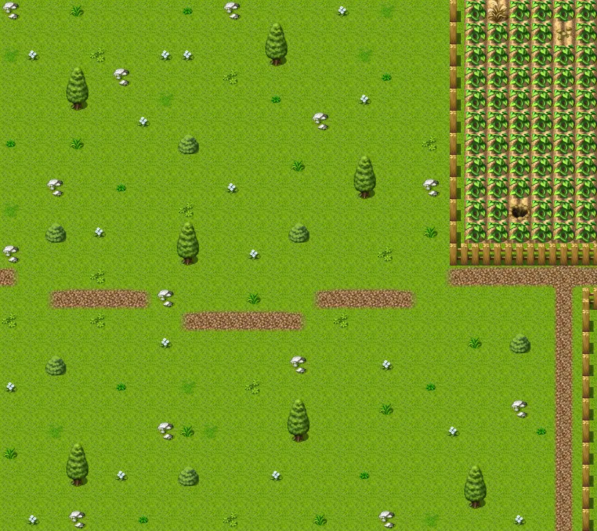

# Fields4

27×24 tiles · outdoors · part of [World1](index.md)

<label class="lg"><input type="checkbox" data-t="spawn" checked><b>Red</b>&nbsp;Monsters / NPCs</label><label class="lg"><input type="checkbox" data-t="mapchange" checked><b>Blue</b>&nbsp;Exit to another map</label><label class="lg"><input type="checkbox" data-t="container" checked><b>Yellow</b>&nbsp;Container (click to see contents)</label><label class="lg"><input type="checkbox" data-t="sign" checked><b>Purple</b>&nbsp;Sign</label><label class="lg"><input type="checkbox" data-t="rest" checked><b>Green</b>&nbsp;Resting place</label><label class="lg"><input type="checkbox" data-t="key" checked><b>Orange dashed</b>&nbsp;Blocked until a quest step / item</label><label class="lg"><input type="checkbox" data-t="script"><b>Grey dotted</b>&nbsp;Scripted event</label><label class="lg"><input type="checkbox" data-t="replace"><b>White dotted</b>&nbsp;Changes during a quest</label>

## Exits

- [Fields1](fields1.md)
- [Fields7](fields7.md)
- [Loneford1](loneford1.md)
- [Loneford2](loneford2.md)

## Monsters & NPCs here

| Name | HP |
|---|---|
| [Grasslands beetle](../monsters/grass_beetle.md) | 34 |
| [Tough grasslands beetle](../monsters/grass_beetle2.md) | 35 |
| [Grasslands snake](../monsters/grass_snake.md) | 36 |
| [Tough grasslands snake](../monsters/grass_snake2.md) | 38 |

<small>Map ID: `fields4` · Data from v0.8.18</small>
