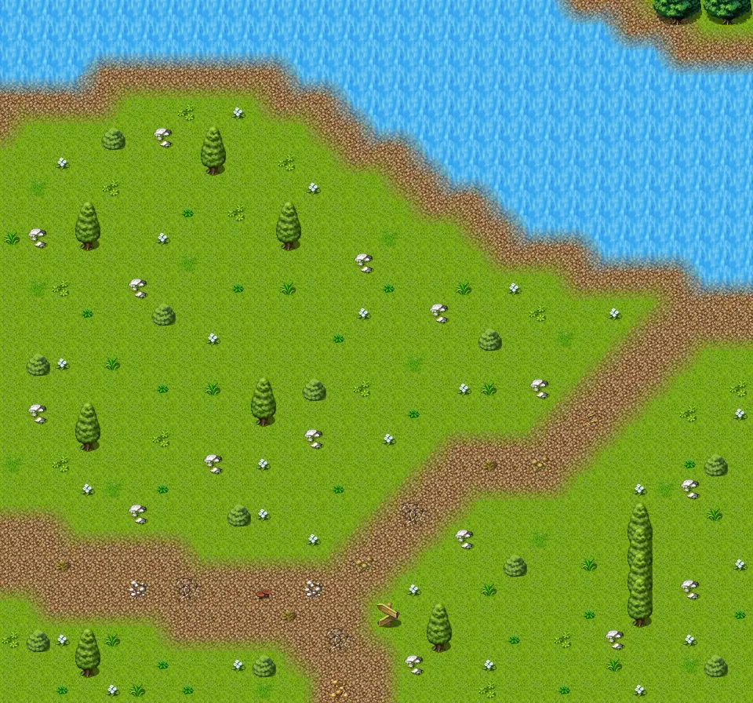

# Fields6

30×28 tiles · outdoors · part of [World1](index.md)

<label class="lg lg-spawn"><input type="checkbox" data-t="spawn" checked> Monsters / NPCs</label><label class="lg lg-mapchange"><input type="checkbox" data-t="mapchange" checked> Exit to another map</label><label class="lg lg-container"><input type="checkbox" data-t="container" checked> Container</label><label class="lg lg-sign"><input type="checkbox" data-t="sign" checked> Sign</label><label class="lg lg-rest"><input type="checkbox" data-t="rest" checked> Resting place</label><label class="lg lg-key"><input type="checkbox" data-t="key" checked> Blocked / needs key or quest</label><label class="lg lg-script"><input type="checkbox" data-t="script"> Scripted event</label><label class="lg lg-replace"><input type="checkbox" data-t="replace"> Changes after a quest</label>

## Exits

- [Fields1](fields1.md)
- [Fields5](fields5.md)
- [Fields7](fields7.md)

## Monsters & NPCs here

| Name | HP |
|---|---|
| [Tinlyn](../monsters/tinlyn.md) | 0 |
| [Feygard soldier](../monsters/patrol_roaming.md) | 0 |
| [Sheep](../monsters/sheep1.md) | 5 |
| [Grasslands ant](../monsters/grass_ant.md) | 29 |
| [Tough grasslands ant](../monsters/grass_ant2.md) | 29 |

<small>Map ID: `fields6` · Data from v0.8.18</small>
