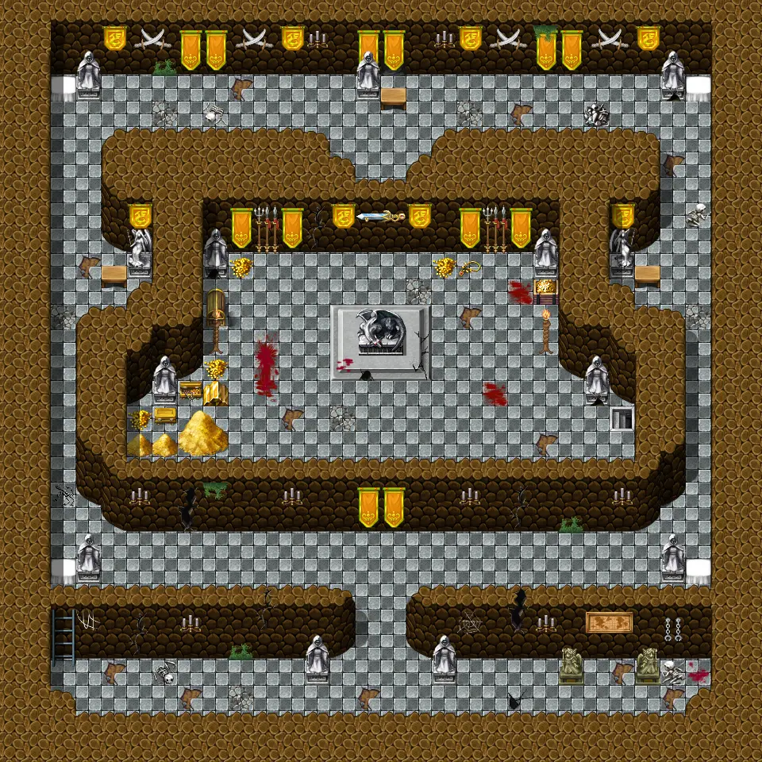
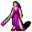
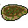

# Final cave1

30×30 tiles · part of [Island cave 2](index.md)

<label class="lg"><input type="checkbox" data-t="spawn" checked><b>Red</b>&nbsp;Monsters / NPCs</label><label class="lg"><input type="checkbox" data-t="mapchange" checked><b>Blue</b>&nbsp;Exit to another map</label><label class="lg"><input type="checkbox" data-t="container" checked><b>Yellow</b>&nbsp;Container (click to see contents)</label><label class="lg"><input type="checkbox" data-t="sign" checked><b>Purple</b>&nbsp;Sign</label><label class="lg"><input type="checkbox" data-t="rest" checked><b>Green</b>&nbsp;Resting place</label><label class="lg"><input type="checkbox" data-t="key" checked><b>Orange dashed</b>&nbsp;Blocked until a quest step / item</label><label class="lg"><input type="checkbox" data-t="script"><b>Grey dotted</b>&nbsp;Scripted event</label><label class="lg"><input type="checkbox" data-t="replace"><b>White dotted</b>&nbsp;Changes during a quest</label>

## Containers

<b>Container 1</b><ul><li><a href="../../items/rock/">Small rock</a> <small>100% · ×1 to 2</small></li></ul>

<b>Container 2</b><ul><li><a href="../../items/spider/">Dead spider</a> <small>100%</small></li></ul>

<b>Container 3</b><ul><li><a href="../../items/meat2/">Rotten meat</a> <small>100% · ×10 to 20</small></li></ul>

## Exits

- [Final cave2](final_cave2.md)
- [Final cave labyrinth](final_cave_labyrinth.md)
- [Final cave map](final_cave_map.md)

## Monsters & NPCs here

| Name | HP |
|---|---|
| [Jhaeld](../monsters/lae_jhaeld2.md) | 0 |
| [Andor](../monsters/lae_andor2.md) | 0 |
| [Algangror](../monsters/lae_algangror2.md) | 0 |

<small>Map ID: `final_cave1` · Data from v0.8.18</small>
