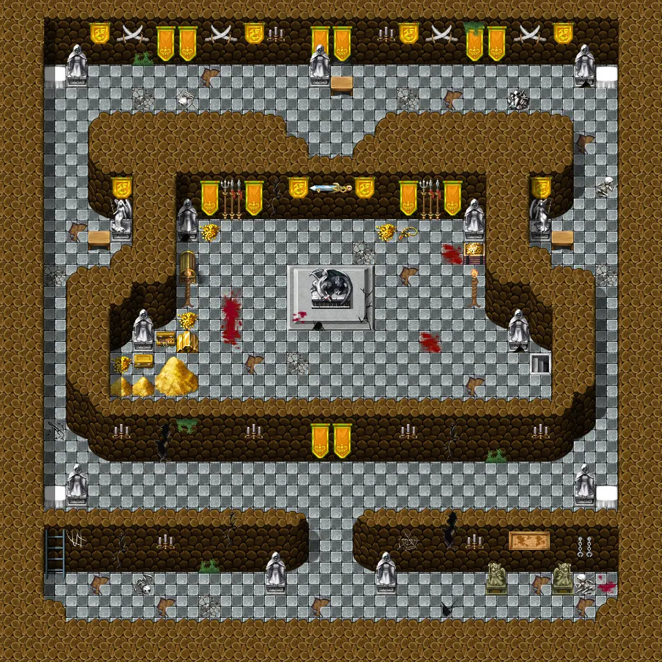

# Final cave1

| | |
|---|---|
| **Map ID** | `final_cave1` |
| **Type** | Indoors / underground |
| **Size** | 30×30 tiles |
| **World map** | [Island cave 2](index.md) |
| **Introduced** | [v0.8.11](../versions/0.8.11.md) |
| **NPCs** | 3 |
| **Quests** | 2 |
| **Containers** | 3 |

**Final cave1** is an indoor map. It has 3 NPCs, and no enemies. Exits lead to Final cave2, Final cave labyrinth, Final cave map.

## Map

<label class="lg"><input type="checkbox" data-t="spawn" checked><b>Red</b>&nbsp;Monsters / NPCs</label><label class="lg"><input type="checkbox" data-t="mapchange" checked><b>Blue</b>&nbsp;Exit to another map</label><label class="lg"><input type="checkbox" data-t="container" checked><b>Yellow</b>&nbsp;Container (click to see contents)</label><label class="lg"><input type="checkbox" data-t="sign" checked><b>Purple</b>&nbsp;Sign</label><label class="lg"><input type="checkbox" data-t="rest" checked><b>Green</b>&nbsp;Resting place</label><label class="lg"><input type="checkbox" data-t="key" checked><b>Orange dashed</b>&nbsp;Blocked until a quest step / item</label><label class="lg"><input type="checkbox" data-t="script"><b>Grey dotted</b>&nbsp;Scripted event</label><label class="lg"><input type="checkbox" data-t="replace"><b>White dotted</b>&nbsp;Changes during a quest</label><label class="lg"><input type="checkbox" data-t="pin" checked><b>Numbers</b>&nbsp;Numbered key points (see the key below the map)</label>

<a class="pin pin-exit" href="#key-1" style="left:81.667%;top:55.000%" title="Exit (stairs / passage): to [Final cave2](final_cave2.md)">1</a><a class="pin pin-exit" href="#key-2" style="left:8.333%;top:81.667%" title="Exit (stairs / passage): to [Final cave labyrinth](final_cave_labyrinth.md)">2</a><a class="pin pin-exit" href="#key-3" style="left:80.000%;top:85.000%" title="Exit (stairs / passage): to [Final cave map](final_cave_map.md)">3</a><a id="pin-npc-lae_algangror2" class="pin pin-npc" href="#key-4" style="left:68.333%;top:38.333%" title="[Algangror](../../monsters/algangror.md#v-lae_algangror2): 1 quest">4</a><a id="pin-npc-lae_andor2" class="pin pin-npc" href="#key-5" style="left:58.333%;top:48.333%" title="[Andor](../../monsters/dds_andor.md#v-lae_andor2): 1 quest">5</a><a id="pin-npc-lae_jhaeld2" class="pin pin-npc" href="#key-6" style="left:55.000%;top:41.667%" title="[Jhaeld](../../monsters/jhaeld.md#v-lae_jhaeld2): 1 quest">6</a><a class="pin pin-script" href="#key-7" style="left:53.333%;top:46.667%" title="Quest trigger: Scripted event: advances the quest: Not Pony Island to stage 160 (“With an intense sound, the wall built up again. I&#x27;ve been locked up!”) (+1 more quest(s))">7</a><a class="pin pin-script" href="#key-8" style="left:50.000%;top:81.667%" title="Quest trigger: Scripted event: advances the quest: Not Pony Island to stage 140 (“To open an entrance I had to find the four scrolls of elements and the three color globes. These were hidden all over the island.
The scrolls and globes would need to be properly placed around Andor&#x27;s golden prison.”) (+1 more quest(s))">8</a><a class="pin pin-container" href="#key-9" style="left:25.000%;top:51.667%" title="Container 1: Small rock">9</a><a class="pin pin-container" href="#key-10" style="left:21.667%;top:55.000%" title="Container 2: Dead spider">10</a><a class="pin pin-container" href="#key-11" style="left:28.333%;top:38.333%" title="Container 3: Rotten meat">11</a><a class="pin pin-key" href="#key-12" style="left:8.333%;top:75.000%" title="Blocked passage: Closed off once you reach this point in the quest: Search for Andor (stage 1: “My father Mikhail says that Andor has not been home since yesterday. I should go look for him in the village.”)">12</a><a class="pin pin-key" href="#key-12" style="left:15.000%;top:35.000%" title="Blocked passage: Closed off once you reach this point in the quest: Search for Andor (stage 1: “My father Mikhail says that Andor has not been home since yesterday. I should go look for him in the village.”)">12</a><a class="pin pin-key" href="#key-12" style="left:8.333%;top:11.667%" title="Blocked passage: Closed off once you reach this point in the quest: Search for Andor (stage 1: “My father Mikhail says that Andor has not been home since yesterday. I should go look for him in the village.”)">12</a><a class="pin pin-key" href="#key-12" style="left:51.667%;top:11.667%" title="Blocked passage: Closed off once you reach this point in the quest: Search for Andor (stage 1: “My father Mikhail says that Andor has not been home since yesterday. I should go look for him in the village.”)">12</a><a class="pin pin-key" href="#key-12" style="left:91.667%;top:11.667%" title="Blocked passage: Closed off once you reach this point in the quest: Search for Andor (stage 1: “My father Mikhail says that Andor has not been home since yesterday. I should go look for him in the village.”)">12</a><a class="pin pin-key" href="#key-12" style="left:85.000%;top:35.000%" title="Blocked passage: Closed off once you reach this point in the quest: Search for Andor (stage 1: “My father Mikhail says that Andor has not been home since yesterday. I should go look for him in the village.”)">12</a><a class="pin pin-key" href="#key-12" style="left:91.667%;top:75.000%" title="Blocked passage: Closed off once you reach this point in the quest: Search for Andor (stage 1: “My father Mikhail says that Andor has not been home since yesterday. I should go look for him in the village.”)">12</a><a class="pin pin-key" href="#key-13" style="left:81.886%;top:52.500%" title="Blocked passage: Unlocked during the quest: Not Pony Island (stage 170: “The only way out was down a staircase, which, however, seemed to be magically secured.”)">13</a><a class="pin pin-replace" href="#key-14" style="left:8.553%;top:72.500%" title="Changes during a quest: This area changes during the quest: hidden story flag “final_cave” (stage 1: “key 1 set - sw”)">14</a><a class="pin pin-replace" href="#key-15" style="left:10.015%;top:77.194%" title="Changes during a quest: This area changes back during the quest: hidden story flag “final_cave” (stage 1: “key 1 set - sw”)">15</a><a class="pin pin-replace" href="#key-16" style="left:15.219%;top:32.500%" title="Changes during a quest: This area changes during the quest: hidden story flag “final_cave” (stage 2: “key 2 set - w”)">16</a><a class="pin pin-replace" href="#key-17" style="left:16.682%;top:37.194%" title="Changes during a quest: This area changes back during the quest: hidden story flag “final_cave” (stage 2: “key 2 set - w”)">17</a><a class="pin pin-replace" href="#key-18" style="left:8.553%;top:9.167%" title="Changes during a quest: This area changes during the quest: hidden story flag “final_cave” (stage 3: “key 3 set - nw”)">18</a><a class="pin pin-replace" href="#key-19" style="left:10.015%;top:13.860%" title="Changes during a quest: This area changes back during the quest: hidden story flag “final_cave” (stage 3: “key 3 set - nw”)">19</a><a class="pin pin-replace" href="#key-20" style="left:51.886%;top:9.167%" title="Changes during a quest: This area changes during the quest: hidden story flag “final_cave” (stage 4: “key 4 set - n”)">20</a><a class="pin pin-replace" href="#key-21" style="left:53.349%;top:13.860%" title="Changes during a quest: This area changes back during the quest: hidden story flag “final_cave” (stage 4: “key 4 set - n”)">21</a><a class="pin pin-replace" href="#key-22" style="left:91.886%;top:9.167%" title="Changes during a quest: This area changes during the quest: hidden story flag “final_cave” (stage 5: “key 5 set - ne”)">22</a><a class="pin pin-replace" href="#key-23" style="left:93.349%;top:13.860%" title="Changes during a quest: This area changes back during the quest: hidden story flag “final_cave” (stage 5: “key 5 set - ne”)">23</a><a class="pin pin-replace" href="#key-24" style="left:85.219%;top:32.500%" title="Changes during a quest: This area changes during the quest: hidden story flag “final_cave” (stage 6: “key 6 set - e”)">24</a><a class="pin pin-replace" href="#key-25" style="left:86.682%;top:37.194%" title="Changes during a quest: This area changes back during the quest: hidden story flag “final_cave” (stage 6: “key 6 set - e”)">25</a><a class="pin pin-replace" href="#key-26" style="left:91.886%;top:72.500%" title="Changes during a quest: This area changes during the quest: hidden story flag “final_cave” (stage 7: “key 7 set - se”)">26</a><a class="pin pin-replace" href="#key-27" style="left:93.349%;top:77.194%" title="Changes during a quest: This area changes back during the quest: hidden story flag “final_cave” (stage 7: “key 7 set - se”)">27</a><a class="pin pin-replace" href="#key-28" style="left:50.000%;top:43.333%" title="Changes during a quest: This area changes during the quest: hidden story flag “final_cave” (stage 9: “9: wall down”)">28</a><a class="pin pin-replace" href="#key-29" style="left:50.219%;top:40.834%" title="Changes during a quest: This area changes back during the quest: hidden story flag “final_cave” (stage 9: “9: wall down”)">29</a>

??? abstract "Key to the numbers on the map"

    | # | What | Details |
    |---|---|---|
    | 1 | Exit (stairs / passage) | to [Final cave2](final_cave2.md) |
    | 2 | Exit (stairs / passage) | to [Final cave labyrinth](final_cave_labyrinth.md) |
    | 3 | Exit (stairs / passage) | to [Final cave map](final_cave_map.md) |
    | 4 | [Algangror](../monsters/algangror.md#v-lae_algangror2) | 1 quest |
    | 5 | [Andor](../monsters/dds_andor.md#v-lae_andor2) | 1 quest |
    | 6 | [Jhaeld](../monsters/jhaeld.md#v-lae_jhaeld2) | 1 quest |
    | 7 | Quest trigger | Scripted event: advances the quest: Not Pony Island to stage 160 (“With an intense sound, the wall built up again. I've been locked up!”) (+1 more quest(s)) |
    | 8 | Quest trigger | Scripted event: advances the quest: Not Pony Island to stage 140 (“To open an entrance I had to find the four scrolls of elements and the three color globes. These were hidden all over the island. The scrolls and globes would need to be properly placed around Andor's golden prison.”) (+1 more quest(s)) |
    | 9 | Container 1 | Small rock |
    | 10 | Container 2 | Dead spider |
    | 11 | Container 3 | Rotten meat |
    | 12 | Blocked passage | Closed off once you reach this point in the quest: Search for Andor (stage 1: “My father Mikhail says that Andor has not been home since yesterday. I should go look for him in the village.”) |
    | 13 | Blocked passage | Unlocked during the quest: Not Pony Island (stage 170: “The only way out was down a staircase, which, however, seemed to be magically secured.”) |
    | 14 | Changes during a quest | This area changes during the quest: hidden story flag “final_cave” (stage 1: “key 1 set - sw”) |
    | 15 | Changes during a quest | This area changes back during the quest: hidden story flag “final_cave” (stage 1: “key 1 set - sw”) |
    | 16 | Changes during a quest | This area changes during the quest: hidden story flag “final_cave” (stage 2: “key 2 set - w”) |
    | 17 | Changes during a quest | This area changes back during the quest: hidden story flag “final_cave” (stage 2: “key 2 set - w”) |
    | 18 | Changes during a quest | This area changes during the quest: hidden story flag “final_cave” (stage 3: “key 3 set - nw”) |
    | 19 | Changes during a quest | This area changes back during the quest: hidden story flag “final_cave” (stage 3: “key 3 set - nw”) |
    | 20 | Changes during a quest | This area changes during the quest: hidden story flag “final_cave” (stage 4: “key 4 set - n”) |
    | 21 | Changes during a quest | This area changes back during the quest: hidden story flag “final_cave” (stage 4: “key 4 set - n”) |
    | 22 | Changes during a quest | This area changes during the quest: hidden story flag “final_cave” (stage 5: “key 5 set - ne”) |
    | 23 | Changes during a quest | This area changes back during the quest: hidden story flag “final_cave” (stage 5: “key 5 set - ne”) |
    | 24 | Changes during a quest | This area changes during the quest: hidden story flag “final_cave” (stage 6: “key 6 set - e”) |
    | 25 | Changes during a quest | This area changes back during the quest: hidden story flag “final_cave” (stage 6: “key 6 set - e”) |
    | 26 | Changes during a quest | This area changes during the quest: hidden story flag “final_cave” (stage 7: “key 7 set - se”) |
    | 27 | Changes during a quest | This area changes back during the quest: hidden story flag “final_cave” (stage 7: “key 7 set - se”) |
    | 28 | Changes during a quest | This area changes during the quest: hidden story flag “final_cave” (stage 9: “9: wall down”) |
    | 29 | Changes during a quest | This area changes back during the quest: hidden story flag “final_cave” (stage 9: “9: wall down”) |

Verified against v0.8.18 map data.

## Connections

| Direction | Leads to | Region there | Map # |
|---|---|---|---|
| Stairs / passage | [Final cave2](final_cave2.md) | – | 1 |
| Stairs / passage | [Final cave labyrinth](final_cave_labyrinth.md) | – | 2 |
| Stairs / passage | [Final cave map](final_cave_map.md) | – | 3 |

## NPCs

- [Algangror](../monsters/algangror.md#v-lae_algangror2) — quests: [Not Pony Island](../quests/lae_centaurs.md) (#4)
- [Andor](../monsters/dds_andor.md#v-lae_andor2) — quests: [Not Pony Island](../quests/lae_centaurs.md) (#5)
- [Jhaeld](../monsters/jhaeld.md#v-lae_jhaeld2) — quests: [Not Pony Island](../quests/lae_centaurs.md) (#6)

## Items & containers

<b>Container 1</b><ul><li><a href="../../items/rock/">Small rock</a> <small>100% · ×1 to 2</small></li></ul>

<b>Container 2</b><ul><li><a href="../../items/spider/">Dead spider</a> <small>100%</small></li></ul>

<b>Container 3</b><ul><li><a href="../../items/meat2/">Rotten meat</a> <small>100% · ×10 to 20</small></li></ul>

## Quests

- [Not Pony Island](../quests/lae_centaurs.md): [Algangror](../monsters/algangror.md#v-lae_algangror2) is involved; [Andor](../monsters/dds_andor.md#v-lae_andor2) is involved; [Jhaeld](../monsters/jhaeld.md#v-lae_jhaeld2) is involved; blocked passage opens at stage 170; something on this map advances it; stepping on a trigger here sets stage 130; stepping on a trigger here sets stage 140; stepping on a trigger here sets stage 150; stepping on a trigger here sets stage 160
- [Search for Andor](../quests/andor.md): blocked passage closes at stage 1
- [final_cave (hidden flag)](../quests/final_cave.md): part of the map changes at stage 1; part of the map changes at stage 2; part of the map changes at stage 3; part of the map changes at stage 4; part of the map changes at stage 5; part of the map changes at stage 6; part of the map changes at stage 7; part of the map changes at stage 9; something on this map advances it; stepping on a trigger here sets stage 11; stepping on a trigger here sets stage 9

## Points of interest

- **Quest trigger** (#7): Scripted event: advances the quest: Not Pony Island to stage 160 (“With an intense sound, the wall built up again. I've been locked up!”) (+1 more quest(s))
- **Quest trigger** (#8): Scripted event: advances the quest: Not Pony Island to stage 140 (“To open an entrance I had to find the four scrolls of elements and the three color globes. These were hidden all over the island. The scrolls and globes would need to be properly placed around Andor's golden prison.”) (+1 more quest(s))
- **Blocked passage** (#12): Closed off once you reach this point in the quest: Search for Andor (stage 1: “My father Mikhail says that Andor has not been home since yesterday. I should go look for him in the village.”)
- **Blocked passage** (#13): Unlocked during the quest: Not Pony Island (stage 170: “The only way out was down a staircase, which, however, seemed to be magically secured.”)
- **Changes during a quest** (#14): This area changes during the quest: hidden story flag “final_cave” (stage 1: “key 1 set - sw”)
- **Changes during a quest** (#15): This area changes back during the quest: hidden story flag “final_cave” (stage 1: “key 1 set - sw”)
- **Changes during a quest** (#16): This area changes during the quest: hidden story flag “final_cave” (stage 2: “key 2 set - w”)
- **Changes during a quest** (#17): This area changes back during the quest: hidden story flag “final_cave” (stage 2: “key 2 set - w”)
- **Changes during a quest** (#18): This area changes during the quest: hidden story flag “final_cave” (stage 3: “key 3 set - nw”)
- **Changes during a quest** (#19): This area changes back during the quest: hidden story flag “final_cave” (stage 3: “key 3 set - nw”)
- **Changes during a quest** (#20): This area changes during the quest: hidden story flag “final_cave” (stage 4: “key 4 set - n”)
- **Changes during a quest** (#21): This area changes back during the quest: hidden story flag “final_cave” (stage 4: “key 4 set - n”)
- **Changes during a quest** (#22): This area changes during the quest: hidden story flag “final_cave” (stage 5: “key 5 set - ne”)
- **Changes during a quest** (#23): This area changes back during the quest: hidden story flag “final_cave” (stage 5: “key 5 set - ne”)
- **Changes during a quest** (#24): This area changes during the quest: hidden story flag “final_cave” (stage 6: “key 6 set - e”)
- **Changes during a quest** (#25): This area changes back during the quest: hidden story flag “final_cave” (stage 6: “key 6 set - e”)
- **Changes during a quest** (#26): This area changes during the quest: hidden story flag “final_cave” (stage 7: “key 7 set - se”)
- **Changes during a quest** (#27): This area changes back during the quest: hidden story flag “final_cave” (stage 7: “key 7 set - se”)
- **Changes during a quest** (#28): This area changes during the quest: hidden story flag “final_cave” (stage 9: “9: wall down”)
- **Changes during a quest** (#29): This area changes back during the quest: hidden story flag “final_cave” (stage 9: “9: wall down”)

## Version history

| Version | Change |
|---|---|
| [v0.8.11](../versions/0.8.11.md) | Added |

Verified against v0.8.18 and every earlier release back to v0.7.0 (game data compared release by release).

## Community notes

<small>Written by players, not generated from game data. **Observations**: what players notice in-game · **Lore**: the in-world story · **Trivia**: real-world facts, references, development history · **Theory / speculation**: unconfirmed ideas; may just be unfinished content</small>

### Observations

*No notes yet. Contributions are welcome: [add a note](https://github.com/asdfghjkl628/Andor-s-Trail-Wikiiii/new/main/notes/maps?filename=final_cave1.md&value=%23%23%20Observations%0A%0A%3C%21--%20what%20players%20notice%20in-game%20--%3E%0A%0A%23%23%20Lore%0A%0A%3C%21--%20the%20in-world%20story%20--%3E%0A%0A%23%23%20Trivia%0A%0A%3C%21--%20real-world%20facts%2C%20references%2C%20development%20history%20--%3E%0A%0A%23%23%20Theory%20/%20speculation%0A%0A%3C%21--%20unconfirmed%20ideas%3B%20may%20just%20be%20unfinished%20content%20--%3E%0A).*

### Lore

*No notes yet. Contributions are welcome: [add a note](https://github.com/asdfghjkl628/Andor-s-Trail-Wikiiii/new/main/notes/maps?filename=final_cave1.md&value=%23%23%20Observations%0A%0A%3C%21--%20what%20players%20notice%20in-game%20--%3E%0A%0A%23%23%20Lore%0A%0A%3C%21--%20the%20in-world%20story%20--%3E%0A%0A%23%23%20Trivia%0A%0A%3C%21--%20real-world%20facts%2C%20references%2C%20development%20history%20--%3E%0A%0A%23%23%20Theory%20/%20speculation%0A%0A%3C%21--%20unconfirmed%20ideas%3B%20may%20just%20be%20unfinished%20content%20--%3E%0A).*

### Trivia

*No notes yet. Contributions are welcome: [add a note](https://github.com/asdfghjkl628/Andor-s-Trail-Wikiiii/new/main/notes/maps?filename=final_cave1.md&value=%23%23%20Observations%0A%0A%3C%21--%20what%20players%20notice%20in-game%20--%3E%0A%0A%23%23%20Lore%0A%0A%3C%21--%20the%20in-world%20story%20--%3E%0A%0A%23%23%20Trivia%0A%0A%3C%21--%20real-world%20facts%2C%20references%2C%20development%20history%20--%3E%0A%0A%23%23%20Theory%20/%20speculation%0A%0A%3C%21--%20unconfirmed%20ideas%3B%20may%20just%20be%20unfinished%20content%20--%3E%0A).*

### Theory / speculation

*No notes yet. Contributions are welcome: [add a note](https://github.com/asdfghjkl628/Andor-s-Trail-Wikiiii/new/main/notes/maps?filename=final_cave1.md&value=%23%23%20Observations%0A%0A%3C%21--%20what%20players%20notice%20in-game%20--%3E%0A%0A%23%23%20Lore%0A%0A%3C%21--%20the%20in-world%20story%20--%3E%0A%0A%23%23%20Trivia%0A%0A%3C%21--%20real-world%20facts%2C%20references%2C%20development%20history%20--%3E%0A%0A%23%23%20Theory%20/%20speculation%0A%0A%3C%21--%20unconfirmed%20ideas%3B%20may%20just%20be%20unfinished%20content%20--%3E%0A).*

??? info "Technical information"

    | | |
    |---|---|
    | Map ID | `final_cave1` |
    | File | `res/xml/final_cave1.tmx` |
    | Size | 30×30 tiles (960×960 px) |
    | outdoors property | – |
    | Layers drawn | base, ground, objects, above, top |
    | Tilesets | map_bed_1, map_border_1, map_bridge_1, map_bridge_2, map_broken_1, map_cavewall_1, map_cavewall_2, map_cavewall_3, map_cavewall_4, map_chair_table_1, map_chair_table_2, map_crate_1, map_cupboard_1, map_curtain_1, map_entrance_1, map_entrance_2, map_fence_1, map_fence_2, map_fence_3, map_fence_4, map_ground_1, map_ground_2, map_ground_3, map_ground_4, map_ground_5, map_ground_6, map_ground_7, map_ground_8, map_guynmart, map_house_1, map_house_2, map_indoor_1, map_indoor_2, map_items_japozero, map_kitchen_1, map_outdoor_1, map_pillar_1, map_pillar_2, map_plant_1, map_plant_2, map_rock_1, map_rock_2, map_roof_1, map_roof_2, map_roof_3, map_shop_1, map_sign_ladder_1, map_table_1, map_trail_1, map_transition_1, map_transition_2, map_transition_3, map_transition_4, map_transition_5, map_tree_1, map_tree_2, map_wall_1, map_wall_2, map_wall_3, map_wall_4, map_window_1, map_window_2 |
    | Map objects | replace: 16, key: 8, mapchange: 5, script: 3, container: 3, spawn: 3 |
    | World map position | segment `island_cave_2`, x -19, y -47 |

<small>Data from v0.8.18</small>
