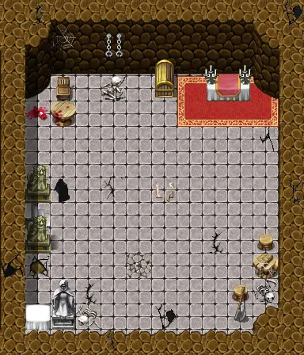

# Final cave 2

| | |
|---|---|
| **Map ID** | `final_cave2` |
| **Type** | Indoors / underground |
| **Size** | 12×14 tiles |
| **Introduced** | [v0.8.11](../versions/0.8.11.md) |
| **NPCs** | 4 |
| **Quests** | 2 |

**Final cave 2** is an indoor map. It has 4 NPCs, and no enemies. Exits lead to Final cave 1.

## Map

<label class="lg"><input type="checkbox" data-t="spawn" checked><b>Red</b>&nbsp;Monsters / NPCs</label><label class="lg"><input type="checkbox" data-t="mapchange" checked><b>Blue</b>&nbsp;Exit to another map</label><label class="lg"><input type="checkbox" data-t="container" checked><b>Yellow</b>&nbsp;Container (click to see contents)</label><label class="lg"><input type="checkbox" data-t="sign" checked><b>Purple</b>&nbsp;Sign</label><label class="lg"><input type="checkbox" data-t="rest" checked><b>Green</b>&nbsp;Resting place</label><label class="lg"><input type="checkbox" data-t="key" checked><b>Orange dashed</b>&nbsp;Blocked until a quest step / item</label><label class="lg"><input type="checkbox" data-t="script"><b>Grey dotted</b>&nbsp;Scripted event</label><label class="lg"><input type="checkbox" data-t="replace"><b>White dotted</b>&nbsp;Changes during a quest</label><label class="lg"><input type="checkbox" data-t="pin" checked><b>Numbers</b>&nbsp;Numbered key points (see the key below the map)</label>

<a class="pin pin-exit" href="#key-1" style="left:12.500%;top:60.714%" title="Exit (west): to [Final cave 1](final_cave1.md)">1</a><a id="pin-npc-lae_algangror3" class="pin pin-npc" href="#key-2" style="left:13.048%;top:55.358%" title="[Algangror](../../monsters/algangror.md#v-lae_algangror3): 1 quest">2</a><a id="pin-npc-lae_andor3" class="pin pin-npc" href="#key-3" style="left:12.500%;top:46.429%" title="[Andor](../../monsters/dds_andor.md#v-lae_andor3): NPC">3</a><a id="pin-npc-lae_island_boss" class="pin pin-npc" href="#key-4" style="left:75.000%;top:35.714%" title="[Dorhantarh](../../monsters/lae_island_boss.md): NPC">4</a><a id="pin-npc-lae_jhaeld3" class="pin pin-npc" href="#key-5" style="left:16.705%;top:65.415%" title="[Jhaeld](../../monsters/jhaeld.md#v-lae_jhaeld3): 1 quest">5</a><a class="pin pin-script" href="#key-6" style="left:20.833%;top:60.714%" title="Quest trigger: Scripted event: advances the quest: Not Pony Island to stage 190 (“It was no problem going downstairs, but something was wrong there.”) (+1 more quest(s))">6</a><a class="pin pin-key" href="#key-7" style="left:16.820%;top:71.008%" title="Blocked passage: Unlocked during the quest: Not Pony Island (stage 200: “The whole thing was just a big scam to lure me into this cave to serve Dorhantarh as dinner.”)">7</a><a class="pin pin-key" href="#key-7" style="left:29.167%;top:60.714%" title="Blocked passage: Unlocked during the quest: Not Pony Island (stage 200: “The whole thing was just a big scam to lure me into this cave to serve Dorhantarh as dinner.”)">7</a><a class="pin pin-key" href="#key-7" style="left:20.833%;top:53.571%" title="Blocked passage: Unlocked during the quest: Not Pony Island (stage 200: “The whole thing was just a big scam to lure me into this cave to serve Dorhantarh as dinner.”)">7</a><a class="pin pin-key" href="#key-8" style="left:12.500%;top:89.286%" title="Blocked passage: Closed off once you reach this point in the quest: Search for Andor (stage 1: “My father Mikhail says that Andor has not been home since yesterday. I should go look for him in the village.”)">8</a>

??? abstract "Key to the numbers on the map"

    | # | What | Details |
    |---|---|---|
    | 1 | Exit (west) | to [Final cave 1](final_cave1.md) |
    | 2 | [Algangror](../monsters/algangror.md#v-lae_algangror3) | 1 quest |
    | 3 | [Andor](../monsters/dds_andor.md#v-lae_andor3) | NPC |
    | 4 | [Dorhantarh](../monsters/lae_island_boss.md) | NPC |
    | 5 | [Jhaeld](../monsters/jhaeld.md#v-lae_jhaeld3) | 1 quest |
    | 6 | Quest trigger | Scripted event: advances the quest: Not Pony Island to stage 190 (“It was no problem going downstairs, but something was wrong there.”) (+1 more quest(s)) |
    | 7 | Blocked passage | Unlocked during the quest: Not Pony Island (stage 200: “The whole thing was just a big scam to lure me into this cave to serve Dorhantarh as dinner.”) |
    | 8 | Blocked passage | Closed off once you reach this point in the quest: Search for Andor (stage 1: “My father Mikhail says that Andor has not been home since yesterday. I should go look for him in the village.”) |

Verified against v0.8.18 map data.

## Connections

| Direction | Leads to | Region there | Map # |
|---|---|---|---|
| West | [Final cave 1](final_cave1.md) | – | 1 |

## NPCs

- [Algangror](../monsters/algangror.md#v-lae_algangror3) — can be fought — quests: [Not Pony Island](../quests/lae_centaurs.md) (#2)
- [Andor](../monsters/dds_andor.md#v-lae_andor3) — can be fought (#3)
- [Dorhantarh](../monsters/lae_island_boss.md) — can be fought (#4)
- [Jhaeld](../monsters/jhaeld.md#v-lae_jhaeld3) — can be fought — quests: [Not Pony Island](../quests/lae_centaurs.md) (#5)

## Quests

- [Not Pony Island](../quests/lae_centaurs.md): [Algangror](../monsters/algangror.md#v-lae_algangror3) is involved; [Jhaeld](../monsters/jhaeld.md#v-lae_jhaeld3) is involved; blocked passage opens at stage 200; something on this map advances it; stepping on a trigger here sets stage 190; stepping on a trigger here sets stage 210
- [Search for Andor](../quests/andor.md): blocked passage closes at stage 1
- [Final cave (hidden flag)](../quests/final_cave.md): something on this map advances it; stepping on a trigger here sets stage 9

## Points of interest

- **Quest trigger** (#6): Scripted event: advances the quest: Not Pony Island to stage 190 (“It was no problem going downstairs, but something was wrong there.”) (+1 more quest(s))
- **Blocked passage** (#7): Unlocked during the quest: Not Pony Island (stage 200: “The whole thing was just a big scam to lure me into this cave to serve Dorhantarh as dinner.”)
- **Blocked passage** (#8): Closed off once you reach this point in the quest: Search for Andor (stage 1: “My father Mikhail says that Andor has not been home since yesterday. I should go look for him in the village.”)

## Version history

| Version | Change |
|---|---|
| [v0.8.11](../versions/0.8.11.md) | Added |

Verified against v0.8.18 and every earlier release back to v0.7.0 (game data compared release by release).

## Community notes

<small>Written by players, not generated from game data. **Observations**: what players notice in-game · **Lore**: the in-world story · **Trivia**: real-world facts, references, development history · **Theory / speculation**: unconfirmed ideas; may just be unfinished content</small>

### Observations

*No notes yet. Contributions are welcome: [add a note](https://github.com/asdfghjkl628/Andor-s-Trail-Wikiiii/new/main/notes/maps?filename=final_cave2.md&value=%23%23%20Observations%0A%0A%3C%21--%20what%20players%20notice%20in-game%20--%3E%0A%0A%23%23%20Lore%0A%0A%3C%21--%20the%20in-world%20story%20--%3E%0A%0A%23%23%20Trivia%0A%0A%3C%21--%20real-world%20facts%2C%20references%2C%20development%20history%20--%3E%0A%0A%23%23%20Theory%20/%20speculation%0A%0A%3C%21--%20unconfirmed%20ideas%3B%20may%20just%20be%20unfinished%20content%20--%3E%0A).*

### Lore

*No notes yet. Contributions are welcome: [add a note](https://github.com/asdfghjkl628/Andor-s-Trail-Wikiiii/new/main/notes/maps?filename=final_cave2.md&value=%23%23%20Observations%0A%0A%3C%21--%20what%20players%20notice%20in-game%20--%3E%0A%0A%23%23%20Lore%0A%0A%3C%21--%20the%20in-world%20story%20--%3E%0A%0A%23%23%20Trivia%0A%0A%3C%21--%20real-world%20facts%2C%20references%2C%20development%20history%20--%3E%0A%0A%23%23%20Theory%20/%20speculation%0A%0A%3C%21--%20unconfirmed%20ideas%3B%20may%20just%20be%20unfinished%20content%20--%3E%0A).*

### Trivia

*No notes yet. Contributions are welcome: [add a note](https://github.com/asdfghjkl628/Andor-s-Trail-Wikiiii/new/main/notes/maps?filename=final_cave2.md&value=%23%23%20Observations%0A%0A%3C%21--%20what%20players%20notice%20in-game%20--%3E%0A%0A%23%23%20Lore%0A%0A%3C%21--%20the%20in-world%20story%20--%3E%0A%0A%23%23%20Trivia%0A%0A%3C%21--%20real-world%20facts%2C%20references%2C%20development%20history%20--%3E%0A%0A%23%23%20Theory%20/%20speculation%0A%0A%3C%21--%20unconfirmed%20ideas%3B%20may%20just%20be%20unfinished%20content%20--%3E%0A).*

### Theory / speculation

*No notes yet. Contributions are welcome: [add a note](https://github.com/asdfghjkl628/Andor-s-Trail-Wikiiii/new/main/notes/maps?filename=final_cave2.md&value=%23%23%20Observations%0A%0A%3C%21--%20what%20players%20notice%20in-game%20--%3E%0A%0A%23%23%20Lore%0A%0A%3C%21--%20the%20in-world%20story%20--%3E%0A%0A%23%23%20Trivia%0A%0A%3C%21--%20real-world%20facts%2C%20references%2C%20development%20history%20--%3E%0A%0A%23%23%20Theory%20/%20speculation%0A%0A%3C%21--%20unconfirmed%20ideas%3B%20may%20just%20be%20unfinished%20content%20--%3E%0A).*

??? info "Technical information"

    | | |
    |---|---|
    | Map ID | `final_cave2` |
    | File | `res/xml/final_cave2.tmx` |
    | Size | 12×14 tiles (384×448 px) |
    | outdoors property | – |
    | Layers drawn | base, ground, objects, above, top |
    | Tilesets | map_bed_1, map_border_1, map_bridge_1, map_bridge_2, map_broken_1, map_cavewall_1, map_cavewall_2, map_cavewall_3, map_cavewall_4, map_chair_table_1, map_chair_table_2, map_crate_1, map_cupboard_1, map_curtain_1, map_entrance_1, map_entrance_2, map_fence_1, map_fence_2, map_fence_3, map_fence_4, map_ground_1, map_ground_2, map_ground_3, map_ground_4, map_ground_5, map_ground_6, map_ground_7, map_ground_8, map_house_1, map_house_2, map_indoor_1, map_indoor_2, map_kitchen_1, map_outdoor_1, map_pillar_1, map_pillar_2, map_plant_1, map_plant_2, map_rock_1, map_rock_2, map_roof_1, map_roof_2, map_roof_3, map_shop_1, map_sign_ladder_1, map_table_1, map_trail_1, map_transition_1, map_transition_2, map_transition_3, map_transition_4, map_transition_5, map_tree_1, map_tree_2, map_wall_1, map_wall_2, map_wall_3, map_wall_4, map_window_1, map_window_2 |
    | Map objects | spawn: 4, key: 4, mapchange: 2, script: 1 |
    | World map position | – |

<small>Data from v0.8.18</small>
