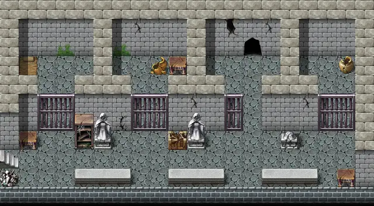

# Flagstone1

20×11 tiles

<label class="lg"><input type="checkbox" data-t="spawn" checked><b>Red</b>&nbsp;Monsters / NPCs</label><label class="lg"><input type="checkbox" data-t="mapchange" checked><b>Blue</b>&nbsp;Exit to another map</label><label class="lg"><input type="checkbox" data-t="container" checked><b>Yellow</b>&nbsp;Container (click to see contents)</label><label class="lg"><input type="checkbox" data-t="sign" checked><b>Purple</b>&nbsp;Sign</label><label class="lg"><input type="checkbox" data-t="rest" checked><b>Green</b>&nbsp;Resting place</label><label class="lg"><input type="checkbox" data-t="key" checked><b>Orange dashed</b>&nbsp;Blocked until a quest step / item</label><label class="lg"><input type="checkbox" data-t="script"><b>Grey dotted</b>&nbsp;Scripted event</label><label class="lg"><input type="checkbox" data-t="replace"><b>White dotted</b>&nbsp;Changes during a quest</label>

## Exits

- [Flagstone2](flagstone2.md)
- [Flagstone inner](flagstone_inner.md)

## Monsters & NPCs here

| Name | HP |
|---|---|
| [Starving prisoner](../monsters/starving_prisoner.md) | 10 |
| [Large cave rat](../monsters/large_cave_rat.md) | 21 |
| [Bone warrior](../monsters/bone_warrior.md) | 32 |
| [Fledgling gargoyle](../monsters/fledgling_gargoyle.md) | 35 |
| [Gargoyle](../monsters/gargoyle.md) | 47 |
| [Rotting corpse](../monsters/rotting_corpse.md) | 71 |
| [Walking corpse](../monsters/walking_corpse.md) | 90 |

<small>Map ID: `flagstone1` · Data from v0.8.18</small>
