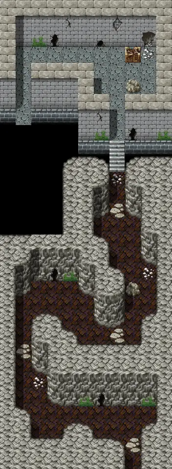

# Flagstone2

11×30 tiles · part of [Flagstone](index.md)

<label class="lg lg-spawn"><input type="checkbox" data-t="spawn" checked> Monsters / NPCs</label><label class="lg lg-mapchange"><input type="checkbox" data-t="mapchange" checked> Exit to another map</label><label class="lg lg-container"><input type="checkbox" data-t="container" checked> Container</label><label class="lg lg-sign"><input type="checkbox" data-t="sign" checked> Sign</label><label class="lg lg-rest"><input type="checkbox" data-t="rest" checked> Resting place</label><label class="lg lg-key"><input type="checkbox" data-t="key" checked> Blocked / needs key or quest</label><label class="lg lg-script"><input type="checkbox" data-t="script"> Scripted event</label><label class="lg lg-replace"><input type="checkbox" data-t="replace"> Changes after a quest</label>

## Exits

- [Flagstone1](flagstone1.md)
- [Flagstone3](flagstone3.md)

## Monsters & NPCs here

| Name | HP |
|---|---|
| [Starving prisoner](../monsters/starving_prisoner.md) | 10 |
| [Bone warrior](../monsters/bone_warrior.md) | 32 |
| [Skeleton](../monsters/skeleton.md) | 35 |
| [Fledgling gargoyle](../monsters/fledgling_gargoyle.md) | 35 |
| [Basilisk](../monsters/basilisk.md) | 40 |
| [Gargoyle](../monsters/gargoyle.md) | 47 |
| [Skeletal master](../monsters/skeletal_master.md) | 52 |
| [Skeletal warrior](../monsters/skeletal_warrior.md) | 52 |
| [Cave guardian](../monsters/cave_guardian.md) | 61 |
| [Rotting corpse](../monsters/rotting_corpse.md) | 71 |
| [Walking corpse](../monsters/walking_corpse.md) | 90 |

<small>Map ID: `flagstone2` · Data from v0.8.18</small>
