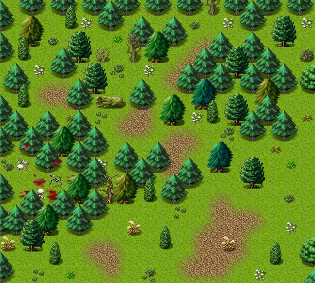

# Flagstone filler east 1

20×18 tiles · outdoors · part of [World1](index.md)

<label class="lg lg-spawn"><input type="checkbox" data-t="spawn" checked> Monsters / NPCs</label><label class="lg lg-mapchange"><input type="checkbox" data-t="mapchange" checked> Exit to another map</label><label class="lg lg-container"><input type="checkbox" data-t="container" checked> Container</label><label class="lg lg-sign"><input type="checkbox" data-t="sign" checked> Sign</label><label class="lg lg-rest"><input type="checkbox" data-t="rest" checked> Resting place</label><label class="lg lg-key"><input type="checkbox" data-t="key" checked> Blocked / needs key or quest</label><label class="lg lg-script"><input type="checkbox" data-t="script"> Scripted event</label><label class="lg lg-replace"><input type="checkbox" data-t="replace"> Changes after a quest</label>

## Exits

- [Flagstone0](flagstone0.md)
- [Flagstone filler east 2](flagstone_filler_east_2.md)
- [Lake shore road 0](lake_shore_road_0.md)

## Monsters & NPCs here

| Name | HP |
|---|---|
| [Wolf](../monsters/wolf.md) | 30 |
| [Basilisk](../monsters/basilisk.md) | 40 |
| [Lizard](../monsters/stn_lizard.md) | 50 |

<small>Map ID: `flagstone_filler_east_1` · Data from v0.8.18</small>
