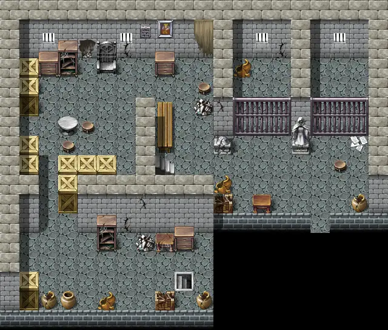

# Flagstone inner

| | |
|---|---|
| **Map ID** | `flagstone_inner` |
| **Region** | In Flagstone Prison (other) |
| **Type** | Indoors / underground |
| **Size** | 20×17 tiles |
| **Introduced** | v0.7.0 or earlier |
| **NPCs** | 3 |
| **Enemy types** | 4 |
| **Quests** | 0 |

**Flagstone inner** is an indoor map, in Flagstone Prison (other). It has 3 NPCs and 4 kinds of enemy. Exits lead to Flagstone0, Flagstone1, Flagstone upper.

## Map

<label class="lg"><input type="checkbox" data-t="spawn" checked><b>Red</b>&nbsp;Monsters / NPCs</label><label class="lg"><input type="checkbox" data-t="mapchange" checked><b>Blue</b>&nbsp;Exit to another map</label><label class="lg"><input type="checkbox" data-t="container" checked><b>Yellow</b>&nbsp;Container (click to see contents)</label><label class="lg"><input type="checkbox" data-t="sign" checked><b>Purple</b>&nbsp;Sign</label><label class="lg"><input type="checkbox" data-t="rest" checked><b>Green</b>&nbsp;Resting place</label><label class="lg"><input type="checkbox" data-t="key" checked><b>Orange dashed</b>&nbsp;Blocked until a quest step / item</label><label class="lg"><input type="checkbox" data-t="script"><b>Grey dotted</b>&nbsp;Scripted event</label><label class="lg"><input type="checkbox" data-t="replace"><b>White dotted</b>&nbsp;Changes during a quest</label><label class="lg"><input type="checkbox" data-t="pin" checked><b>Numbers</b>&nbsp;Numbered key points (see the key below the map)</label>

<a class="pin pin-exit" href="#key-1" style="left:82.500%;top:67.647%" title="Exit (exit outside): to [Flagstone0](../flagstone0.md)">1</a><a class="pin pin-exit" href="#key-2" style="left:47.500%;top:85.294%" title="Exit (stairs / passage): to [Flagstone1](../flagstone1.md)">2</a><a class="pin pin-exit" href="#key-3" style="left:42.500%;top:50.000%" title="Exit (stairs / passage): to [Flagstone upper](../flagstone_upper.md)">3</a><a class="pin pin-npc" href="#key-4" style="left:67.500%;top:32.353%" title="[Escaped prisoner](../../monsters/escaped_prisoner.md): NPC">4</a><a class="pin pin-npc" href="#key-5" style="left:57.500%;top:50.000%" title="[Rotting corpse](../../monsters/rotting_corpse.md): NPC">5</a><a class="pin pin-npc" href="#key-6" style="left:87.500%;top:20.588%" title="[Starving prisoner](../../monsters/starving_prisoner.md): NPC">6</a>

??? abstract "Key to the numbers on the map"

    | # | What | Details |
    |---|---|---|
    | 1 | Exit (exit outside) | to [Flagstone0](../flagstone0.md) |
    | 2 | Exit (stairs / passage) | to [Flagstone1](../flagstone1.md) |
    | 3 | Exit (stairs / passage) | to [Flagstone upper](../flagstone_upper.md) |
    | 4 | [Escaped prisoner](../monsters/escaped_prisoner.md) | NPC |
    | 5 | [Rotting corpse](../monsters/rotting_corpse.md) | NPC |
    | 6 | [Starving prisoner](../monsters/starving_prisoner.md) | NPC |

Verified against v0.8.18 map data.

## Connections

| Direction | Leads to | Region there | Map # |
|---|---|---|---|
| Exit outside | [Flagstone0](flagstone0.md) | Flagstone Prison | 1 |
| Stairs / passage | [Flagstone1](flagstone1.md) | Flagstone Prison | 2 |
| Stairs / passage | [Flagstone upper](flagstone_upper.md) | Flagstone Prison | 3 |

## NPCs

- [Escaped prisoner](../monsters/escaped_prisoner.md) (#4)
- [Rotting corpse](../monsters/rotting_corpse.md) (#5)
- [Starving prisoner](../monsters/starving_prisoner.md) (#6)

## Enemies

| Enemy | HP | Damage | Up to | Notes |
|---|---|---|---|---|
| [Bone warrior](../monsters/bone_warrior.md) | 32 | 3–9 | 1 | – |
| [Fledgling gargoyle](../monsters/fledgling_gargoyle.md) | 35 | 3–6 | 8 | shares spawn with Gargoyle, Rotting corpse, Walking corpse |
| [Gargoyle](../monsters/gargoyle.md) | 47 | 3–7 | 8 | shares spawn with Fledgling gargoyle, Rotting corpse, Walking corpse |
| [Walking corpse](../monsters/walking_corpse.md) | 90 | 2–4 | 8 | shares spawn with Fledgling gargoyle, Gargoyle, Rotting corpse |

<small>“Up to” is the most that can be alive at once from the spawn areas on this map.</small>

## Version history

| Version | Change |
|---|---|
| [v0.7.0](../versions/0.7.0.md) | Present in v0.7.0 (earliest release tracked) |
| [v0.7.1](../versions/0.7.1.md) | map layout or objects changed |
| [v0.7.2](../versions/0.7.2.md) | map layout or objects changed |
| [v0.8.2](../versions/0.8.2.md) | map layout or objects changed |

Verified against v0.8.18 and every earlier release back to v0.7.0 (game data compared release by release).

## Community notes

<small>Written by players, not generated from game data. **Observations**: what players notice in-game · **Lore**: the in-world story · **Trivia**: real-world facts, references, development history · **Theory / speculation**: unconfirmed ideas; may just be unfinished content</small>

### Observations

*Nothing here yet. Know something? [Add it](https://github.com/asdfghjkl628/Andor-s-Trail-Wikiiii/new/main/notes/maps?filename=flagstone_inner.md&value=%23%23%20Observations%0A%0A%3C%21--%20what%20players%20notice%20in-game%20--%3E%0A%0A%23%23%20Lore%0A%0A%3C%21--%20the%20in-world%20story%20--%3E%0A%0A%23%23%20Trivia%0A%0A%3C%21--%20real-world%20facts%2C%20references%2C%20development%20history%20--%3E%0A%0A%23%23%20Theory%20/%20speculation%0A%0A%3C%21--%20unconfirmed%20ideas%3B%20may%20just%20be%20unfinished%20content%20--%3E%0A).*

### Lore

*Nothing here yet. Know something? [Add it](https://github.com/asdfghjkl628/Andor-s-Trail-Wikiiii/new/main/notes/maps?filename=flagstone_inner.md&value=%23%23%20Observations%0A%0A%3C%21--%20what%20players%20notice%20in-game%20--%3E%0A%0A%23%23%20Lore%0A%0A%3C%21--%20the%20in-world%20story%20--%3E%0A%0A%23%23%20Trivia%0A%0A%3C%21--%20real-world%20facts%2C%20references%2C%20development%20history%20--%3E%0A%0A%23%23%20Theory%20/%20speculation%0A%0A%3C%21--%20unconfirmed%20ideas%3B%20may%20just%20be%20unfinished%20content%20--%3E%0A).*

### Trivia

*Nothing here yet. Know something? [Add it](https://github.com/asdfghjkl628/Andor-s-Trail-Wikiiii/new/main/notes/maps?filename=flagstone_inner.md&value=%23%23%20Observations%0A%0A%3C%21--%20what%20players%20notice%20in-game%20--%3E%0A%0A%23%23%20Lore%0A%0A%3C%21--%20the%20in-world%20story%20--%3E%0A%0A%23%23%20Trivia%0A%0A%3C%21--%20real-world%20facts%2C%20references%2C%20development%20history%20--%3E%0A%0A%23%23%20Theory%20/%20speculation%0A%0A%3C%21--%20unconfirmed%20ideas%3B%20may%20just%20be%20unfinished%20content%20--%3E%0A).*

### Theory / speculation

*Nothing here yet. Know something? [Add it](https://github.com/asdfghjkl628/Andor-s-Trail-Wikiiii/new/main/notes/maps?filename=flagstone_inner.md&value=%23%23%20Observations%0A%0A%3C%21--%20what%20players%20notice%20in-game%20--%3E%0A%0A%23%23%20Lore%0A%0A%3C%21--%20the%20in-world%20story%20--%3E%0A%0A%23%23%20Trivia%0A%0A%3C%21--%20real-world%20facts%2C%20references%2C%20development%20history%20--%3E%0A%0A%23%23%20Theory%20/%20speculation%0A%0A%3C%21--%20unconfirmed%20ideas%3B%20may%20just%20be%20unfinished%20content%20--%3E%0A).*

??? info "Technical information"

    | | |
    |---|---|
    | Map ID | `flagstone_inner` |
    | File | `res/xml/flagstone_inner.tmx` |
    | Size | 20×17 tiles (640×544 px) |
    | outdoors property | – |
    | Layers drawn | ground, objects, above |
    | Tilesets | map_bed_1, map_border_1, map_bridge_1, map_bridge_2, map_broken_1, map_cavewall_1, map_cavewall_2, map_cavewall_3, map_cavewall_4, map_chair_table_1, map_chair_table_2, map_crate_1, map_cupboard_1, map_curtain_1, map_entrance_1, map_entrance_2, map_fence_1, map_fence_2, map_fence_3, map_fence_4, map_ground_1, map_ground_2, map_ground_3, map_ground_4, map_ground_5, map_ground_6, map_ground_7, map_ground_8, map_house_1, map_house_2, map_indoor_1, map_indoor_2, map_kitchen_1, map_outdoor_1, map_pillar_1, map_pillar_2, map_plant_1, map_plant_2, map_rock_1, map_rock_2, map_roof_1, map_roof_2, map_roof_3, map_shop_1, map_sign_ladder_1, map_table_1, map_trail_1, map_transition_1, map_transition_2, map_transition_3, map_transition_4, map_transition_5, map_tree_1, map_tree_2, map_wall_1, map_wall_2, map_wall_3, map_wall_4, map_window_1, map_window_2 |
    | Map objects | spawn: 8, mapchange: 3 |
    | World map position | – |

<small>Data from v0.8.18</small>
