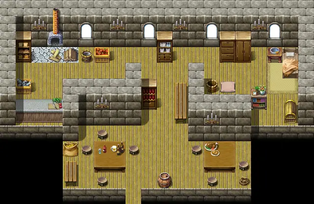

# Foaming flask

20×13 tiles

<label class="lg"><input type="checkbox" data-t="spawn" checked><b>Red</b>&nbsp;Monsters / NPCs</label><label class="lg"><input type="checkbox" data-t="mapchange" checked><b>Blue</b>&nbsp;Exit to another map</label><label class="lg"><input type="checkbox" data-t="container" checked><b>Yellow</b>&nbsp;Container (click to see contents)</label><label class="lg"><input type="checkbox" data-t="sign" checked><b>Purple</b>&nbsp;Sign</label><label class="lg"><input type="checkbox" data-t="rest" checked><b>Green</b>&nbsp;Resting place</label><label class="lg"><input type="checkbox" data-t="key" checked><b>Orange dashed</b>&nbsp;Blocked until a quest step / item</label><label class="lg"><input type="checkbox" data-t="script"><b>Grey dotted</b>&nbsp;Scripted event</label><label class="lg"><input type="checkbox" data-t="replace"><b>White dotted</b>&nbsp;Changes during a quest</label>

## Exits

- [Road1](road1.md)

## Monsters & NPCs here

| Name | HP |
|---|---|
| [Feygard patrol captain](../monsters/feygard_patrol_captain.md) | 0 |
| [Burhczyd](../monsters/burhczyd13.md) | 0 |
| [Ambelie](../monsters/ambelie.md) | 0 |
| [Knight of Elythom](../monsters/burhczyd13e.md) | 0 |
| [Foaming Flask cook](../monsters/foaming_flask_cook.md) | 0 |
| [Torilo](../monsters/torilo.md) | 0 |
| [Feygard patrol](../monsters/feygard_patrol.md) | 0 |

<small>Map ID: `foaming_flask` · Data from v0.8.18</small>
