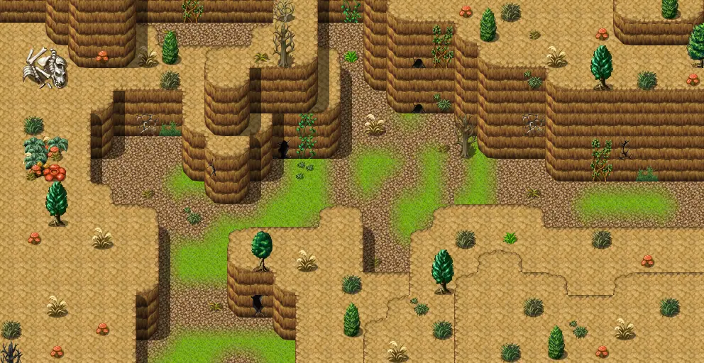

# Galmore 12a

31×16 tiles · part of [World1](index.md)

<label class="lg lg-spawn"><input type="checkbox" data-t="spawn" checked> Monsters / NPCs</label><label class="lg lg-mapchange"><input type="checkbox" data-t="mapchange" checked> Exit to another map</label><label class="lg lg-container"><input type="checkbox" data-t="container" checked> Container</label><label class="lg lg-sign"><input type="checkbox" data-t="sign" checked> Sign</label><label class="lg lg-rest"><input type="checkbox" data-t="rest" checked> Resting place</label><label class="lg lg-key"><input type="checkbox" data-t="key" checked> Blocked / needs key or quest</label><label class="lg lg-script"><input type="checkbox" data-t="script"> Scripted event</label><label class="lg lg-replace"><input type="checkbox" data-t="replace"> Changes after a quest</label>

## Exits

- [Galmore 12](galmore_12.md)
- [Galmore 13](galmore_13.md)
- [Stoutford filler 1](stoutford_filler_1.md)

## Monsters & NPCs here

| Name | HP |
|---|---|
| [Ruetmaple](../monsters/ruetmaple.md) | 50 |
| [Dirt spider](../monsters/dirt_spider.md) | 82 |

<small>Map ID: `galmore_12a` · Data from v0.8.18</small>
