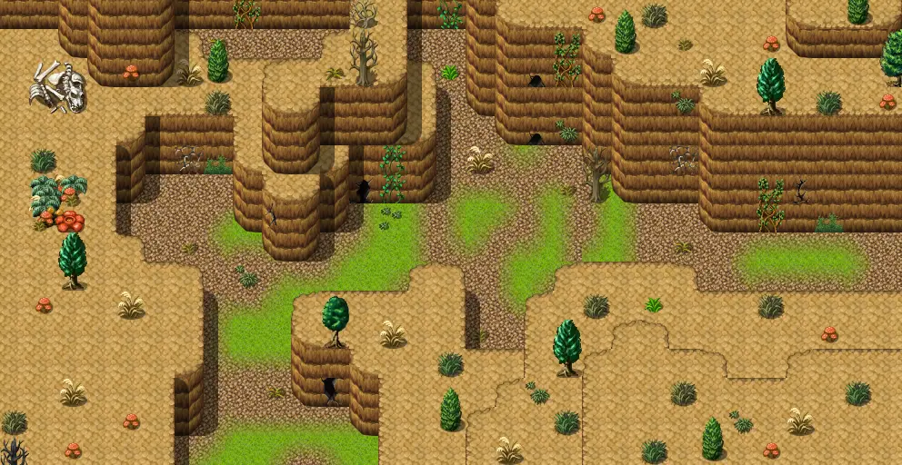

# Galmore 12a

| | |
|---|---|
| **Map ID** | `galmore_12a` |
| **Region** | In Stoutford (settlement) |
| **Type** | Indoors / underground |
| **Size** | 31×16 tiles |
| **World map** | [World1](index.md) |
| **Introduced** | [v0.8.14](../versions/0.8.14.md) |
| **NPCs** | 1 |
| **Enemy types** | 1 |
| **Quests** | 0 |

**Galmore 12a** is an indoor map, in Stoutford (settlement). It has 1 NPC and 1 kind of enemy. Exits lead to Stoutford filler 1, Galmore 12, Galmore 13.

## Map

<label class="lg"><input type="checkbox" data-t="spawn" checked><b>Red</b>&nbsp;Monsters / NPCs</label><label class="lg"><input type="checkbox" data-t="mapchange" checked><b>Blue</b>&nbsp;Exit to another map</label><label class="lg"><input type="checkbox" data-t="container" checked><b>Yellow</b>&nbsp;Container (click to see contents)</label><label class="lg"><input type="checkbox" data-t="sign" checked><b>Purple</b>&nbsp;Sign</label><label class="lg"><input type="checkbox" data-t="rest" checked><b>Green</b>&nbsp;Resting place</label><label class="lg"><input type="checkbox" data-t="key" checked><b>Orange dashed</b>&nbsp;Blocked until a quest step / item</label><label class="lg"><input type="checkbox" data-t="script"><b>Grey dotted</b>&nbsp;Scripted event</label><label class="lg"><input type="checkbox" data-t="replace"><b>White dotted</b>&nbsp;Changes during a quest</label><label class="lg"><input type="checkbox" data-t="pin" checked><b>Numbers</b>&nbsp;Numbered key points (see the key below the map)</label>

<a class="pin pin-exit" href="#key-1" style="left:27.419%;top:3.125%" title="Exit (north): to [Stoutford filler 1](../stoutford_filler_1.md)">1</a><a class="pin pin-exit" href="#key-1" style="left:70.968%;top:3.125%" title="Exit (north): to [Stoutford filler 1](../stoutford_filler_1.md)">1</a><a class="pin pin-exit" href="#key-2" style="left:98.387%;top:62.500%" title="Exit (east): to [Galmore 12](../galmore_12.md)">2</a><a class="pin pin-exit" href="#key-2" style="left:98.387%;top:21.875%" title="Exit (east): to [Galmore 12](../galmore_12.md)">2</a><a class="pin pin-exit" href="#key-3" style="left:30.645%;top:96.875%" title="Exit (south): to [Galmore 13](../galmore_13.md)">3</a><a class="pin pin-npc" href="#key-4" style="left:72.581%;top:65.625%" title="[Ruetmaple](../../monsters/ruetmaple.md): NPC">4</a><a class="pin pin-script" href="#key-5" style="left:46.774%;top:9.375%" title="Quest trigger: Scripted event: advances the quest: hidden story flag “galmore_nondisplayed” to stage 2 (“level 2 warning - marked stone”)">5</a><a class="pin pin-script" href="#key-6" style="left:30.645%;top:9.375%" title="Quest trigger: Scripted event: advances the quest: hidden story flag “galmore_nondisplayed” to stage 56 (“rubycrest strider spawned on stoutford_filler_4”)">6</a>

??? abstract "Key to the numbers on the map"

    | # | What | Details |
    |---|---|---|
    | 1 | Exit (north) | to [Stoutford filler 1](../stoutford_filler_1.md) |
    | 2 | Exit (east) | to [Galmore 12](../galmore_12.md) |
    | 3 | Exit (south) | to [Galmore 13](../galmore_13.md) |
    | 4 | [Ruetmaple](../monsters/ruetmaple.md) | NPC |
    | 5 | Quest trigger | Scripted event: advances the quest: hidden story flag “galmore_nondisplayed” to stage 2 (“level 2 warning - marked stone”) |
    | 6 | Quest trigger | Scripted event: advances the quest: hidden story flag “galmore_nondisplayed” to stage 56 (“rubycrest strider spawned on stoutford_filler_4”) |

Verified against v0.8.18 map data.

## Connections

| Direction | Leads to | Region there | Map # |
|---|---|---|---|
| North | [Stoutford filler 1](stoutford_filler_1.md) | Stoutford | 1 |
| East | [Galmore 12](galmore_12.md) | Stoutford | 2 |
| South | [Galmore 13](galmore_13.md) | Stoutford | 3 |

## NPCs

- [Ruetmaple](../monsters/ruetmaple.md) (#4)

## Enemies

| Enemy | HP | Damage | Up to | Notes |
|---|---|---|---|---|
| [Dirt spider](../monsters/dirt_spider.md) | 82 | 5–7 | 11 | – |

<small>“Up to” is the most that can be alive at once from the spawn areas on this map.</small>

## Quests

- [galmore_nondisplayed (hidden flag)](../quests/galmore_nondisplayed.md): something on this map advances it; stepping on a trigger here sets stage 1; stepping on a trigger here sets stage 2; stepping on a trigger here sets stage 52; stepping on a trigger here sets stage 53; stepping on a trigger here sets stage 54; stepping on a trigger here sets stage 55; stepping on a trigger here sets stage 56

## Points of interest

- **Quest trigger** (#5): Scripted event: advances the quest: hidden story flag “galmore_nondisplayed” to stage 2 (“level 2 warning - marked stone”)
- **Quest trigger** (#6): Scripted event: advances the quest: hidden story flag “galmore_nondisplayed” to stage 56 (“rubycrest strider spawned on stoutford_filler_4”)

## Version history

| Version | Change |
|---|---|
| [v0.8.14](../versions/0.8.14.md) | Added |

Verified against v0.8.18 and every earlier release back to v0.7.0 (game data compared release by release).

## Community notes

<small>Written by players, not generated from game data. **Observations**: what players notice in-game · **Lore**: the in-world story · **Trivia**: real-world facts, references, development history · **Theory / speculation**: unconfirmed ideas; may just be unfinished content</small>

### Observations

*Nothing here yet. Know something? [Add it](https://github.com/asdfghjkl628/Andor-s-Trail-Wikiiii/new/main/notes/maps?filename=galmore_12a.md&value=%23%23%20Observations%0A%0A%3C%21--%20what%20players%20notice%20in-game%20--%3E%0A%0A%23%23%20Lore%0A%0A%3C%21--%20the%20in-world%20story%20--%3E%0A%0A%23%23%20Trivia%0A%0A%3C%21--%20real-world%20facts%2C%20references%2C%20development%20history%20--%3E%0A%0A%23%23%20Theory%20/%20speculation%0A%0A%3C%21--%20unconfirmed%20ideas%3B%20may%20just%20be%20unfinished%20content%20--%3E%0A).*

### Lore

*Nothing here yet. Know something? [Add it](https://github.com/asdfghjkl628/Andor-s-Trail-Wikiiii/new/main/notes/maps?filename=galmore_12a.md&value=%23%23%20Observations%0A%0A%3C%21--%20what%20players%20notice%20in-game%20--%3E%0A%0A%23%23%20Lore%0A%0A%3C%21--%20the%20in-world%20story%20--%3E%0A%0A%23%23%20Trivia%0A%0A%3C%21--%20real-world%20facts%2C%20references%2C%20development%20history%20--%3E%0A%0A%23%23%20Theory%20/%20speculation%0A%0A%3C%21--%20unconfirmed%20ideas%3B%20may%20just%20be%20unfinished%20content%20--%3E%0A).*

### Trivia

*Nothing here yet. Know something? [Add it](https://github.com/asdfghjkl628/Andor-s-Trail-Wikiiii/new/main/notes/maps?filename=galmore_12a.md&value=%23%23%20Observations%0A%0A%3C%21--%20what%20players%20notice%20in-game%20--%3E%0A%0A%23%23%20Lore%0A%0A%3C%21--%20the%20in-world%20story%20--%3E%0A%0A%23%23%20Trivia%0A%0A%3C%21--%20real-world%20facts%2C%20references%2C%20development%20history%20--%3E%0A%0A%23%23%20Theory%20/%20speculation%0A%0A%3C%21--%20unconfirmed%20ideas%3B%20may%20just%20be%20unfinished%20content%20--%3E%0A).*

### Theory / speculation

*Nothing here yet. Know something? [Add it](https://github.com/asdfghjkl628/Andor-s-Trail-Wikiiii/new/main/notes/maps?filename=galmore_12a.md&value=%23%23%20Observations%0A%0A%3C%21--%20what%20players%20notice%20in-game%20--%3E%0A%0A%23%23%20Lore%0A%0A%3C%21--%20the%20in-world%20story%20--%3E%0A%0A%23%23%20Trivia%0A%0A%3C%21--%20real-world%20facts%2C%20references%2C%20development%20history%20--%3E%0A%0A%23%23%20Theory%20/%20speculation%0A%0A%3C%21--%20unconfirmed%20ideas%3B%20may%20just%20be%20unfinished%20content%20--%3E%0A).*

??? info "Technical information"

    | | |
    |---|---|
    | Map ID | `galmore_12a` |
    | File | `res/xml/galmore_12a.tmx` |
    | Size | 31×16 tiles (992×512 px) |
    | outdoors property | – |
    | Layers drawn | base, ground, objects, above, top |
    | Tilesets | map_bed_1, map_border_1, map_bridge_1, map_bridge_2, map_broken_1, map_cavewall_1, map_cavewall_2, map_cavewall_3, map_cavewall_4, map_chair_table_1, map_chair_table_2, map_crate_1, map_cupboard_1, map_curtain_1, map_entrance_1, map_entrance_2, map_fence_1, map_fence_2, map_fence_3, map_fence_4, map_ground_1, map_ground_2, map_ground_3, map_ground_4, map_ground_5, map_ground_6, map_ground_7, map_ground_8, map_house_1, map_house_2, map_indoor_1, map_indoor_2, map_kitchen_1, map_outdoor_1, map_pillar_1, map_pillar_2, map_plant_1, map_plant_2, map_rock_1, map_rock_2, map_roof_1, map_roof_2, map_roof_3, map_shop_1, map_sign_ladder_1, map_table_1, map_trail_1, map_transition_1, map_transition_2, map_transition_3, map_transition_4, map_transition_5, map_tree_1, map_tree_2, map_tree_3, map_wall_1, map_wall_2, map_wall_3, map_wall_4, map_window_1, map_window_2 |
    | Map objects | spawn: 6, mapchange: 5, script: 3 |
    | World map position | segment `world1`, x 3, y 586 |

<small>Data from v0.8.18</small>
