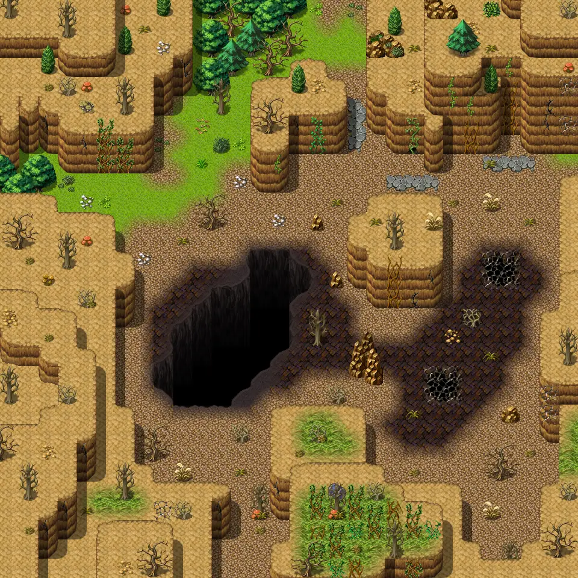

# Galmore 23

30×30 tiles · outdoors · part of [World1](index.md)

<label class="lg lg-spawn"><input type="checkbox" data-t="spawn" checked> Monsters / NPCs</label><label class="lg lg-mapchange"><input type="checkbox" data-t="mapchange" checked> Exit to another map</label><label class="lg lg-container"><input type="checkbox" data-t="container" checked> Container</label><label class="lg lg-sign"><input type="checkbox" data-t="sign" checked> Sign</label><label class="lg lg-rest"><input type="checkbox" data-t="rest" checked> Resting place</label><label class="lg lg-key"><input type="checkbox" data-t="key" checked> Blocked / needs key or quest</label><label class="lg lg-script"><input type="checkbox" data-t="script"> Scripted event</label><label class="lg lg-replace"><input type="checkbox" data-t="replace"> Changes after a quest</label>

## Exits

- [Galmore 13](galmore_13.md)
- [Galmore 24](galmore_24.md)
- [Galmore 33](galmore_33.md)

## Monsters & NPCs here

| Name | HP |
|---|---|
| [Dirt spider](../monsters/dirt_spider.md) | 82 |
| [Flying tree ant](../monsters/flying_tree_ant.md) | 119 |
| [Thorny vine](../monsters/thorny_vine_bottom.md) | 144 |
| [Harrowback](../monsters/harrowback.md) | 197 |

<small>Map ID: `galmore_23` · Data from v0.8.18</small>
