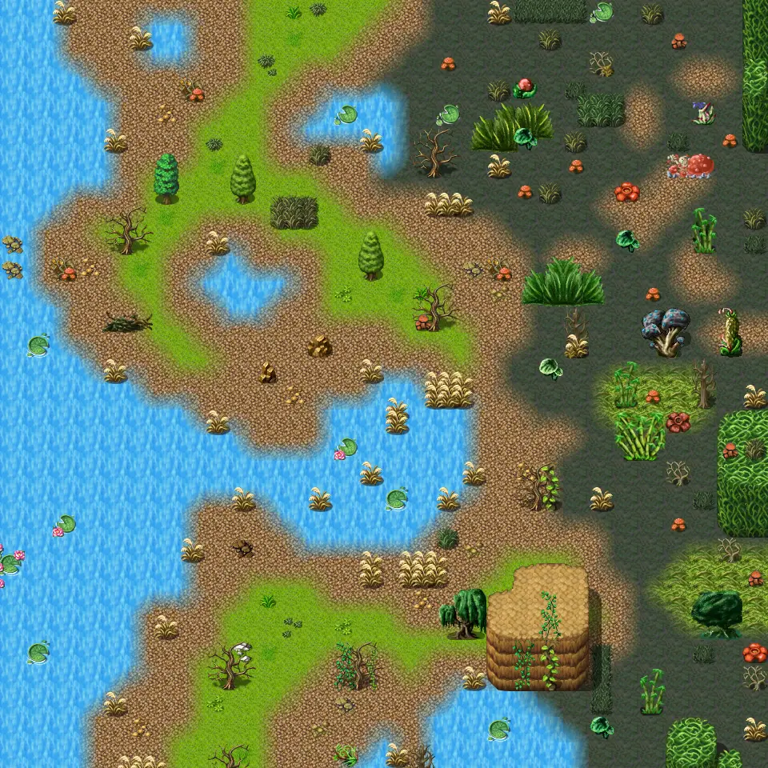

# Galmore 27

30×30 tiles · outdoors · part of [World1](index.md)

<label class="lg"><input type="checkbox" data-t="spawn" checked><b>Red</b>&nbsp;Monsters / NPCs</label><label class="lg"><input type="checkbox" data-t="mapchange" checked><b>Blue</b>&nbsp;Exit to another map</label><label class="lg"><input type="checkbox" data-t="container" checked><b>Yellow</b>&nbsp;Container (click to see contents)</label><label class="lg"><input type="checkbox" data-t="sign" checked><b>Purple</b>&nbsp;Sign</label><label class="lg"><input type="checkbox" data-t="rest" checked><b>Green</b>&nbsp;Resting place</label><label class="lg"><input type="checkbox" data-t="key" checked><b>Orange dashed</b>&nbsp;Blocked until a quest step / item</label><label class="lg"><input type="checkbox" data-t="script"><b>Grey dotted</b>&nbsp;Scripted event</label><label class="lg"><input type="checkbox" data-t="replace"><b>White dotted</b>&nbsp;Changes during a quest</label>

## Exits

- [Galmore 17](galmore_17.md)
- [Galmore 26](galmore_26.md)
- [Galmore 28](galmore_28.md)
- [Galmore 37](galmore_37.md)

## Monsters & NPCs here

| Name | HP |
|---|---|
| [Pond fish](../monsters/pond_fish.md) | 0 |
| [Swamp hornet](../monsters/swamp_hornet.md) | 99 |
| [Swamp beetle](../monsters/swamp_bettle.md) | 101 |
| [Giant mosquito](../monsters/giant_mosquito.md) | 106 |
| [Snapmaw](../monsters/snapmaw.md) | 114 |

<small>Map ID: `galmore_27` · Data from v0.8.18</small>
