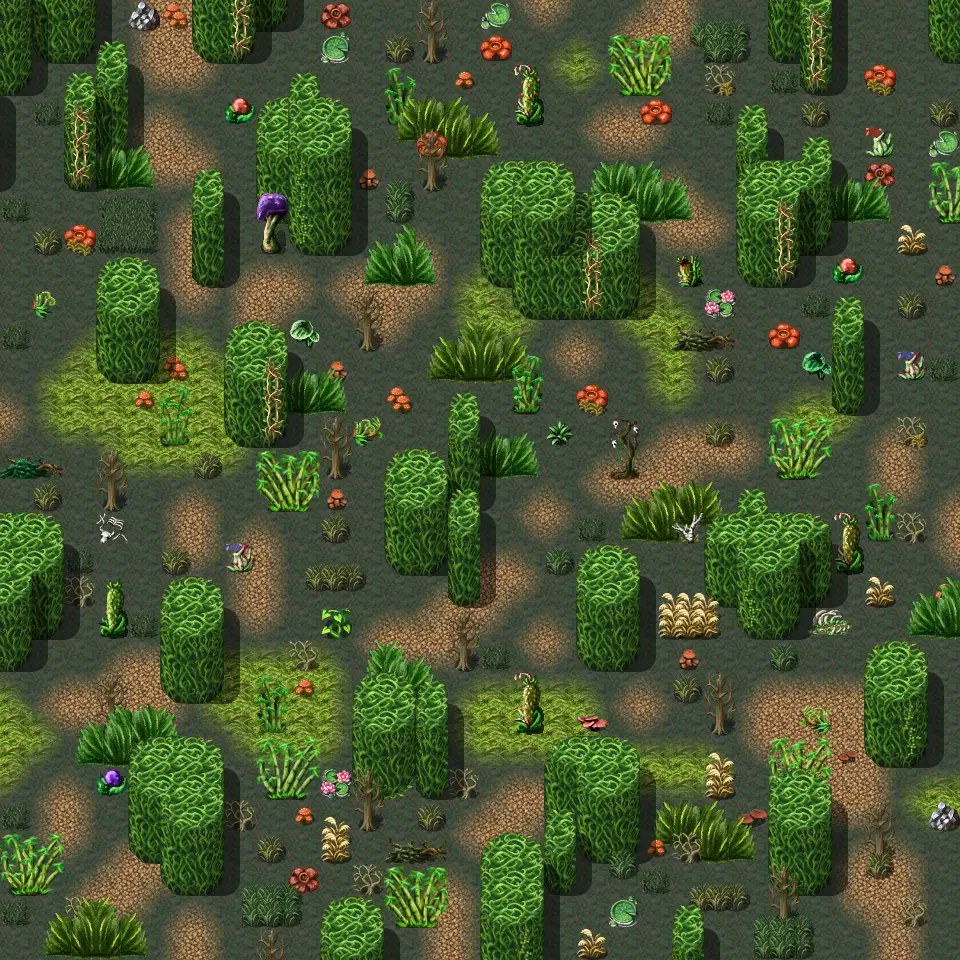

# Galmore 28

30×30 tiles · outdoors · part of [World1](index.md)

<label class="lg lg-spawn"><input type="checkbox" data-t="spawn" checked> Monsters / NPCs</label><label class="lg lg-mapchange"><input type="checkbox" data-t="mapchange" checked> Exit to another map</label><label class="lg lg-container"><input type="checkbox" data-t="container" checked> Container</label><label class="lg lg-sign"><input type="checkbox" data-t="sign" checked> Sign</label><label class="lg lg-rest"><input type="checkbox" data-t="rest" checked> Resting place</label><label class="lg lg-key"><input type="checkbox" data-t="key" checked> Blocked / needs key or quest</label><label class="lg lg-script"><input type="checkbox" data-t="script"> Scripted event</label><label class="lg lg-replace"><input type="checkbox" data-t="replace"> Changes after a quest</label>

## Exits

- [Galmore 18](galmore_18.md)
- [Galmore 27](galmore_27.md)
- [Galmore 29](galmore_29.md)
- [Galmore 38](galmore_38.md)

## Monsters & NPCs here

| Name | HP |
|---|---|
| [Swamp hornet](../monsters/swamp_hornet.md) | 99 |
| [Giant mosquito](../monsters/giant_mosquito.md) | 106 |
| [Bog eel](../monsters/bog_eel_leech.md) | 121 |
| [Bog eel](../monsters/bog_eel.md) | 121 |
| [Swamp lizard](../monsters/swamp_lizard_leech.md) | 130 |
| [Crocodilian behemoth](../monsters/crocodilian_behemoth.md) | 130 |
| [Swamp lizard](../monsters/swamp_lizard.md) | 130 |
| [Venomous swamp creature](../monsters/venomous_swamp_creature.md) | 301 |

<small>Map ID: `galmore_28` · Data from v0.8.18</small>
