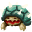

# Galmore 29

30×30 tiles · outdoors · part of [World1](index.md)

<label class="lg"><input type="checkbox" data-t="spawn" checked><b>Red</b>&nbsp;Monsters / NPCs</label><label class="lg"><input type="checkbox" data-t="mapchange" checked><b>Blue</b>&nbsp;Exit to another map</label><label class="lg"><input type="checkbox" data-t="container" checked><b>Yellow</b>&nbsp;Container (click to see contents)</label><label class="lg"><input type="checkbox" data-t="sign" checked><b>Purple</b>&nbsp;Sign</label><label class="lg"><input type="checkbox" data-t="rest" checked><b>Green</b>&nbsp;Resting place</label><label class="lg"><input type="checkbox" data-t="key" checked><b>Orange dashed</b>&nbsp;Blocked until a quest step / item</label><label class="lg"><input type="checkbox" data-t="script"><b>Grey dotted</b>&nbsp;Scripted event</label><label class="lg"><input type="checkbox" data-t="replace"><b>White dotted</b>&nbsp;Changes during a quest</label>

## Containers

<b>Container 1</b><ul><li><a href="../../items/gold/">Gold coins</a> <small>100% · ×10000</small></li></ul>

## Exits

- [Galmore 19](galmore_19.md)
- [Galmore 28](galmore_28.md)
- [Galmore 39](galmore_39.md)
- [Galmore train cave](galmore_train_cave.md)
- [Way to sullengard west 3](way_to_sullengard_west_3.md)

## Monsters & NPCs here

| Name | HP |
|---|---|
| [River snapper](../monsters/sutdover_snapper.md) | 100 |
| [Swamp beetle](../monsters/swamp_bettle.md) | 101 |
| [Giant mosquito](../monsters/giant_mosquito.md) | 106 |

<small>Map ID: `galmore_29` · Data from v0.8.18</small>
