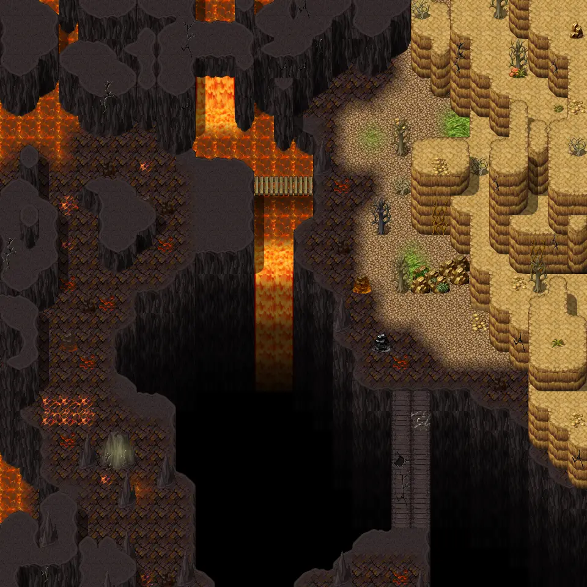
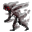

# Galmore 32

30×30 tiles · outdoors · part of [World1](index.md)

<label class="lg"><input type="checkbox" data-t="spawn" checked><b>Red</b>&nbsp;Monsters / NPCs</label><label class="lg"><input type="checkbox" data-t="mapchange" checked><b>Blue</b>&nbsp;Exit to another map</label><label class="lg"><input type="checkbox" data-t="container" checked><b>Yellow</b>&nbsp;Container (click to see contents)</label><label class="lg"><input type="checkbox" data-t="sign" checked><b>Purple</b>&nbsp;Sign</label><label class="lg"><input type="checkbox" data-t="rest" checked><b>Green</b>&nbsp;Resting place</label><label class="lg"><input type="checkbox" data-t="key" checked><b>Orange dashed</b>&nbsp;Blocked until a quest step / item</label><label class="lg"><input type="checkbox" data-t="script"><b>Grey dotted</b>&nbsp;Scripted event</label><label class="lg"><input type="checkbox" data-t="replace"><b>White dotted</b>&nbsp;Changes during a quest</label>

## Exits

- [Galmore 33](galmore_33.md)
- [Galmore 42](galmore_42.md)

## Monsters & NPCs here

| Name | HP |
|---|---|
| [Dark spirit minion](../monsters/dark_spirit_minion.md) | 247 |
| [Pyreling](../monsters/pyreling.md) | 266 |
| [Lava entity](../monsters/lava_entity.md) | 290 |
| [Dark spirit](../monsters/undertell_dark_spirit.md) | 509 |

<small>Map ID: `galmore_32` · Data from v0.8.18</small>
