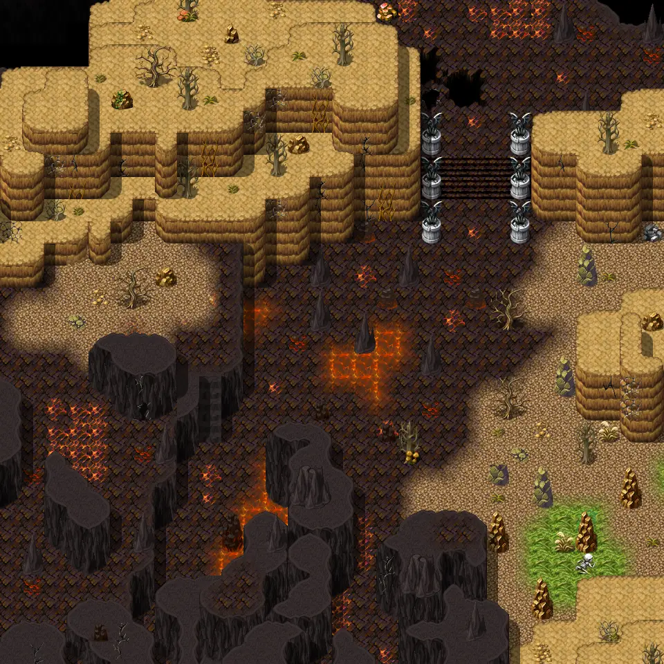

# Galmore 43

30×30 tiles · outdoors · part of [World1](index.md)

<label class="lg"><input type="checkbox" data-t="spawn" checked><b>Red</b>&nbsp;Monsters / NPCs</label><label class="lg"><input type="checkbox" data-t="mapchange" checked><b>Blue</b>&nbsp;Exit to another map</label><label class="lg"><input type="checkbox" data-t="container" checked><b>Yellow</b>&nbsp;Container (click to see contents)</label><label class="lg"><input type="checkbox" data-t="sign" checked><b>Purple</b>&nbsp;Sign</label><label class="lg"><input type="checkbox" data-t="rest" checked><b>Green</b>&nbsp;Resting place</label><label class="lg"><input type="checkbox" data-t="key" checked><b>Orange dashed</b>&nbsp;Blocked until a quest step / item</label><label class="lg"><input type="checkbox" data-t="script"><b>Grey dotted</b>&nbsp;Scripted event</label><label class="lg"><input type="checkbox" data-t="replace"><b>White dotted</b>&nbsp;Changes during a quest</label>

## Exits

- [Galmore 33](galmore_33.md)
- [Galmore 42](galmore_42.md)
- [Galmore 44](galmore_44.md)
- [Galmore 53](galmore_53.md)

## Monsters & NPCs here

| Name | HP |
|---|---|
| [Spitfire bug](../monsters/spitfire_bug.md) | 106 |
| [Mutated harrowback](../monsters/mutated_harrowback.md) | 197 |
| [Molten pyreling](../monsters/molten_pyreling.md) | 236 |
| [Erupting pyreling](../monsters/erupting_pyreling.md) | 246 |

<small>Map ID: `galmore_43` · Data from v0.8.18</small>
