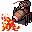
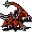

# Galmore 45

30×30 tiles · outdoors · part of [World1](index.md)

<label class="lg"><input type="checkbox" data-t="spawn" checked><b>Red</b>&nbsp;Monsters / NPCs</label><label class="lg"><input type="checkbox" data-t="mapchange" checked><b>Blue</b>&nbsp;Exit to another map</label><label class="lg"><input type="checkbox" data-t="container" checked><b>Yellow</b>&nbsp;Container (click to see contents)</label><label class="lg"><input type="checkbox" data-t="sign" checked><b>Purple</b>&nbsp;Sign</label><label class="lg"><input type="checkbox" data-t="rest" checked><b>Green</b>&nbsp;Resting place</label><label class="lg"><input type="checkbox" data-t="key" checked><b>Orange dashed</b>&nbsp;Blocked until a quest step / item</label><label class="lg"><input type="checkbox" data-t="script"><b>Grey dotted</b>&nbsp;Scripted event</label><label class="lg"><input type="checkbox" data-t="replace"><b>White dotted</b>&nbsp;Changes during a quest</label>

## Exits

- [Galmore 35](galmore_35.md)
- [Galmore 44](galmore_44.md)
- [Galmore 46](galmore_46.md)
- [Galmore 55](galmore_55.md)

## Monsters & NPCs here

| Name | HP |
|---|---|
| [Miri](../monsters/dds_miri.md) | 0 |
| [Borvis](../monsters/dds_borvis.md) | 0 |
| [Mourning woman](../monsters/dds_mourning_woman.md) | 0 |
| [Dirt spider](../monsters/dirt_spider.md) | 82 |
| [Young spitfire bug](../monsters/young_spitfire_bug.md) | 106 |
| [Ridgehowler](../monsters/ridgehowler.md) | 180 |
| [Mutated harrowback](../monsters/mutated_harrowback.md) | 197 |
| [Dreadmane](../monsters/dreadmane.md) | 235 |
| [Kazaul statue](../monsters/dds_kazaul_statue.md) | 478 |

<small>Map ID: `galmore_45` · Data from v0.8.18</small>
