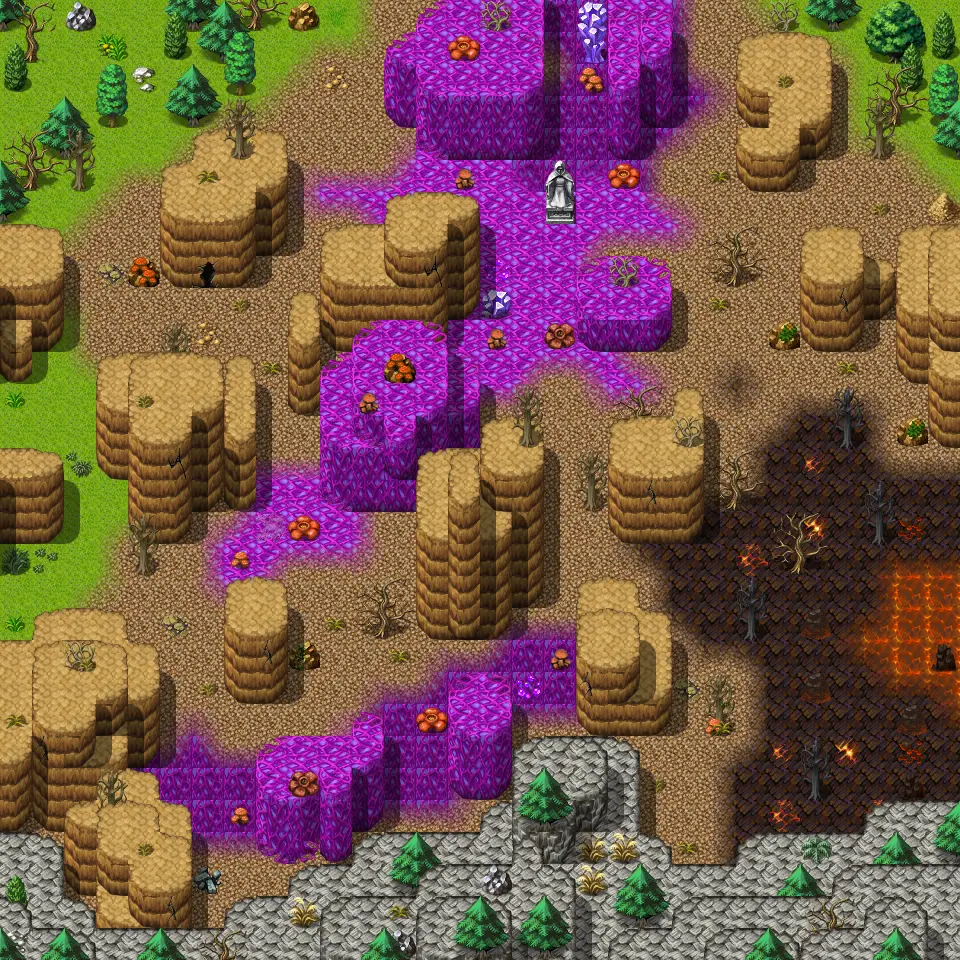
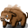

# Galmore 45

| | |
|---|---|
| **Map ID** | `galmore_45` |
| **Region** | Near Mt. Galmore (other) |
| **Type** | Outdoors |
| **Size** | 30×30 tiles |
| **World map** | [World1](index.md) |
| **Introduced** | [v0.8.14](../versions/0.8.14.md) |
| **NPCs** | 3 |
| **Enemy types** | 6 |
| **Quests** | 3 |

**Galmore 45** is an outdoor map, near Mt. Galmore (other). It has 3 NPCs and 6 kinds of enemy. Exits lead to Galmore 35, Galmore 46, Galmore 55, Galmore 44.

## Map

<label class="lg"><input type="checkbox" data-t="spawn" checked><b>Red</b>&nbsp;Monsters / NPCs</label><label class="lg"><input type="checkbox" data-t="mapchange" checked><b>Blue</b>&nbsp;Exit to another map</label><label class="lg"><input type="checkbox" data-t="container" checked><b>Yellow</b>&nbsp;Container (click to see contents)</label><label class="lg"><input type="checkbox" data-t="sign" checked><b>Purple</b>&nbsp;Sign</label><label class="lg"><input type="checkbox" data-t="rest" checked><b>Green</b>&nbsp;Resting place</label><label class="lg"><input type="checkbox" data-t="key" checked><b>Orange dashed</b>&nbsp;Blocked until a quest step / item</label><label class="lg"><input type="checkbox" data-t="script"><b>Grey dotted</b>&nbsp;Scripted event</label><label class="lg"><input type="checkbox" data-t="replace"><b>White dotted</b>&nbsp;Changes during a quest</label><label class="lg"><input type="checkbox" data-t="pin" checked><b>Numbers</b>&nbsp;Numbered key points (see the key below the map)</label>

<a class="pin pin-exit" href="#key-1" style="left:50.000%;top:1.667%" title="Exit (north): to [Galmore 35](../galmore_35.md)">1</a><a class="pin pin-exit" href="#key-2" style="left:98.333%;top:65.000%" title="Exit (east): to [Galmore 46](../galmore_46.md)">2</a><a class="pin pin-exit" href="#key-2" style="left:98.333%;top:18.333%" title="Exit (east): to [Galmore 46](../galmore_46.md)">2</a><a class="pin pin-exit" href="#key-3" style="left:81.667%;top:98.333%" title="Exit (south): to [Galmore 55](../galmore_55.md)">3</a><a class="pin pin-exit" href="#key-4" style="left:1.667%;top:38.333%" title="Exit (west): to [Galmore 44](../galmore_44.md)">4</a><a class="pin pin-npc" href="#key-5" style="left:65.000%;top:21.667%" title="[Borvis](../../monsters/dds_borvis.md): 1 quest">5</a><a class="pin pin-npc" href="#key-6" style="left:65.000%;top:25.000%" title="[Miri](../../monsters/dds_miri.md): 1 quest">6</a><a class="pin pin-npc" href="#key-7" style="left:58.333%;top:25.000%" title="[Mourning woman](../../monsters/dds_mourning_woman.md): 2 quests">7</a><a class="pin pin-key" href="#key-8" style="left:58.333%;top:21.667%" title="Blocked passage: Closed off once you reach this point in the quest: hidden story flag “dds_nd” (stage 3: “3=Dark shield active”)">8</a><a class="pin pin-key" href="#key-9" style="left:58.553%;top:17.500%" title="Blocked passage: Closed off once you reach this point in the quest: Search for Andor (stage 1: “My father Mikhail says that Andor has not been home since yesterday. I should go look for him in the village.”)">9</a><a class="pin pin-replace" href="#key-10" style="left:55.400%;top:21.148%" title="Changes during a quest: This area changes during the quest: hidden story flag “dds_nd” (stage 3: “3=Dark shield active”)">10</a><a class="pin pin-replace" href="#key-11" style="left:61.007%;top:19.966%" title="Changes during a quest: This area changes back during the quest: hidden story flag “dds_nd” (stage 3: “3=Dark shield active”)">11</a>

??? abstract "Key to the numbers on the map"

    | # | What | Details |
    |---|---|---|
    | 1 | Exit (north) | to [Galmore 35](../galmore_35.md) |
    | 2 | Exit (east) | to [Galmore 46](../galmore_46.md) |
    | 3 | Exit (south) | to [Galmore 55](../galmore_55.md) |
    | 4 | Exit (west) | to [Galmore 44](../galmore_44.md) |
    | 5 | [Borvis](../monsters/dds_borvis.md) | 1 quest |
    | 6 | [Miri](../monsters/dds_miri.md) | 1 quest |
    | 7 | [Mourning woman](../monsters/dds_mourning_woman.md) | 2 quests |
    | 8 | Blocked passage | Closed off once you reach this point in the quest: hidden story flag “dds_nd” (stage 3: “3=Dark shield active”) |
    | 9 | Blocked passage | Closed off once you reach this point in the quest: Search for Andor (stage 1: “My father Mikhail says that Andor has not been home since yesterday. I should go look for him in the village.”) |
    | 10 | Changes during a quest | This area changes during the quest: hidden story flag “dds_nd” (stage 3: “3=Dark shield active”) |
    | 11 | Changes during a quest | This area changes back during the quest: hidden story flag “dds_nd” (stage 3: “3=Dark shield active”) |

Verified against v0.8.18 map data.

## Connections

| Direction | Leads to | Region there | Map # |
|---|---|---|---|
| North | [Galmore 35](galmore_35.md) | Mt. Galmore | 1 |
| East | [Galmore 46](galmore_46.md) | Mt. Galmore | 2 |
| South | [Galmore 55](galmore_55.md) | Mt. Galmore | 3 |
| West | [Galmore 44](galmore_44.md) | Mt. Galmore | 4 |

## NPCs

- [Borvis](../monsters/dds_borvis.md) — quests: [Shadows](../quests/shadows.md) (#5)
- [Miri](../monsters/dds_miri.md) — quests: [Darkness in the Daylight](../quests/darkness_in_daylight.md) (#6)
- [Mourning woman](../monsters/dds_mourning_woman.md) — quests: [Darkness in the Daylight](../quests/darkness_in_daylight.md), [Shadows](../quests/shadows.md) (#7)

## Enemies

| Enemy | HP | Damage | Up to | Notes |
|---|---|---|---|---|
| [Dirt spider](../monsters/dirt_spider.md) | 82 | 5–7 | 3 | – |
| [Young spitfire bug](../monsters/young_spitfire_bug.md) | 106 | 9–11 | 5 | – |
| [Ridgehowler](../monsters/ridgehowler.md) | 180 | 19–19 | 2 | – |
| [Mutated harrowback](../monsters/mutated_harrowback.md) | 197 | 10–13 | 14 | – |
| [Dreadmane](../monsters/dreadmane.md) | 235 | 15–21 | 2 | – |
| [Kazaul statue](../monsters/dds_kazaul_statue.md) | 478 | 10–14 | 1 | appears later, during a quest |

<small>“Up to” is the most that can be alive at once from the spawn areas on this map.</small>

## Quests

- [Darkness in the Daylight](../quests/darkness_in_daylight.md): [Miri](../monsters/dds_miri.md) is involved; [Mourning woman](../monsters/dds_mourning_woman.md) is involved; something on this map advances it
- [Search for Andor](../quests/andor.md): blocked passage closes at stage 1
- [Shadows](../quests/shadows.md): [Borvis](../monsters/dds_borvis.md) is involved; [Mourning woman](../monsters/dds_mourning_woman.md) is involved; something on this map advances it
- [Darkness in the Daylight and Shadows - Non displayed (hidden flag)](../quests/dds_nd.md): [Borvis](../monsters/dds_borvis.md) is involved; [Miri](../monsters/dds_miri.md) is involved; blocked passage closes at stage 3; part of the map changes at stage 3

## Points of interest

- **Blocked passage** (#8): Closed off once you reach this point in the quest: hidden story flag “dds_nd” (stage 3: “3=Dark shield active”)
- **Blocked passage** (#9): Closed off once you reach this point in the quest: Search for Andor (stage 1: “My father Mikhail says that Andor has not been home since yesterday. I should go look for him in the village.”)
- **Changes during a quest** (#10): This area changes during the quest: hidden story flag “dds_nd” (stage 3: “3=Dark shield active”)
- **Changes during a quest** (#11): This area changes back during the quest: hidden story flag “dds_nd” (stage 3: “3=Dark shield active”)

## Version history

| Version | Change |
|---|---|
| [v0.8.14](../versions/0.8.14.md) | Added |

Verified against v0.8.18 and every earlier release back to v0.7.0 (game data compared release by release).

## Community notes

<small>Written by players, not generated from game data. **Observations**: what players notice in-game · **Lore**: the in-world story · **Trivia**: real-world facts, references, development history · **Theory / speculation**: unconfirmed ideas; may just be unfinished content</small>

### Observations

*Nothing here yet. Know something? [Add it](https://github.com/asdfghjkl628/Andor-s-Trail-Wikiiii/new/main/notes/maps?filename=galmore_45.md&value=%23%23%20Observations%0A%0A%3C%21--%20what%20players%20notice%20in-game%20--%3E%0A%0A%23%23%20Lore%0A%0A%3C%21--%20the%20in-world%20story%20--%3E%0A%0A%23%23%20Trivia%0A%0A%3C%21--%20real-world%20facts%2C%20references%2C%20development%20history%20--%3E%0A%0A%23%23%20Theory%20/%20speculation%0A%0A%3C%21--%20unconfirmed%20ideas%3B%20may%20just%20be%20unfinished%20content%20--%3E%0A).*

### Lore

*Nothing here yet. Know something? [Add it](https://github.com/asdfghjkl628/Andor-s-Trail-Wikiiii/new/main/notes/maps?filename=galmore_45.md&value=%23%23%20Observations%0A%0A%3C%21--%20what%20players%20notice%20in-game%20--%3E%0A%0A%23%23%20Lore%0A%0A%3C%21--%20the%20in-world%20story%20--%3E%0A%0A%23%23%20Trivia%0A%0A%3C%21--%20real-world%20facts%2C%20references%2C%20development%20history%20--%3E%0A%0A%23%23%20Theory%20/%20speculation%0A%0A%3C%21--%20unconfirmed%20ideas%3B%20may%20just%20be%20unfinished%20content%20--%3E%0A).*

### Trivia

*Nothing here yet. Know something? [Add it](https://github.com/asdfghjkl628/Andor-s-Trail-Wikiiii/new/main/notes/maps?filename=galmore_45.md&value=%23%23%20Observations%0A%0A%3C%21--%20what%20players%20notice%20in-game%20--%3E%0A%0A%23%23%20Lore%0A%0A%3C%21--%20the%20in-world%20story%20--%3E%0A%0A%23%23%20Trivia%0A%0A%3C%21--%20real-world%20facts%2C%20references%2C%20development%20history%20--%3E%0A%0A%23%23%20Theory%20/%20speculation%0A%0A%3C%21--%20unconfirmed%20ideas%3B%20may%20just%20be%20unfinished%20content%20--%3E%0A).*

### Theory / speculation

*Nothing here yet. Know something? [Add it](https://github.com/asdfghjkl628/Andor-s-Trail-Wikiiii/new/main/notes/maps?filename=galmore_45.md&value=%23%23%20Observations%0A%0A%3C%21--%20what%20players%20notice%20in-game%20--%3E%0A%0A%23%23%20Lore%0A%0A%3C%21--%20the%20in-world%20story%20--%3E%0A%0A%23%23%20Trivia%0A%0A%3C%21--%20real-world%20facts%2C%20references%2C%20development%20history%20--%3E%0A%0A%23%23%20Theory%20/%20speculation%0A%0A%3C%21--%20unconfirmed%20ideas%3B%20may%20just%20be%20unfinished%20content%20--%3E%0A).*

??? info "Technical information"

    | | |
    |---|---|
    | Map ID | `galmore_45` |
    | File | `res/xml/galmore_45.tmx` |
    | Size | 30×30 tiles (960×960 px) |
    | outdoors property | 1 |
    | Layers drawn | base, ground, objects, above, top |
    | Tilesets | map_bed_1, map_border_1, map_bridge_1, map_bridge_2, map_broken_1, map_cavewall_1, map_cavewall_2, map_cavewall_3, map_cavewall_4, map_cavewall_5, map_chair_table_1, map_chair_table_2, map_crate_1, map_cupboard_1, map_curtain_1, map_entrance_1, map_entrance_2, map_fence_1, map_fence_2, map_fence_3, map_fence_4, map_ground_1, map_ground_2, map_ground_3, map_ground_4, map_ground_5, map_ground_6, map_ground_7, map_ground_8, map_house_1, map_house_2, map_indoor_1, map_indoor_2, map_kitchen_1, map_outdoor_1, map_pillar_1, map_pillar_2, map_plant_1, map_plant_2, map_rock_1, map_rock_2, map_rock_3, map_roof_1, map_roof_2, map_roof_3, map_shop_1, map_sign_ladder_1, map_table_1, map_trail_1, map_transition_1, map_transition_2, map_transition_3, map_transition_4, map_transition_5, map_transition_6, map_tree_1, map_tree_2, map_wall_1, map_wall_2, map_wall_3, map_wall_4, map_window_1, map_window_2 |
    | Map objects | spawn: 23, script: 7, mapchange: 5, key: 2, replace: 2 |
    | World map position | segment `world1`, x 65, y 696 |

<small>Data from v0.8.18</small>
