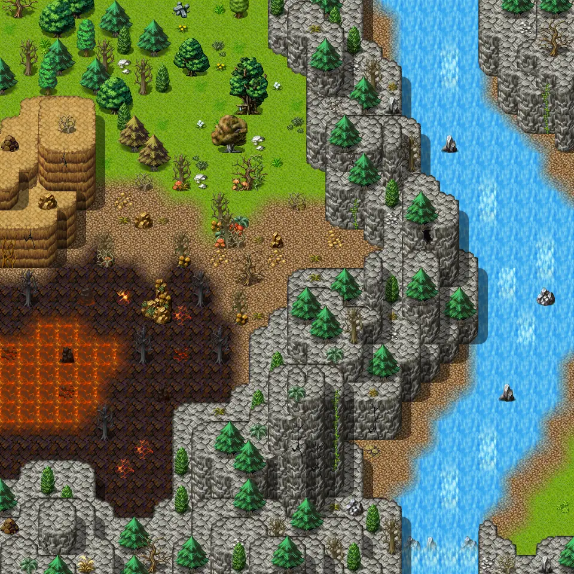

# Galmore 46

30×30 tiles · outdoors · part of [World1](index.md)

<label class="lg lg-spawn"><input type="checkbox" data-t="spawn" checked> Monsters / NPCs</label><label class="lg lg-mapchange"><input type="checkbox" data-t="mapchange" checked> Exit to another map</label><label class="lg lg-container"><input type="checkbox" data-t="container" checked> Container</label><label class="lg lg-sign"><input type="checkbox" data-t="sign" checked> Sign</label><label class="lg lg-rest"><input type="checkbox" data-t="rest" checked> Resting place</label><label class="lg lg-key"><input type="checkbox" data-t="key" checked> Blocked / needs key or quest</label><label class="lg lg-script"><input type="checkbox" data-t="script"> Scripted event</label><label class="lg lg-replace"><input type="checkbox" data-t="replace"> Changes after a quest</label>

## Exits

- [Galmore 36](galmore_36.md)
- [Galmore 45](galmore_45.md)
- [Galmore 47](galmore_47.md)

## Monsters & NPCs here

| Name | HP |
|---|---|
| [Pond fish](../monsters/pond_fish.md) | 0 |
| [River snapper](../monsters/sutdover_snapper.md) | 100 |
| [Young spitfire bug](../monsters/young_spitfire_bug.md) | 106 |
| [Ridgehowler](../monsters/ridgehowler.md) | 180 |
| [Mutated harrowback](../monsters/mutated_harrowback.md) | 197 |
| [River wretch](../monsters/river_wretch.md) | 201 |

<small>Map ID: `galmore_46` · Data from v0.8.18</small>
