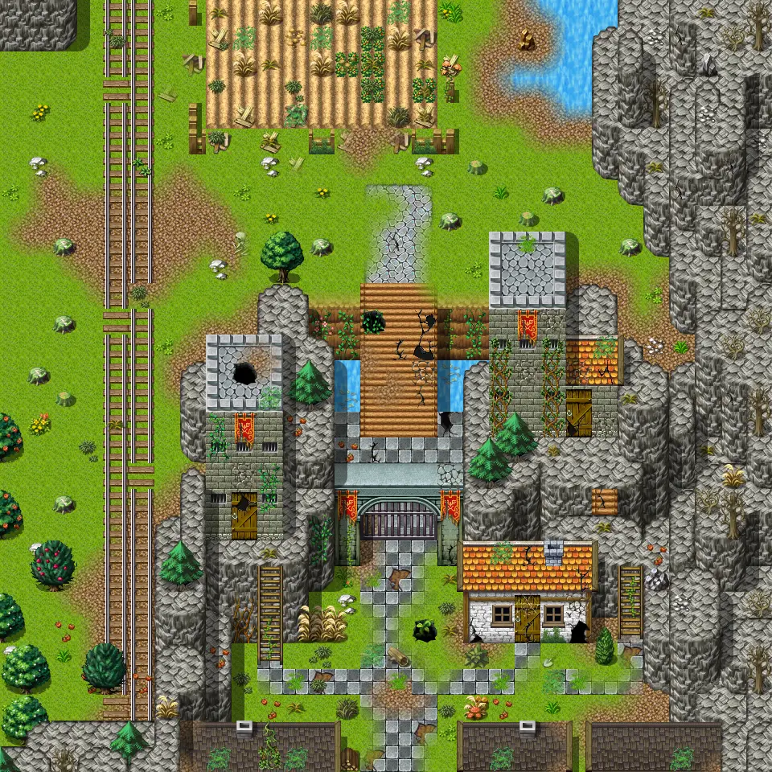
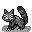

# Galmore 48

30×30 tiles · outdoors · part of [World1](index.md)

<label class="lg"><input type="checkbox" data-t="spawn" checked><b>Red</b>&nbsp;Monsters / NPCs</label><label class="lg"><input type="checkbox" data-t="mapchange" checked><b>Blue</b>&nbsp;Exit to another map</label><label class="lg"><input type="checkbox" data-t="container" checked><b>Yellow</b>&nbsp;Container (click to see contents)</label><label class="lg"><input type="checkbox" data-t="sign" checked><b>Purple</b>&nbsp;Sign</label><label class="lg"><input type="checkbox" data-t="rest" checked><b>Green</b>&nbsp;Resting place</label><label class="lg"><input type="checkbox" data-t="key" checked><b>Orange dashed</b>&nbsp;Blocked until a quest step / item</label><label class="lg"><input type="checkbox" data-t="script"><b>Grey dotted</b>&nbsp;Scripted event</label><label class="lg"><input type="checkbox" data-t="replace"><b>White dotted</b>&nbsp;Changes during a quest</label>

## Exits

- [Galmore 38](galmore_38.md)
- [Galmore 47](galmore_47.md)
- [Galmore 58](galmore_58.md)
- [Galmore rail cave](galmore_rail_cave.md)
- [Mt galmore0 h1](mt_galmore0_h1.md)
- [Mt galmore0 h2](mt_galmore0_h2.md)
- [Mt galmore nw tower f1](mt_galmore_nw_tower_f1.md)

## Monsters & NPCs here

| Name | HP |
|---|---|
| [Aroughcun kit](../monsters/aroughcun_kit.md) | 155 |
| [Sow aroughcun](../monsters/aroughcun_sow.md) | 175 |
| [Bridge bogling](../monsters/bridge_bogling.md) | 222 |

<small>Map ID: `galmore_48` · Data from v0.8.18</small>
