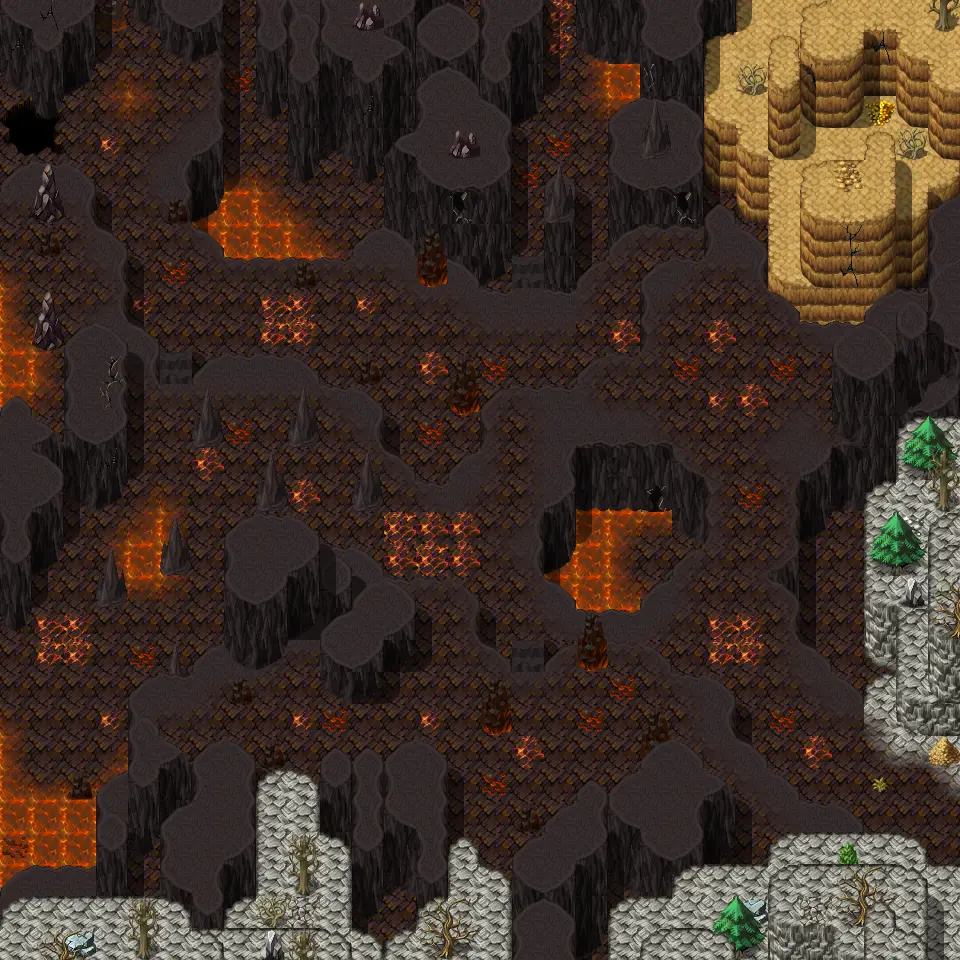
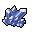

# Galmore 53

30×30 tiles · outdoors · part of [World1](index.md)

<label class="lg"><input type="checkbox" data-t="spawn" checked><b>Red</b>&nbsp;Monsters / NPCs</label><label class="lg"><input type="checkbox" data-t="mapchange" checked><b>Blue</b>&nbsp;Exit to another map</label><label class="lg"><input type="checkbox" data-t="container" checked><b>Yellow</b>&nbsp;Container (click to see contents)</label><label class="lg"><input type="checkbox" data-t="sign" checked><b>Purple</b>&nbsp;Sign</label><label class="lg"><input type="checkbox" data-t="rest" checked><b>Green</b>&nbsp;Resting place</label><label class="lg"><input type="checkbox" data-t="key" checked><b>Orange dashed</b>&nbsp;Blocked until a quest step / item</label><label class="lg"><input type="checkbox" data-t="script"><b>Grey dotted</b>&nbsp;Scripted event</label><label class="lg"><input type="checkbox" data-t="replace"><b>White dotted</b>&nbsp;Changes during a quest</label>

## Containers

<b>Container 1</b><ul><li><a href="../../items/garnet_stone/">Garnet stone</a> <small>100%</small></li><li><a href="../../items/gold_bar/">Gold bar</a> <small>100%</small></li><li><a href="../../items/crystal_blue/">Blue Crystals</a> <small>100% · ×1 to 2</small></li></ul>

## Exits

- [Galmore 43](galmore_43.md)
- [Galmore 52](galmore_52.md)
- [Galmore 54](galmore_54.md)
- [Galmore 63](galmore_63.md)

## Monsters & NPCs here

| Name | HP |
|---|---|
| [Spitfire bug](../monsters/spitfire_bug.md) | 106 |
| [Molten pyreling](../monsters/molten_pyreling.md) | 236 |
| [Erupting pyreling](../monsters/erupting_pyreling.md) | 246 |
| [Pyreling](../monsters/pyreling.md) | 266 |

<small>Map ID: `galmore_53` · Data from v0.8.18</small>
