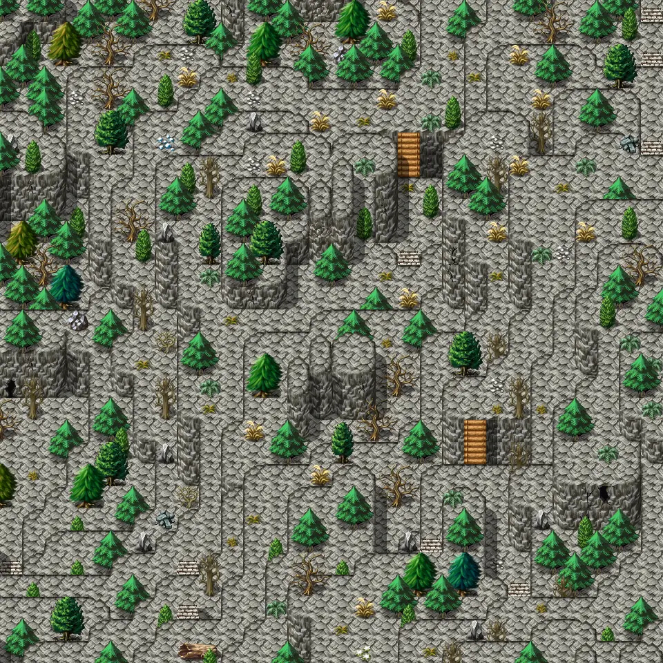

# Galmore 55

30×30 tiles · outdoors · part of [World1](index.md)

<label class="lg lg-spawn"><input type="checkbox" data-t="spawn" checked> Monsters / NPCs</label><label class="lg lg-mapchange"><input type="checkbox" data-t="mapchange" checked> Exit to another map</label><label class="lg lg-container"><input type="checkbox" data-t="container" checked> Container</label><label class="lg lg-sign"><input type="checkbox" data-t="sign" checked> Sign</label><label class="lg lg-rest"><input type="checkbox" data-t="rest" checked> Resting place</label><label class="lg lg-key"><input type="checkbox" data-t="key" checked> Blocked / needs key or quest</label><label class="lg lg-script"><input type="checkbox" data-t="script"> Scripted event</label><label class="lg lg-replace"><input type="checkbox" data-t="replace"> Changes after a quest</label>

## Exits

- [Galmore 45](galmore_45.md)
- [Galmore 54](galmore_54.md)
- [Galmore 56](galmore_56.md)
- [Galmore 65](galmore_65.md)

## Monsters & NPCs here

| Name | HP |
|---|---|
| [River wretch](../monsters/river_wretch.md) | 201 |
| [Aroughcun](../monsters/aroughcun.md) | 204 |
| [Mountain bridge bogling](../monsters/mt_bridge_bogling.md) | 232 |
| [Dreadmane](../monsters/dreadmane.md) | 235 |
| [Galmore wolf](../monsters/mg2_wolves.md) | 251 |

<small>Map ID: `galmore_55` · Data from v0.8.18</small>
