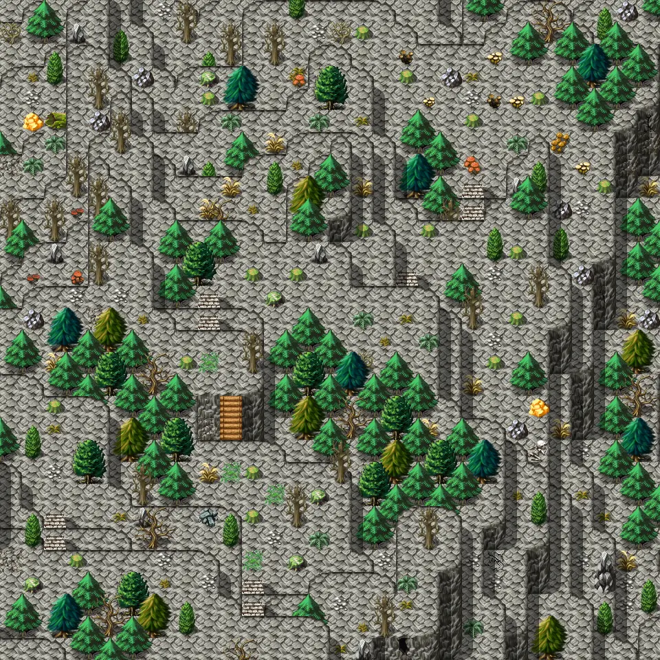

# Galmore 57

30×30 tiles · outdoors · part of [World1](index.md)

<label class="lg"><input type="checkbox" data-t="spawn" checked><b>Red</b>&nbsp;Monsters / NPCs</label><label class="lg"><input type="checkbox" data-t="mapchange" checked><b>Blue</b>&nbsp;Exit to another map</label><label class="lg"><input type="checkbox" data-t="container" checked><b>Yellow</b>&nbsp;Container (click to see contents)</label><label class="lg"><input type="checkbox" data-t="sign" checked><b>Purple</b>&nbsp;Sign</label><label class="lg"><input type="checkbox" data-t="rest" checked><b>Green</b>&nbsp;Resting place</label><label class="lg"><input type="checkbox" data-t="key" checked><b>Orange dashed</b>&nbsp;Blocked until a quest step / item</label><label class="lg"><input type="checkbox" data-t="script"><b>Grey dotted</b>&nbsp;Scripted event</label><label class="lg"><input type="checkbox" data-t="replace"><b>White dotted</b>&nbsp;Changes during a quest</label>

## Exits

- [Galmore 56](galmore_56.md)
- [Galmore 67](galmore_67.md)

## Monsters & NPCs here

| Name | HP |
|---|---|
| [Scardy aroughcun](../monsters/scardy_aroughcun.md) | 170 |
| [Sow aroughcun](../monsters/aroughcun_sow.md) | 175 |
| [Aroughcun](../monsters/aroughcun.md) | 204 |
| [Mountain bridge bogling](../monsters/mt_bridge_bogling.md) | 232 |
| [Dreadmane](../monsters/dreadmane.md) | 235 |

<small>Map ID: `galmore_57` · Data from v0.8.18</small>
