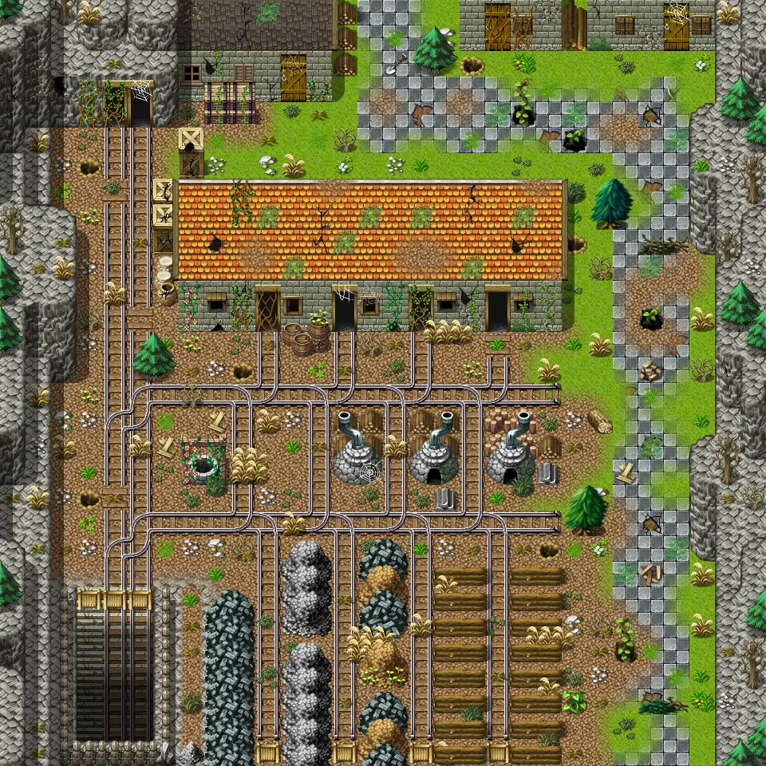
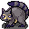

# Galmore 58

| | |
|---|---|
| **Map ID** | `galmore_58` |
| **Region** | Near Mt. Galmore (other) |
| **Type** | Outdoors |
| **Size** | 30×30 tiles |
| **World map** | [World 1](index.md) |
| **Introduced** | [v0.8.14](../versions/0.8.14.md) |
| **NPCs** | 1 |
| **Enemy types** | 4 |
| **Quests** | 3 |

**Galmore 58** is an outdoor map, near Mt. Galmore (other). It has 1 NPC and 4 kinds of enemy. Exits lead to Galmore 48, Galmore 58 house 3, Galmore 68, Undertell exit and 3 more.

## Map

<label class="lg"><input type="checkbox" data-t="spawn" checked><b>Red</b>&nbsp;Monsters / NPCs</label><label class="lg"><input type="checkbox" data-t="mapchange" checked><b>Blue</b>&nbsp;Exit to another map</label><label class="lg"><input type="checkbox" data-t="container" checked><b>Yellow</b>&nbsp;Container (click to see contents)</label><label class="lg"><input type="checkbox" data-t="sign" checked><b>Purple</b>&nbsp;Sign</label><label class="lg"><input type="checkbox" data-t="rest" checked><b>Green</b>&nbsp;Resting place</label><label class="lg"><input type="checkbox" data-t="key" checked><b>Orange dashed</b>&nbsp;Blocked until a quest step / item</label><label class="lg"><input type="checkbox" data-t="script"><b>Grey dotted</b>&nbsp;Scripted event</label><label class="lg"><input type="checkbox" data-t="replace"><b>White dotted</b>&nbsp;Changes during a quest</label><label class="lg"><input type="checkbox" data-t="pin" checked><b>Numbers</b>&nbsp;Numbered key points (see the key below the map)</label>

<a class="pin pin-exit" href="#key-1" style="left:53.333%;top:1.667%" title="Exit (north): to [Galmore 48](galmore_48.md)">1</a><a class="pin pin-exit" href="#key-2" style="left:88.333%;top:5.000%" title="Exit (north): to [Galmore 58 house 3](galmore_58_house3.md)">2</a><a class="pin pin-exit" href="#key-3" style="left:85.000%;top:98.333%" title="Exit (south): to [Galmore 68](galmore_68.md)">3</a><a class="pin pin-exit" href="#key-4" style="left:15.000%;top:98.333%" title="Exit (south): to [Undertell exit](undertell_exit.md)">4</a><a class="pin pin-exit" href="#key-5" style="left:38.333%;top:11.667%" title="Exit (door): to [Galmore 58 house 1](galmore_58_house1.md)">5</a><a class="pin pin-exit" href="#key-6" style="left:18.333%;top:15.000%" title="Exit (cave entrance): to [Galmore rail cave](galmore_rail_cave.md)">6</a><a class="pin pin-exit" href="#key-7" style="left:45.000%;top:41.667%" title="Exit (door): to [Mt galmore railhouse](mt_galmore_railhouse.md)">7</a><a class="pin pin-exit" href="#key-7" style="left:65.000%;top:41.667%" title="Exit (door): to [Mt galmore railhouse](mt_galmore_railhouse.md)">7</a><a id="pin-npc-mg_myrelis" class="pin pin-npc" href="#key-8" style="left:58.333%;top:45.000%" title="[Myrelis](../../monsters/mg_myrelis.md): 2 quests">8</a><a class="pin pin-key" href="#key-9" style="left:15.000%;top:78.333%" title="Blocked passage: Unlocked during the quest: You shall pass (stage 160: “Shannal thanked me for helping Rain and warned me to be careful. She removed the barricades in front of the entrance to Undertell.”)">9</a><a class="pin pin-script" href="#key-10" style="left:53.333%;top:91.667%" title="Quest trigger: Scripted event: advances the quest: Devotion to stage 70 (“Once more I was thrown out of the caverns the moment I approached a shade. This time, Anoa better help me in a smart way.”)">10</a><a class="pin pin-replace" href="#key-11" style="left:15.219%;top:75.834%" title="Changes during a quest: This area changes during the quest: You shall pass (stage 160: “Shannal thanked me for helping Rain and warned me to be careful. She removed the barricades in front of the entrance to Undertell.”)">11</a>

??? abstract "Key to the numbers on the map"

    | # | What | Details |
    |---|---|---|
    | 1 | Exit (north) | to [Galmore 48](galmore_48.md) |
    | 2 | Exit (north) | to [Galmore 58 house 3](galmore_58_house3.md) |
    | 3 | Exit (south) | to [Galmore 68](galmore_68.md) |
    | 4 | Exit (south) | to [Undertell exit](undertell_exit.md) |
    | 5 | Exit (door) | to [Galmore 58 house 1](galmore_58_house1.md) |
    | 6 | Exit (cave entrance) | to [Galmore rail cave](galmore_rail_cave.md) |
    | 7 | Exit (door) | to [Mt galmore railhouse](mt_galmore_railhouse.md) |
    | 8 | [Myrelis](../monsters/mg_myrelis.md) | 2 quests |
    | 9 | Blocked passage | Unlocked during the quest: You shall pass (stage 160: “Shannal thanked me for helping Rain and warned me to be careful. She removed the barricades in front of the entrance to Undertell.”) |
    | 10 | Quest trigger | Scripted event: advances the quest: Devotion to stage 70 (“Once more I was thrown out of the caverns the moment I approached a shade. This time, Anoa better help me in a smart way.”) |
    | 11 | Changes during a quest | This area changes during the quest: You shall pass (stage 160: “Shannal thanked me for helping Rain and warned me to be careful. She removed the barricades in front of the entrance to Undertell.”) |

Verified against v0.8.18 map data.

## Connections

| Direction | Leads to | Region there | Map # |
|---|---|---|---|
| North | [Galmore 48](galmore_48.md) | Mt. Galmore | 1 |
| North | [Galmore 58 house 3](galmore_58_house3.md) | Mt. Galmore | 2 |
| South | [Galmore 68](galmore_68.md) | Mt. Galmore | 3 |
| South | [Undertell exit](undertell_exit.md) | Mt. Galmore | 4 |
| Door | [Galmore 58 house 1](galmore_58_house1.md) | Mt. Galmore | 5 |
| Cave entrance | [Galmore rail cave](galmore_rail_cave.md) | Mt. Galmore | 6 |
| Door | [Mt galmore railhouse](mt_galmore_railhouse.md) | Mt. Galmore | 7 |

## NPCs

- [Myrelis](../monsters/mg_myrelis.md) — quests: [Lost treasures](../quests/nocmar.md), [You shall pass](../quests/undertell_barricades.md) (#8)

## Enemies

| Enemy | HP | Damage | Up to | Notes |
|---|---|---|---|---|
| [Aroughcun kit](../monsters/aroughcun_kit.md) | 155 | 10–15 | 6 | – |
| [Agile aroughcun](../monsters/aroughcun_agile.md) | 168 | 10–15 | 2 | – |
| [Scardy aroughcun](../monsters/scardy_aroughcun.md) | 170 | 12–17 | 3 | – |
| [Sow aroughcun](../monsters/aroughcun_sow.md) | 175 | 12–17 | 10 | – |

<small>“Up to” is the most that can be alive at once from the spawn areas on this map.</small>

## Quests

- [Devotion](../quests/devotion.md): something on this map advances it; stepping on a trigger here sets stage 30; stepping on a trigger here sets stage 50; stepping on a trigger here sets stage 70
- [Lost treasures](../quests/nocmar.md): [Myrelis](../monsters/mg_myrelis.md) is involved
- [You shall pass](../quests/undertell_barricades.md): [Myrelis](../monsters/mg_myrelis.md) is involved; blocked passage opens at stage 160; part of the map changes at stage 160
- [Galmore story flags (hidden flag)](../quests/galmore_nondisplayed.md): [Myrelis](../monsters/mg_myrelis.md) is involved
- [Undertell story flags (hidden flag)](../quests/undertell_hidden.md): something on this map advances it

## Points of interest

- **Blocked passage** (#9): Unlocked during the quest: You shall pass (stage 160: “Shannal thanked me for helping Rain and warned me to be careful. She removed the barricades in front of the entrance to Undertell.”)
- **Quest trigger** (#10): Scripted event: advances the quest: Devotion to stage 70 (“Once more I was thrown out of the caverns the moment I approached a shade. This time, Anoa better help me in a smart way.”)
- **Changes during a quest** (#11): This area changes during the quest: You shall pass (stage 160: “Shannal thanked me for helping Rain and warned me to be careful. She removed the barricades in front of the entrance to Undertell.”)

## Version history

| Version | Change |
|---|---|
| [v0.8.14](../versions/0.8.14.md) | Added |
| [v0.8.18](../versions/0.8.18.md) | Map layout or objects changed |

Verified against v0.8.18 and every earlier release back to v0.7.0 (game data compared release by release).

## Community notes

<small>Written by players, not generated from game data. **Observations**: what players notice in-game · **Lore**: the in-world story · **Trivia**: real-world facts, references, development history · **Theory / speculation**: unconfirmed ideas; may just be unfinished content</small>

### Observations

*No notes yet. Contributions are welcome: [add a note](https://github.com/asdfghjkl628/Andor-s-Trail-Wikiiii/new/main/notes/maps?filename=galmore_58.md&value=%23%23%20Observations%0A%0A%3C%21--%20what%20players%20notice%20in-game%20--%3E%0A%0A%23%23%20Lore%0A%0A%3C%21--%20the%20in-world%20story%20--%3E%0A%0A%23%23%20Trivia%0A%0A%3C%21--%20real-world%20facts%2C%20references%2C%20development%20history%20--%3E%0A%0A%23%23%20Theory%20/%20speculation%0A%0A%3C%21--%20unconfirmed%20ideas%3B%20may%20just%20be%20unfinished%20content%20--%3E%0A).*

### Lore

*No notes yet. Contributions are welcome: [add a note](https://github.com/asdfghjkl628/Andor-s-Trail-Wikiiii/new/main/notes/maps?filename=galmore_58.md&value=%23%23%20Observations%0A%0A%3C%21--%20what%20players%20notice%20in-game%20--%3E%0A%0A%23%23%20Lore%0A%0A%3C%21--%20the%20in-world%20story%20--%3E%0A%0A%23%23%20Trivia%0A%0A%3C%21--%20real-world%20facts%2C%20references%2C%20development%20history%20--%3E%0A%0A%23%23%20Theory%20/%20speculation%0A%0A%3C%21--%20unconfirmed%20ideas%3B%20may%20just%20be%20unfinished%20content%20--%3E%0A).*

### Trivia

*No notes yet. Contributions are welcome: [add a note](https://github.com/asdfghjkl628/Andor-s-Trail-Wikiiii/new/main/notes/maps?filename=galmore_58.md&value=%23%23%20Observations%0A%0A%3C%21--%20what%20players%20notice%20in-game%20--%3E%0A%0A%23%23%20Lore%0A%0A%3C%21--%20the%20in-world%20story%20--%3E%0A%0A%23%23%20Trivia%0A%0A%3C%21--%20real-world%20facts%2C%20references%2C%20development%20history%20--%3E%0A%0A%23%23%20Theory%20/%20speculation%0A%0A%3C%21--%20unconfirmed%20ideas%3B%20may%20just%20be%20unfinished%20content%20--%3E%0A).*

### Theory / speculation

*No notes yet. Contributions are welcome: [add a note](https://github.com/asdfghjkl628/Andor-s-Trail-Wikiiii/new/main/notes/maps?filename=galmore_58.md&value=%23%23%20Observations%0A%0A%3C%21--%20what%20players%20notice%20in-game%20--%3E%0A%0A%23%23%20Lore%0A%0A%3C%21--%20the%20in-world%20story%20--%3E%0A%0A%23%23%20Trivia%0A%0A%3C%21--%20real-world%20facts%2C%20references%2C%20development%20history%20--%3E%0A%0A%23%23%20Theory%20/%20speculation%0A%0A%3C%21--%20unconfirmed%20ideas%3B%20may%20just%20be%20unfinished%20content%20--%3E%0A).*

??? info "Technical information"

    | | |
    |---|---|
    | Map ID | `galmore_58` |
    | File | `res/xml/galmore_58.tmx` |
    | Size | 30×30 tiles (960×960 px) |
    | outdoors property | 1 |
    | Layers drawn | base, ground, objects, above, top |
    | Tilesets | map_bed_1, map_border_1, map_bridge_1, map_bridge_2, map_broken_1, map_cavewall_1, map_cavewall_2, map_cavewall_3, map_cavewall_4, map_cavewall_5, map_chair_table_1, map_chair_table_2, map_crate_1, map_cupboard_1, map_curtain_1, map_entrance_1, map_entrance_2, map_fence_1, map_fence_2, map_fence_3, map_fence_4, map_ground_1, map_ground_2, map_ground_3, map_ground_4, map_ground_5, map_ground_6, map_ground_7, map_ground_8, map_house_1, map_house_2, map_indoor_1, map_indoor_2, map_kitchen_1, map_outdoor_1, map_pillar_1, map_pillar_2, map_plant_1, map_plant_2, map_plant_3, map_rock_1, map_rock_2, map_rock_3, map_roof_1, map_roof_2, map_roof_3, map_shop_1, map_sign_ladder_1, map_table_1, map_trail_1, map_transition_1, map_transition_2, map_transition_3, map_transition_4, map_transition_5, map_transition_6, map_tree_1, map_tree_2, map_tree_3, map_wall_1, map_wall_2, map_wall_3, map_wall_4, map_window_1, map_window_2 |
    | Map objects | spawn: 14, mapchange: 9, script: 2, key: 1, replace: 1 |
    | World map position | segment `world1`, x 158, y 727 |

<small>Data from v0.8.18</small>
