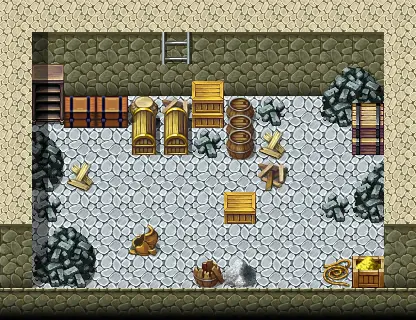

# Galmore 58 house 1b

| | |
|---|---|
| **Map ID** | `galmore_58_house1b` |
| **Type** | Indoors / underground |
| **Size** | 13×10 tiles |
| **Introduced** | [v0.8.14](../versions/0.8.14.md) |
| **Enemy types** | 1 |
| **Quests** | 1 |
| **Containers** | 7 |

**Galmore 58 house 1b** is an indoor map. It has no NPCs and 1 kind of enemy. Exits lead to Galmore 58 house 1.

## Map

<label class="lg"><input type="checkbox" data-t="spawn" checked><b>Red</b>&nbsp;Monsters / NPCs</label><label class="lg"><input type="checkbox" data-t="mapchange" checked><b>Blue</b>&nbsp;Exit to another map</label><label class="lg"><input type="checkbox" data-t="container" checked><b>Yellow</b>&nbsp;Container (click to see contents)</label><label class="lg"><input type="checkbox" data-t="sign" checked><b>Purple</b>&nbsp;Sign</label><label class="lg"><input type="checkbox" data-t="rest" checked><b>Green</b>&nbsp;Resting place</label><label class="lg"><input type="checkbox" data-t="key" checked><b>Orange dashed</b>&nbsp;Blocked until a quest step / item</label><label class="lg"><input type="checkbox" data-t="script"><b>Grey dotted</b>&nbsp;Scripted event</label><label class="lg"><input type="checkbox" data-t="replace"><b>White dotted</b>&nbsp;Changes during a quest</label><label class="lg"><input type="checkbox" data-t="pin" checked><b>Numbers</b>&nbsp;Numbered key points (see the key below the map)</label>

<a class="pin pin-exit" href="#key-1" style="left:42.308%;top:15.000%" title="Exit (north): to [Galmore 58 house 1](galmore_58_house1.md)">1</a><a class="pin pin-container" href="#key-2" style="left:80.769%;top:35.000%" title="Container 1: Small rock">2</a><a class="pin pin-container" href="#key-3" style="left:11.538%;top:45.000%" title="Container 2: Small rock">3</a><a class="pin pin-container" href="#key-4" style="left:88.462%;top:55.000%" title="Container 3: Small rock">4</a><a class="pin pin-container" href="#key-5" style="left:88.462%;top:35.000%" title="Container 4: Small rock">5</a><a class="pin pin-container" href="#key-6" style="left:19.231%;top:75.000%" title="Container 5: Small rock">6</a><a class="pin pin-container" href="#key-7" style="left:11.538%;top:75.000%" title="Container 6: Small rock">7</a><a class="pin pin-container" href="#key-8" style="left:88.462%;top:85.000%" title="Container 7: Gold coins">8</a><a class="pin pin-script" href="#key-9" style="left:57.692%;top:75.000%" title="Quest trigger: Scripted event: advances the quest: hidden story flag “galmore_nondisplayed” to stage 44 (“galmore_58_house1 stand south of chest”)">9</a><a class="pin pin-key" href="#key-10" style="left:42.814%;top:7.501%" title="Blocked passage: Unlocked during the quest: hidden story flag “galmore_nondisplayed” (stage 42: “galmore_58_house1_pile2”)">10</a><a class="pin pin-key" href="#key-11" style="left:42.308%;top:30.000%" title="Blocked passage: Closed off once you reach this point in the quest: Search for Andor (stage 1: “My father Mikhail says that Andor has not been home since yesterday. I should go look for him in the village.”)">11</a><a class="pin pin-key" href="#key-12" style="left:57.692%;top:45.000%" title="Blocked passage: Unlocked during the quest: hidden story flag “galmore_nondisplayed” (stage 45: “galmore_58_house1 chest moved”)">12</a><a class="pin pin-key" href="#key-12" style="left:57.692%;top:65.000%" title="Blocked passage: Unlocked during the quest: hidden story flag “galmore_nondisplayed” (stage 45: “galmore_58_house1 chest moved”)">12</a><a class="pin pin-replace" href="#key-13" style="left:38.462%;top:25.000%" title="Changes during a quest: This area changes during the quest: hidden story flag “galmore_nondisplayed” (stage 41: “galmore_58_house1_pile1”)">13</a><a class="pin pin-replace" href="#key-14" style="left:31.692%;top:23.443%" title="Changes during a quest: This area changes during the quest: hidden story flag “galmore_nondisplayed” (stage 42: “galmore_58_house1_pile2”)">14</a><a class="pin pin-replace" href="#key-15" style="left:58.199%;top:52.501%" title="Changes during a quest: This area changes during the quest: hidden story flag “galmore_nondisplayed” (stage 45: “galmore_58_house1 chest moved”)">15</a>

??? abstract "Key to the numbers on the map"

    | # | What | Details |
    |---|---|---|
    | 1 | Exit (north) | to [Galmore 58 house 1](galmore_58_house1.md) |
    | 2 | Container 1 | Small rock |
    | 3 | Container 2 | Small rock |
    | 4 | Container 3 | Small rock |
    | 5 | Container 4 | Small rock |
    | 6 | Container 5 | Small rock |
    | 7 | Container 6 | Small rock |
    | 8 | Container 7 | Gold coins |
    | 9 | Quest trigger | Scripted event: advances the quest: hidden story flag “galmore_nondisplayed” to stage 44 (“galmore_58_house1 stand south of chest”) |
    | 10 | Blocked passage | Unlocked during the quest: hidden story flag “galmore_nondisplayed” (stage 42: “galmore_58_house1_pile2”) |
    | 11 | Blocked passage | Closed off once you reach this point in the quest: Search for Andor (stage 1: “My father Mikhail says that Andor has not been home since yesterday. I should go look for him in the village.”) |
    | 12 | Blocked passage | Unlocked during the quest: hidden story flag “galmore_nondisplayed” (stage 45: “galmore_58_house1 chest moved”) |
    | 13 | Changes during a quest | This area changes during the quest: hidden story flag “galmore_nondisplayed” (stage 41: “galmore_58_house1_pile1”) |
    | 14 | Changes during a quest | This area changes during the quest: hidden story flag “galmore_nondisplayed” (stage 42: “galmore_58_house1_pile2”) |
    | 15 | Changes during a quest | This area changes during the quest: hidden story flag “galmore_nondisplayed” (stage 45: “galmore_58_house1 chest moved”) |

Verified against v0.8.18 map data.

## Connections

| Direction | Leads to | Region there | Map # |
|---|---|---|---|
| North | [Galmore 58 house 1](galmore_58_house1.md) | Mt. Galmore | 1 |

## Enemies

| Enemy | HP | Damage | Up to | Notes |
|---|---|---|---|---|
| [Sow aroughcun](../monsters/aroughcun_sow.md) | 175 | 12–17 | 1 | – |

<small>“Up to” is the most that can be alive at once from the spawn areas on this map.</small>

## Items & containers

<b>Container 1</b><ul><li><a href="../../items/rock/">Small rock</a> <small>100% · ×12 to 16</small></li></ul>

<b>Container 2</b><ul><li><a href="../../items/rock/">Small rock</a> <small>100% · ×12 to 16</small></li></ul>

<b>Container 3</b><ul><li><a href="../../items/rock/">Small rock</a> <small>100% · ×12 to 16</small></li></ul>

<b>Container 4</b><ul><li><a href="../../items/rock/">Small rock</a> <small>100% · ×12 to 16</small></li></ul>

<b>Container 5</b><ul><li><a href="../../items/rock/">Small rock</a> <small>100% · ×12 to 16</small></li></ul>

<b>Container 6</b><ul><li><a href="../../items/rock/">Small rock</a> <small>100% · ×12 to 16</small></li></ul>

<b>Container 7</b><ul><li><a href="../../items/gold/">Gold coins</a> <small>100% · ×3000 to 5000</small></li></ul>

## Quests

- [Search for Andor](../quests/andor.md): blocked passage closes at stage 1
- [Galmore story flags (hidden flag)](../quests/galmore_nondisplayed.md): blocked passage opens at stage 42; blocked passage opens at stage 45; part of the map changes at stage 41; part of the map changes at stage 42; part of the map changes at stage 45; something on this map advances it; stepping on a trigger here sets stage 44

## Points of interest

- **Quest trigger** (#9): Scripted event: advances the quest: hidden story flag “galmore_nondisplayed” to stage 44 (“galmore_58_house1 stand south of chest”)
- **Blocked passage** (#10): Unlocked during the quest: hidden story flag “galmore_nondisplayed” (stage 42: “galmore_58_house1_pile2”)
- **Blocked passage** (#11): Closed off once you reach this point in the quest: Search for Andor (stage 1: “My father Mikhail says that Andor has not been home since yesterday. I should go look for him in the village.”)
- **Blocked passage** (#12): Unlocked during the quest: hidden story flag “galmore_nondisplayed” (stage 45: “galmore_58_house1 chest moved”)
- **Changes during a quest** (#13): This area changes during the quest: hidden story flag “galmore_nondisplayed” (stage 41: “galmore_58_house1_pile1”)
- **Changes during a quest** (#14): This area changes during the quest: hidden story flag “galmore_nondisplayed” (stage 42: “galmore_58_house1_pile2”)
- **Changes during a quest** (#15): This area changes during the quest: hidden story flag “galmore_nondisplayed” (stage 45: “galmore_58_house1 chest moved”)

## Version history

| Version | Change |
|---|---|
| [v0.8.14](../versions/0.8.14.md) | Added |

Verified against v0.8.18 and every earlier release back to v0.7.0 (game data compared release by release).

## Community notes

<small>Written by players, not generated from game data. **Observations**: what players notice in-game · **Lore**: the in-world story · **Trivia**: real-world facts, references, development history · **Theory / speculation**: unconfirmed ideas; may just be unfinished content</small>

### Observations

*No notes yet. Contributions are welcome: [add a note](https://github.com/asdfghjkl628/Andor-s-Trail-Wikiiii/new/main/notes/maps?filename=galmore_58_house1b.md&value=%23%23%20Observations%0A%0A%3C%21--%20what%20players%20notice%20in-game%20--%3E%0A%0A%23%23%20Lore%0A%0A%3C%21--%20the%20in-world%20story%20--%3E%0A%0A%23%23%20Trivia%0A%0A%3C%21--%20real-world%20facts%2C%20references%2C%20development%20history%20--%3E%0A%0A%23%23%20Theory%20/%20speculation%0A%0A%3C%21--%20unconfirmed%20ideas%3B%20may%20just%20be%20unfinished%20content%20--%3E%0A).*

### Lore

*No notes yet. Contributions are welcome: [add a note](https://github.com/asdfghjkl628/Andor-s-Trail-Wikiiii/new/main/notes/maps?filename=galmore_58_house1b.md&value=%23%23%20Observations%0A%0A%3C%21--%20what%20players%20notice%20in-game%20--%3E%0A%0A%23%23%20Lore%0A%0A%3C%21--%20the%20in-world%20story%20--%3E%0A%0A%23%23%20Trivia%0A%0A%3C%21--%20real-world%20facts%2C%20references%2C%20development%20history%20--%3E%0A%0A%23%23%20Theory%20/%20speculation%0A%0A%3C%21--%20unconfirmed%20ideas%3B%20may%20just%20be%20unfinished%20content%20--%3E%0A).*

### Trivia

*No notes yet. Contributions are welcome: [add a note](https://github.com/asdfghjkl628/Andor-s-Trail-Wikiiii/new/main/notes/maps?filename=galmore_58_house1b.md&value=%23%23%20Observations%0A%0A%3C%21--%20what%20players%20notice%20in-game%20--%3E%0A%0A%23%23%20Lore%0A%0A%3C%21--%20the%20in-world%20story%20--%3E%0A%0A%23%23%20Trivia%0A%0A%3C%21--%20real-world%20facts%2C%20references%2C%20development%20history%20--%3E%0A%0A%23%23%20Theory%20/%20speculation%0A%0A%3C%21--%20unconfirmed%20ideas%3B%20may%20just%20be%20unfinished%20content%20--%3E%0A).*

### Theory / speculation

*No notes yet. Contributions are welcome: [add a note](https://github.com/asdfghjkl628/Andor-s-Trail-Wikiiii/new/main/notes/maps?filename=galmore_58_house1b.md&value=%23%23%20Observations%0A%0A%3C%21--%20what%20players%20notice%20in-game%20--%3E%0A%0A%23%23%20Lore%0A%0A%3C%21--%20the%20in-world%20story%20--%3E%0A%0A%23%23%20Trivia%0A%0A%3C%21--%20real-world%20facts%2C%20references%2C%20development%20history%20--%3E%0A%0A%23%23%20Theory%20/%20speculation%0A%0A%3C%21--%20unconfirmed%20ideas%3B%20may%20just%20be%20unfinished%20content%20--%3E%0A).*

??? info "Technical information"

    | | |
    |---|---|
    | Map ID | `galmore_58_house1b` |
    | File | `res/xml/galmore_58_house1b.tmx` |
    | Size | 13×10 tiles (416×320 px) |
    | outdoors property | – |
    | Layers drawn | base, ground, objects, above, top |
    | Tilesets | map_bed_1, map_border_1, map_bridge_1, map_bridge_2, map_broken_1, map_cavewall_1, map_cavewall_2, map_cavewall_3, map_cavewall_4, map_chair_table_1, map_chair_table_2, map_crate_1, map_cupboard_1, map_curtain_1, map_entrance_1, map_entrance_2, map_fence_1, map_fence_2, map_fence_3, map_fence_4, map_ground_1, map_ground_2, map_ground_3, map_ground_4, map_ground_5, map_ground_6, map_ground_7, map_ground_8, map_house_1, map_house_2, map_indoor_1, map_indoor_2, map_kitchen_1, map_outdoor_1, map_pillar_1, map_pillar_2, map_plant_1, map_plant_2, map_rock_1, map_rock_2, map_roof_1, map_roof_2, map_roof_3, map_shop_1, map_sign_ladder_1, map_table_1, map_trail_1, map_transition_1, map_transition_2, map_transition_3, map_transition_4, map_transition_5, map_tree_1, map_tree_2, map_wall_1, map_wall_2, map_wall_3, map_wall_4, map_window_1, map_window_2 |
    | Map objects | container: 7, key: 4, script: 3, replace: 3, mapchange: 2, spawn: 1 |
    | World map position | – |

<small>Data from v0.8.18</small>
