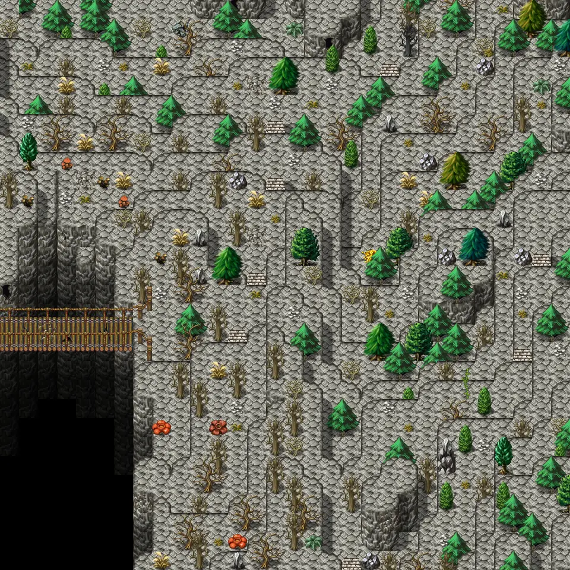

# Galmore 64

30×30 tiles · outdoors · part of [World1](index.md)

<label class="lg"><input type="checkbox" data-t="spawn" checked><b>Red</b>&nbsp;Monsters / NPCs</label><label class="lg"><input type="checkbox" data-t="mapchange" checked><b>Blue</b>&nbsp;Exit to another map</label><label class="lg"><input type="checkbox" data-t="container" checked><b>Yellow</b>&nbsp;Container (click to see contents)</label><label class="lg"><input type="checkbox" data-t="sign" checked><b>Purple</b>&nbsp;Sign</label><label class="lg"><input type="checkbox" data-t="rest" checked><b>Green</b>&nbsp;Resting place</label><label class="lg"><input type="checkbox" data-t="key" checked><b>Orange dashed</b>&nbsp;Blocked until a quest step / item</label><label class="lg"><input type="checkbox" data-t="script"><b>Grey dotted</b>&nbsp;Scripted event</label><label class="lg"><input type="checkbox" data-t="replace"><b>White dotted</b>&nbsp;Changes during a quest</label>

## Containers

<b>Container 1</b><ul><li><a href="../../items/garnet_stone/">Garnet stone</a> <small>100% · ×1 to 5</small></li><li><a href="../../items/gem6/">Azure gem</a> <small>100% · ×5 to 7</small></li><li><a href="../../items/gold/">Gold coins</a> <small>100% · ×777 to 1501</small></li><li><a href="../../items/graxe_black/">Black greataxe</a> <small>100%</small></li></ul>

## Exits

- [Galmore 54](galmore_54.md)
- [Galmore 63](galmore_63.md)
- [Galmore 65](galmore_65.md)
- [Galmore 74](galmore_74.md)

## Monsters & NPCs here

| Name | HP |
|---|---|
| [Aroughcun](../monsters/aroughcun.md) | 204 |
| [Mountain bridge bogling](../monsters/mt_bridge_bogling.md) | 232 |
| [Dreadmane](../monsters/dreadmane.md) | 235 |
| [Galmore wolf](../monsters/mg2_wolves.md) | 251 |

<small>Map ID: `galmore_64` · Data from v0.8.18</small>
