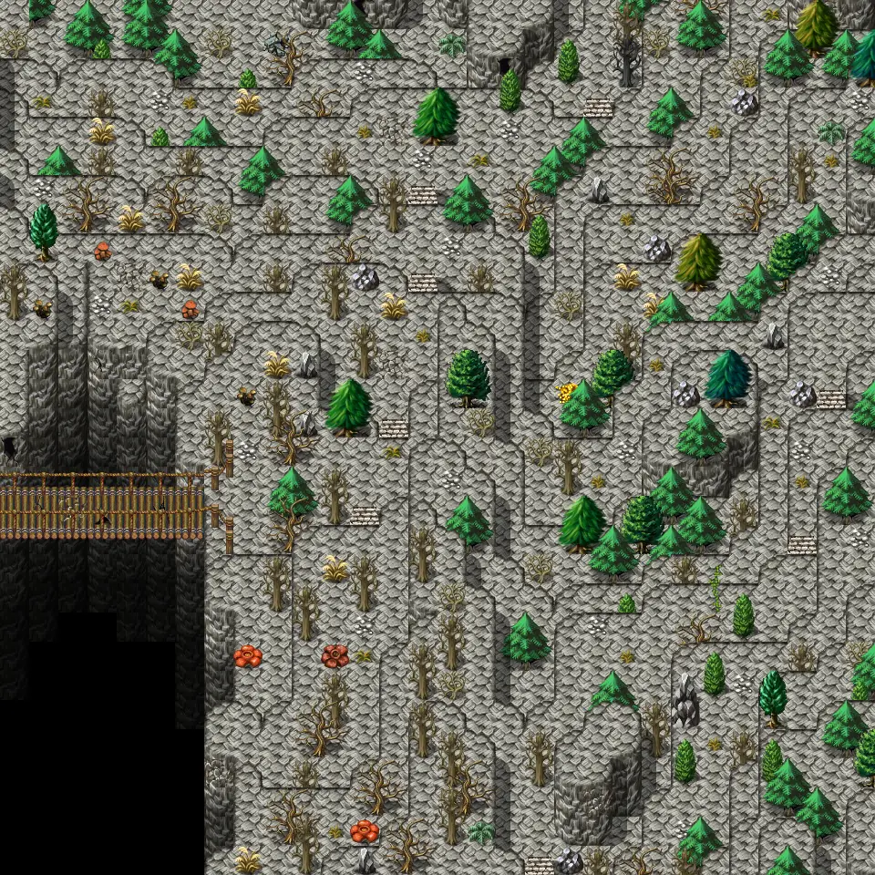

# Galmore 64

| | |
|---|---|
| **Map ID** | `galmore_64` |
| **Region** | In Mt. Galmore (other) |
| **Type** | Outdoors |
| **Size** | 30×30 tiles |
| **World map** | [World1](index.md) |
| **Introduced** | [v0.8.14](../versions/0.8.14.md) |
| **NPCs** | 1 |
| **Enemy types** | 3 |
| **Quests** | 1 |
| **Containers** | 1 |

**Galmore 64** is an outdoor map, in Mt. Galmore (other). It has 1 NPC and 3 kinds of enemy. Exits lead to Galmore 54, Galmore 65, Galmore 74, Galmore 63.

## Map

<label class="lg"><input type="checkbox" data-t="spawn" checked><b>Red</b>&nbsp;Monsters / NPCs</label><label class="lg"><input type="checkbox" data-t="mapchange" checked><b>Blue</b>&nbsp;Exit to another map</label><label class="lg"><input type="checkbox" data-t="container" checked><b>Yellow</b>&nbsp;Container (click to see contents)</label><label class="lg"><input type="checkbox" data-t="sign" checked><b>Purple</b>&nbsp;Sign</label><label class="lg"><input type="checkbox" data-t="rest" checked><b>Green</b>&nbsp;Resting place</label><label class="lg"><input type="checkbox" data-t="key" checked><b>Orange dashed</b>&nbsp;Blocked until a quest step / item</label><label class="lg"><input type="checkbox" data-t="script"><b>Grey dotted</b>&nbsp;Scripted event</label><label class="lg"><input type="checkbox" data-t="replace"><b>White dotted</b>&nbsp;Changes during a quest</label><label class="lg"><input type="checkbox" data-t="pin" checked><b>Numbers</b>&nbsp;Numbered key points (see the key below the map)</label>

<a class="pin pin-exit" href="#key-1" style="left:68.333%;top:1.667%" title="Exit (north): to [Galmore 54](../galmore_54.md)">1</a><a class="pin pin-exit" href="#key-2" style="left:98.333%;top:25.000%" title="Exit (east): to [Galmore 65](../galmore_65.md)">2</a><a class="pin pin-exit" href="#key-3" style="left:61.667%;top:98.333%" title="Exit (south): to [Galmore 74](../galmore_74.md)">3</a><a class="pin pin-exit" href="#key-4" style="left:1.667%;top:58.333%" title="Exit (west): to [Galmore 63](../galmore_63.md)">4</a><a class="pin pin-npc" href="#key-5" style="left:68.333%;top:8.333%" title="[Galmore wolf](../../monsters/mg2_wolves.md): 1 quest">5</a><a class="pin pin-container" href="#key-6" style="left:65.000%;top:45.000%" title="Container 1: Garnet stone, Azure gem, Gold coins, Black greataxe">6</a>

??? abstract "Key to the numbers on the map"

    | # | What | Details |
    |---|---|---|
    | 1 | Exit (north) | to [Galmore 54](../galmore_54.md) |
    | 2 | Exit (east) | to [Galmore 65](../galmore_65.md) |
    | 3 | Exit (south) | to [Galmore 74](../galmore_74.md) |
    | 4 | Exit (west) | to [Galmore 63](../galmore_63.md) |
    | 5 | [Galmore wolf](../monsters/mg2_wolves.md) | 1 quest |
    | 6 | Container 1 | Garnet stone, Azure gem, Gold coins, Black greataxe |

Verified against v0.8.18 map data.

## Connections

| Direction | Leads to | Region there | Map # |
|---|---|---|---|
| North | [Galmore 54](galmore_54.md) | Mt. Galmore | 1 |
| East | [Galmore 65](galmore_65.md) | Mt. Galmore | 2 |
| South | [Galmore 74](galmore_74.md) | Mt. Galmore | 3 |
| West | [Galmore 63](galmore_63.md) | Mt. Galmore | 4 |

## NPCs

- [Galmore wolf](../monsters/mg2_wolves.md) — quests: [Unusual experiences and achievements](../quests/achievements.md) (#5)

## Enemies

| Enemy | HP | Damage | Up to | Notes |
|---|---|---|---|---|
| [Aroughcun](../monsters/aroughcun.md) | 204 | 13–18 | 12 | – |
| [Mountain bridge bogling](../monsters/mt_bridge_bogling.md) | 232 | 12–19 | 1 | – |
| [Dreadmane](../monsters/dreadmane.md) | 235 | 15–21 | 10 | – |

<small>“Up to” is the most that can be alive at once from the spawn areas on this map.</small>

## Items & containers

<b>Container 1</b><ul><li><a href="../../items/garnet_stone/">Garnet stone</a> <small>100% · ×1 to 5</small></li><li><a href="../../items/gem6/">Azure gem</a> <small>100% · ×5 to 7</small></li><li><a href="../../items/gold/">Gold coins</a> <small>100% · ×777 to 1501</small></li><li><a href="../../items/graxe_black/">Black greataxe</a> <small>100%</small></li></ul>

## Quests

- [Unusual experiences and achievements](../quests/achievements.md): [Galmore wolf](../monsters/mg2_wolves.md) is involved
- [Placeholder for hidden quest stages (not displayed) (hidden flag)](../quests/nondisplay.md): [Galmore wolf](../monsters/mg2_wolves.md) is involved

## Version history

| Version | Change |
|---|---|
| [v0.8.14](../versions/0.8.14.md) | Added |
| [v0.8.15](../versions/0.8.15.md) | map layout or objects changed |
| [v0.8.18](../versions/0.8.18.md) | map layout or objects changed |

Verified against v0.8.18 and every earlier release back to v0.7.0 (game data compared release by release).

## Community notes

<small>Written by players, not generated from game data. **Observations**: what players notice in-game · **Lore**: the in-world story · **Trivia**: real-world facts, references, development history · **Theory / speculation**: unconfirmed ideas; may just be unfinished content</small>

### Observations

*Nothing here yet. Know something? [Add it](https://github.com/asdfghjkl628/Andor-s-Trail-Wikiiii/new/main/notes/maps?filename=galmore_64.md&value=%23%23%20Observations%0A%0A%3C%21--%20what%20players%20notice%20in-game%20--%3E%0A%0A%23%23%20Lore%0A%0A%3C%21--%20the%20in-world%20story%20--%3E%0A%0A%23%23%20Trivia%0A%0A%3C%21--%20real-world%20facts%2C%20references%2C%20development%20history%20--%3E%0A%0A%23%23%20Theory%20/%20speculation%0A%0A%3C%21--%20unconfirmed%20ideas%3B%20may%20just%20be%20unfinished%20content%20--%3E%0A).*

### Lore

*Nothing here yet. Know something? [Add it](https://github.com/asdfghjkl628/Andor-s-Trail-Wikiiii/new/main/notes/maps?filename=galmore_64.md&value=%23%23%20Observations%0A%0A%3C%21--%20what%20players%20notice%20in-game%20--%3E%0A%0A%23%23%20Lore%0A%0A%3C%21--%20the%20in-world%20story%20--%3E%0A%0A%23%23%20Trivia%0A%0A%3C%21--%20real-world%20facts%2C%20references%2C%20development%20history%20--%3E%0A%0A%23%23%20Theory%20/%20speculation%0A%0A%3C%21--%20unconfirmed%20ideas%3B%20may%20just%20be%20unfinished%20content%20--%3E%0A).*

### Trivia

*Nothing here yet. Know something? [Add it](https://github.com/asdfghjkl628/Andor-s-Trail-Wikiiii/new/main/notes/maps?filename=galmore_64.md&value=%23%23%20Observations%0A%0A%3C%21--%20what%20players%20notice%20in-game%20--%3E%0A%0A%23%23%20Lore%0A%0A%3C%21--%20the%20in-world%20story%20--%3E%0A%0A%23%23%20Trivia%0A%0A%3C%21--%20real-world%20facts%2C%20references%2C%20development%20history%20--%3E%0A%0A%23%23%20Theory%20/%20speculation%0A%0A%3C%21--%20unconfirmed%20ideas%3B%20may%20just%20be%20unfinished%20content%20--%3E%0A).*

### Theory / speculation

*Nothing here yet. Know something? [Add it](https://github.com/asdfghjkl628/Andor-s-Trail-Wikiiii/new/main/notes/maps?filename=galmore_64.md&value=%23%23%20Observations%0A%0A%3C%21--%20what%20players%20notice%20in-game%20--%3E%0A%0A%23%23%20Lore%0A%0A%3C%21--%20the%20in-world%20story%20--%3E%0A%0A%23%23%20Trivia%0A%0A%3C%21--%20real-world%20facts%2C%20references%2C%20development%20history%20--%3E%0A%0A%23%23%20Theory%20/%20speculation%0A%0A%3C%21--%20unconfirmed%20ideas%3B%20may%20just%20be%20unfinished%20content%20--%3E%0A).*

??? info "Technical information"

    | | |
    |---|---|
    | Map ID | `galmore_64` |
    | File | `res/xml/galmore_64.tmx` |
    | Size | 30×30 tiles (960×960 px) |
    | outdoors property | 1 |
    | Layers drawn | base, ground, objects, above, top |
    | Tilesets | map_bed_1, map_border_1, map_bridge_1, map_bridge_2, map_broken_1, map_cavewall_1, map_cavewall_2, map_cavewall_3, map_cavewall_4, map_cavewall_5, map_chair_table_1, map_chair_table_2, map_crate_1, map_cupboard_1, map_curtain_1, map_entrance_1, map_entrance_2, map_fence_1, map_fence_2, map_fence_3, map_fence_4, map_ground_1, map_ground_2, map_ground_3, map_ground_4, map_ground_5, map_ground_6, map_ground_7, map_ground_8, map_guynmart, map_house_1, map_house_2, map_indoor_1, map_indoor_2, map_kitchen_1, map_outdoor_1, map_pillar_1, map_pillar_2, map_plant_1, map_plant_2, map_rock_1, map_rock_2, map_rock_3, map_roof_1, map_roof_2, map_roof_3, map_shop_1, map_sign_ladder_1, map_table_1, map_trail_1, map_transition_1, map_transition_2, map_transition_3, map_transition_4, map_transition_5, map_transition_6, map_tree_1, map_tree_2, map_tree_3, map_wall_1, map_wall_2, map_wall_3, map_wall_4, map_window_1, map_window_2 |
    | Map objects | spawn: 15, mapchange: 4, container: 1 |
    | World map position | segment `world1`, x 34, y 758 |

<small>Data from v0.8.18</small>
