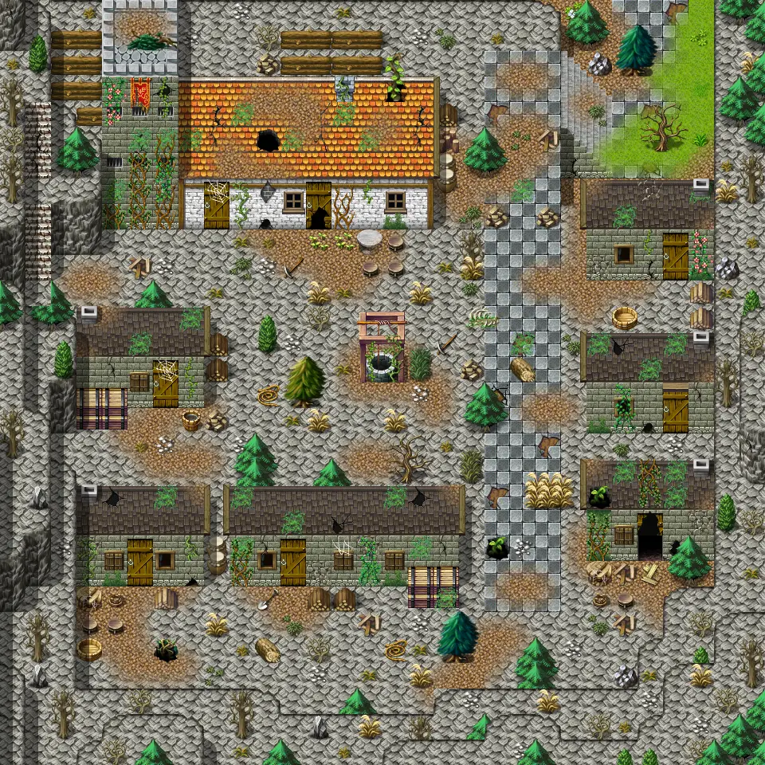

# Galmore 68

30×30 tiles · outdoors · part of [World1](index.md)

<label class="lg lg-spawn"><input type="checkbox" data-t="spawn" checked> Monsters / NPCs</label><label class="lg lg-mapchange"><input type="checkbox" data-t="mapchange" checked> Exit to another map</label><label class="lg lg-container"><input type="checkbox" data-t="container" checked> Container</label><label class="lg lg-sign"><input type="checkbox" data-t="sign" checked> Sign</label><label class="lg lg-rest"><input type="checkbox" data-t="rest" checked> Resting place</label><label class="lg lg-key"><input type="checkbox" data-t="key" checked> Blocked / needs key or quest</label><label class="lg lg-script"><input type="checkbox" data-t="script"> Scripted event</label><label class="lg lg-replace"><input type="checkbox" data-t="replace"> Changes after a quest</label>

## Exits

- [Galmore 58](galmore_58.md)
- [Galmore 67](galmore_67.md)
- [Galmore 68 house](galmore_68_house.md)
- [Mt galmore1 h1](mt_galmore1_h1.md)
- [Mt galmore1 h2](mt_galmore1_h2.md)
- [Mt galmore1 h3](mt_galmore1_h3.md)
- [Mt galmore1 h4](mt_galmore1_h4.md)
- [Mt galmore1 h5](mt_galmore1_h5.md)
- [Mt galmore mess hall](mt_galmore_mess_hall.md)

## Monsters & NPCs here

| Name | HP |
|---|---|
| [Galmore sky hunter](../monsters/eagle.md) | 0 |
| [Aroughcun kit](../monsters/aroughcun_kit.md) | 155 |
| [Agile aroughcun](../monsters/aroughcun_agile.md) | 168 |
| [Sow aroughcun](../monsters/aroughcun_sow.md) | 175 |
| [Aroughcun](../monsters/aroughcun.md) | 204 |

<small>Map ID: `galmore_68` · Data from v0.8.18</small>
