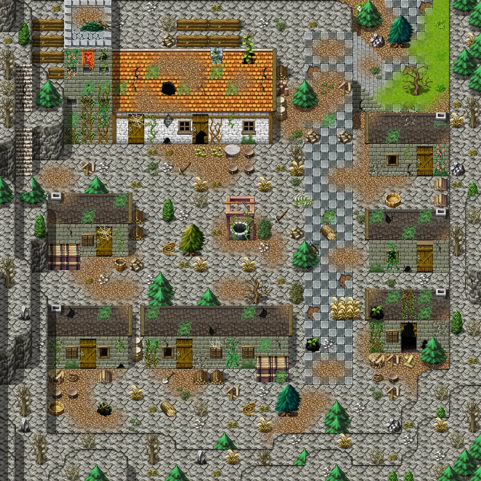

# Galmore 68

| | |
|---|---|
| **Map ID** | `galmore_68` |
| **Region** | Near Mt. Galmore (other) |
| **Type** | Outdoors |
| **Size** | 30×30 tiles |
| **World map** | [World1](index.md) |
| **Introduced** | [v0.8.14](../versions/0.8.14.md) |
| **Enemy types** | 5 |
| **Quests** | 1 |

**Galmore 68** is an outdoor map, near Mt. Galmore (other). It has no NPCs and 5 kinds of enemy. Exits lead to Galmore 58, Galmore 67, Galmore 68 house, Mt galmore1 h1 and 5 more.

## Map

<label class="lg"><input type="checkbox" data-t="spawn" checked><b>Red</b>&nbsp;Monsters / NPCs</label><label class="lg"><input type="checkbox" data-t="mapchange" checked><b>Blue</b>&nbsp;Exit to another map</label><label class="lg"><input type="checkbox" data-t="container" checked><b>Yellow</b>&nbsp;Container (click to see contents)</label><label class="lg"><input type="checkbox" data-t="sign" checked><b>Purple</b>&nbsp;Sign</label><label class="lg"><input type="checkbox" data-t="rest" checked><b>Green</b>&nbsp;Resting place</label><label class="lg"><input type="checkbox" data-t="key" checked><b>Orange dashed</b>&nbsp;Blocked until a quest step / item</label><label class="lg"><input type="checkbox" data-t="script"><b>Grey dotted</b>&nbsp;Scripted event</label><label class="lg"><input type="checkbox" data-t="replace"><b>White dotted</b>&nbsp;Changes during a quest</label><label class="lg"><input type="checkbox" data-t="pin" checked><b>Numbers</b>&nbsp;Numbered key points (see the key below the map)</label>

<a class="pin pin-exit" href="#key-1" style="left:85.000%;top:1.667%" title="Exit (north): to [Galmore 58](galmore_58.md)">1</a><a class="pin pin-exit" href="#key-2" style="left:1.667%;top:10.000%" title="Exit (west): to [Galmore 67](galmore_67.md)">2</a><a class="pin pin-exit" href="#key-3" style="left:41.667%;top:28.333%" title="Exit (door): to [Galmore 68 house](galmore_68_house.md)">3</a><a class="pin pin-exit" href="#key-4" style="left:88.333%;top:35.000%" title="Exit (door): to [Mt galmore1 h1](mt_galmore1_h1.md)">4</a><a class="pin pin-exit" href="#key-5" style="left:88.333%;top:55.000%" title="Exit (door): to [Mt galmore1 h2](mt_galmore1_h2.md)">5</a><a class="pin pin-exit" href="#key-6" style="left:85.000%;top:71.667%" title="Exit (door): to [Mt galmore1 h3](mt_galmore1_h3.md)">6</a><a class="pin pin-exit" href="#key-7" style="left:18.333%;top:75.000%" title="Exit (door): to [Mt galmore1 h4](mt_galmore1_h4.md)">7</a><a class="pin pin-exit" href="#key-8" style="left:21.667%;top:51.667%" title="Exit (door): to [Mt galmore1 h5](mt_galmore1_h5.md)">8</a><a class="pin pin-exit" href="#key-9" style="left:38.333%;top:75.000%" title="Exit (door): to [Mt galmore mess hall](mt_galmore_mess_hall.md)">9</a><a class="pin pin-key" href="#key-10" style="left:88.553%;top:52.500%" title="Blocked passage: Unlocked during the quest: hidden story flag “galmore_nondisplayed” (stage 8: “The PC has opened house two in the Galmore camp.”)">10</a><a class="pin pin-key" href="#key-11" style="left:28.333%;top:28.333%" title="Blocked passage: Closed off once you reach this point in the quest: Search for Andor (stage 1: “My father Mikhail says that Andor has not been home since yesterday. I should go look for him in the village.”)">11</a><a class="pin pin-replace" href="#key-12" style="left:91.667%;top:58.333%" title="Changes during a quest: This area changes during the quest: hidden story flag “galmore_nondisplayed” (stage 8: “The PC has opened house two in the Galmore camp.”)">12</a><a class="pin pin-replace" href="#key-12" style="left:85.400%;top:52.814%" title="Changes during a quest: This area changes during the quest: hidden story flag “galmore_nondisplayed” (stage 8: “The PC has opened house two in the Galmore camp.”)">12</a>

??? abstract "Key to the numbers on the map"

    | # | What | Details |
    |---|---|---|
    | 1 | Exit (north) | to [Galmore 58](galmore_58.md) |
    | 2 | Exit (west) | to [Galmore 67](galmore_67.md) |
    | 3 | Exit (door) | to [Galmore 68 house](galmore_68_house.md) |
    | 4 | Exit (door) | to [Mt galmore1 h1](mt_galmore1_h1.md) |
    | 5 | Exit (door) | to [Mt galmore1 h2](mt_galmore1_h2.md) |
    | 6 | Exit (door) | to [Mt galmore1 h3](mt_galmore1_h3.md) |
    | 7 | Exit (door) | to [Mt galmore1 h4](mt_galmore1_h4.md) |
    | 8 | Exit (door) | to [Mt galmore1 h5](mt_galmore1_h5.md) |
    | 9 | Exit (door) | to [Mt galmore mess hall](mt_galmore_mess_hall.md) |
    | 10 | Blocked passage | Unlocked during the quest: hidden story flag “galmore_nondisplayed” (stage 8: “The PC has opened house two in the Galmore camp.”) |
    | 11 | Blocked passage | Closed off once you reach this point in the quest: Search for Andor (stage 1: “My father Mikhail says that Andor has not been home since yesterday. I should go look for him in the village.”) |
    | 12 | Changes during a quest | This area changes during the quest: hidden story flag “galmore_nondisplayed” (stage 8: “The PC has opened house two in the Galmore camp.”) |

Verified against v0.8.18 map data.

## Connections

| Direction | Leads to | Region there | Map # |
|---|---|---|---|
| North | [Galmore 58](galmore_58.md) | Mt. Galmore | 1 |
| West | [Galmore 67](galmore_67.md) | Mt. Galmore | 2 |
| Door | [Galmore 68 house](galmore_68_house.md) | Mt. Galmore | 3 |
| Door | [Mt galmore1 h1](mt_galmore1_h1.md) | Mt. Galmore | 4 |
| Door | [Mt galmore1 h2](mt_galmore1_h2.md) | Mt. Galmore | 5 |
| Door | [Mt galmore1 h3](mt_galmore1_h3.md) | Mt. Galmore | 6 |
| Door | [Mt galmore1 h4](mt_galmore1_h4.md) | Mt. Galmore | 7 |
| Door | [Mt galmore1 h5](mt_galmore1_h5.md) | Mt. Galmore | 8 |
| Door | [Mt galmore mess hall](mt_galmore_mess_hall.md) | Mt. Galmore | 9 |

## Enemies

| Enemy | HP | Damage | Up to | Notes |
|---|---|---|---|---|
| [Galmore sky hunter](../monsters/eagle.md) | 0 | 0–0 | 1 | – |
| [Aroughcun kit](../monsters/aroughcun_kit.md) | 155 | 10–15 | 1 | – |
| [Agile aroughcun](../monsters/aroughcun_agile.md) | 168 | 10–15 | 7 | – |
| [Sow aroughcun](../monsters/aroughcun_sow.md) | 175 | 12–17 | 2 | – |
| [Aroughcun](../monsters/aroughcun.md) | 204 | 13–18 | 9 | – |

<small>“Up to” is the most that can be alive at once from the spawn areas on this map.</small>

## Quests

- [Search for Andor](../quests/andor.md): blocked passage closes at stage 1
- [galmore_nondisplayed (hidden flag)](../quests/galmore_nondisplayed.md): a scripted event can trigger here from stage 15; a scripted event can trigger here from stage 16; blocked passage opens at stage 8; part of the map changes at stage 8; something on this map advances it

## Points of interest

- **Blocked passage** (#10): Unlocked during the quest: hidden story flag “galmore_nondisplayed” (stage 8: “The PC has opened house two in the Galmore camp.”)
- **Blocked passage** (#11): Closed off once you reach this point in the quest: Search for Andor (stage 1: “My father Mikhail says that Andor has not been home since yesterday. I should go look for him in the village.”)
- **Changes during a quest** (#12): This area changes during the quest: hidden story flag “galmore_nondisplayed” (stage 8: “The PC has opened house two in the Galmore camp.”)

## Version history

| Version | Change |
|---|---|
| [v0.8.14](../versions/0.8.14.md) | Added |
| [v0.8.18](../versions/0.8.18.md) | map layout or objects changed |

Verified against v0.8.18 and every earlier release back to v0.7.0 (game data compared release by release).

## Community notes

<small>Written by players, not generated from game data. **Observations**: what players notice in-game · **Lore**: the in-world story · **Trivia**: real-world facts, references, development history · **Theory / speculation**: unconfirmed ideas; may just be unfinished content</small>

### Observations

*No notes yet. Contributions are welcome: [add a note](https://github.com/asdfghjkl628/Andor-s-Trail-Wikiiii/new/main/notes/maps?filename=galmore_68.md&value=%23%23%20Observations%0A%0A%3C%21--%20what%20players%20notice%20in-game%20--%3E%0A%0A%23%23%20Lore%0A%0A%3C%21--%20the%20in-world%20story%20--%3E%0A%0A%23%23%20Trivia%0A%0A%3C%21--%20real-world%20facts%2C%20references%2C%20development%20history%20--%3E%0A%0A%23%23%20Theory%20/%20speculation%0A%0A%3C%21--%20unconfirmed%20ideas%3B%20may%20just%20be%20unfinished%20content%20--%3E%0A).*

### Lore

*No notes yet. Contributions are welcome: [add a note](https://github.com/asdfghjkl628/Andor-s-Trail-Wikiiii/new/main/notes/maps?filename=galmore_68.md&value=%23%23%20Observations%0A%0A%3C%21--%20what%20players%20notice%20in-game%20--%3E%0A%0A%23%23%20Lore%0A%0A%3C%21--%20the%20in-world%20story%20--%3E%0A%0A%23%23%20Trivia%0A%0A%3C%21--%20real-world%20facts%2C%20references%2C%20development%20history%20--%3E%0A%0A%23%23%20Theory%20/%20speculation%0A%0A%3C%21--%20unconfirmed%20ideas%3B%20may%20just%20be%20unfinished%20content%20--%3E%0A).*

### Trivia

*No notes yet. Contributions are welcome: [add a note](https://github.com/asdfghjkl628/Andor-s-Trail-Wikiiii/new/main/notes/maps?filename=galmore_68.md&value=%23%23%20Observations%0A%0A%3C%21--%20what%20players%20notice%20in-game%20--%3E%0A%0A%23%23%20Lore%0A%0A%3C%21--%20the%20in-world%20story%20--%3E%0A%0A%23%23%20Trivia%0A%0A%3C%21--%20real-world%20facts%2C%20references%2C%20development%20history%20--%3E%0A%0A%23%23%20Theory%20/%20speculation%0A%0A%3C%21--%20unconfirmed%20ideas%3B%20may%20just%20be%20unfinished%20content%20--%3E%0A).*

### Theory / speculation

*No notes yet. Contributions are welcome: [add a note](https://github.com/asdfghjkl628/Andor-s-Trail-Wikiiii/new/main/notes/maps?filename=galmore_68.md&value=%23%23%20Observations%0A%0A%3C%21--%20what%20players%20notice%20in-game%20--%3E%0A%0A%23%23%20Lore%0A%0A%3C%21--%20the%20in-world%20story%20--%3E%0A%0A%23%23%20Trivia%0A%0A%3C%21--%20real-world%20facts%2C%20references%2C%20development%20history%20--%3E%0A%0A%23%23%20Theory%20/%20speculation%0A%0A%3C%21--%20unconfirmed%20ideas%3B%20may%20just%20be%20unfinished%20content%20--%3E%0A).*

??? info "Technical information"

    | | |
    |---|---|
    | Map ID | `galmore_68` |
    | File | `res/xml/galmore_68.tmx` |
    | Size | 30×30 tiles (960×960 px) |
    | outdoors property | 1 |
    | Layers drawn | base, ground, objects, above, top |
    | Tilesets | map_bed_1, map_border_1, map_bridge_1, map_bridge_2, map_broken_1, map_cavewall_1, map_cavewall_2, map_cavewall_3, map_cavewall_4, map_cavewall_5, map_chair_table_1, map_chair_table_2, map_crate_1, map_cupboard_1, map_curtain_1, map_entrance_1, map_entrance_2, map_fence_1, map_fence_2, map_fence_3, map_fence_4, map_ground_1, map_ground_2, map_ground_3, map_ground_4, map_ground_5, map_ground_6, map_ground_7, map_ground_8, map_house_1, map_house_2, map_indoor_1, map_indoor_2, map_kitchen_1, map_outdoor_1, map_pillar_1, map_pillar_2, map_plant_1, map_plant_2, map_plant_3, map_rock_1, map_rock_2, map_rock_3, map_roof_1, map_roof_2, map_roof_3, map_shop_1, map_sign_ladder_1, map_table_1, map_trail_1, map_transition_1, map_transition_2, map_transition_3, map_transition_4, map_transition_5, map_transition_6, map_tree_1, map_tree_2, map_tree_3, map_wall_1, map_wall_2, map_wall_3, map_wall_4, map_window_1, map_window_2 |
    | Map objects | spawn: 12, mapchange: 9, key: 2, replace: 2, script: 1 |
    | World map position | segment `world1`, x 158, y 758 |

<small>Data from v0.8.18</small>
