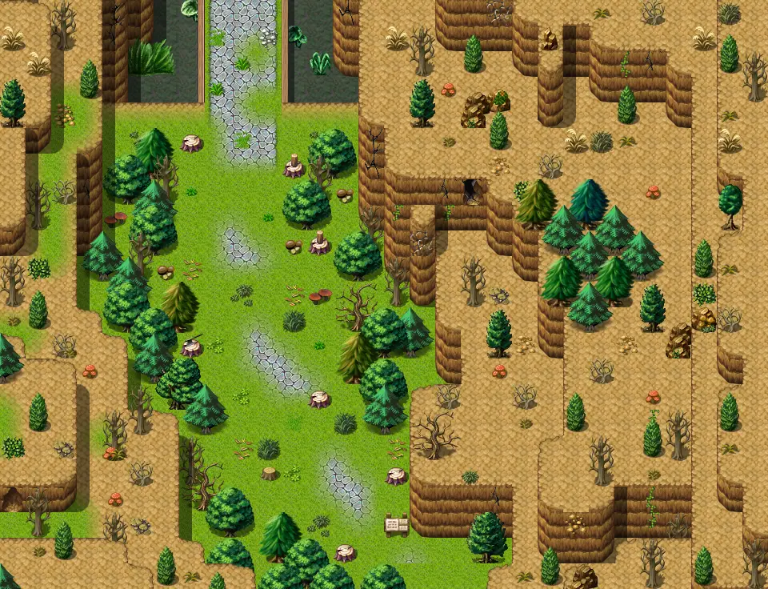

# Galmore 9

| | |
|---|---|
| **Map ID** | `galmore_9` |
| **Region** | Near Flagstone Prison (other) |
| **Type** | Outdoors |
| **Size** | 30×23 tiles |
| **World map** | [World1](index.md) |
| **Introduced** | [v0.8.14](../versions/0.8.14.md) |
| **Enemy types** | 1 |
| **Quests** | 1 |

**Galmore 9** is an outdoor map, near Flagstone Prison (other). It has no NPCs and 1 kind of enemy. Exits lead to Waytogalmore1, Galmore 10, Stoutford filler 4.

## Map

<label class="lg"><input type="checkbox" data-t="spawn" checked><b>Red</b>&nbsp;Monsters / NPCs</label><label class="lg"><input type="checkbox" data-t="mapchange" checked><b>Blue</b>&nbsp;Exit to another map</label><label class="lg"><input type="checkbox" data-t="container" checked><b>Yellow</b>&nbsp;Container (click to see contents)</label><label class="lg"><input type="checkbox" data-t="sign" checked><b>Purple</b>&nbsp;Sign</label><label class="lg"><input type="checkbox" data-t="rest" checked><b>Green</b>&nbsp;Resting place</label><label class="lg"><input type="checkbox" data-t="key" checked><b>Orange dashed</b>&nbsp;Blocked until a quest step / item</label><label class="lg"><input type="checkbox" data-t="script"><b>Grey dotted</b>&nbsp;Scripted event</label><label class="lg"><input type="checkbox" data-t="replace"><b>White dotted</b>&nbsp;Changes during a quest</label><label class="lg"><input type="checkbox" data-t="pin" checked><b>Numbers</b>&nbsp;Numbered key points (see the key below the map)</label>

<a class="pin pin-exit" href="#key-1" style="left:31.667%;top:2.174%" title="Exit (north): to [Waytogalmore1](waytogalmore1.md)">1</a><a class="pin pin-exit" href="#key-2" style="left:58.333%;top:97.826%" title="Exit (south): to [Galmore 10](galmore_10.md)">2</a><a class="pin pin-exit" href="#key-2" style="left:11.667%;top:97.826%" title="Exit (south): to [Galmore 10](galmore_10.md)">2</a><a class="pin pin-exit" href="#key-3" style="left:1.667%;top:93.478%" title="Exit (southwest): to [Stoutford filler 4](stoutford_filler_4.md)">3</a><a class="pin pin-exit" href="#key-4" style="left:1.667%;top:73.913%" title="Exit (west): to [Stoutford filler 4](stoutford_filler_4.md)">4</a><a class="pin pin-key" href="#key-5" style="left:51.667%;top:89.130%" title="Blocked passage: Closed off once you reach this point in the quest: Search for Andor (stage 1: “My father Mikhail says that Andor has not been home since yesterday. I should go look for him in the village.”)">5</a><a class="pin pin-script" href="#key-6" style="left:55.000%;top:93.478%" title="Quest trigger: Scripted event: advances the quest: hidden story flag “mg2_exploded_star_nd” to stage 1 (“1=Seek in galmore_66”)">6</a>

??? abstract "Key to the numbers on the map"

    | # | What | Details |
    |---|---|---|
    | 1 | Exit (north) | to [Waytogalmore1](waytogalmore1.md) |
    | 2 | Exit (south) | to [Galmore 10](galmore_10.md) |
    | 3 | Exit (southwest) | to [Stoutford filler 4](stoutford_filler_4.md) |
    | 4 | Exit (west) | to [Stoutford filler 4](stoutford_filler_4.md) |
    | 5 | Blocked passage | Closed off once you reach this point in the quest: Search for Andor (stage 1: “My father Mikhail says that Andor has not been home since yesterday. I should go look for him in the village.”) |
    | 6 | Quest trigger | Scripted event: advances the quest: hidden story flag “mg2_exploded_star_nd” to stage 1 (“1=Seek in galmore_66”) |

Verified against v0.8.18 map data.

## Connections

| Direction | Leads to | Region there | Map # |
|---|---|---|---|
| North | [Waytogalmore1](waytogalmore1.md) | Flagstone Prison | 1 |
| South | [Galmore 10](galmore_10.md) | – | 2 |
| Southwest | [Stoutford filler 4](stoutford_filler_4.md) | – | 3 |
| West | [Stoutford filler 4](stoutford_filler_4.md) | – | 4 |

## Enemies

| Enemy | HP | Damage | Up to | Notes |
|---|---|---|---|---|
| [Grass spider](../monsters/grass_spider.md) | 79 | 4–6 | 3 | – |

<small>“Up to” is the most that can be alive at once from the spawn areas on this map.</small>

## Quests

- [Search for Andor](../quests/andor.md): blocked passage closes at stage 1
- [mg2_exploded_star_nd (hidden flag)](../quests/mg2_exploded_star_nd.md): something on this map advances it; stepping on a trigger here sets stage 1; stepping on a trigger here sets stage 10; stepping on a trigger here sets stage 2; stepping on a trigger here sets stage 3; stepping on a trigger here sets stage 4; stepping on a trigger here sets stage 5; stepping on a trigger here sets stage 6; stepping on a trigger here sets stage 7; stepping on a trigger here sets stage 8; stepping on a trigger here sets stage 9; stepping on a trigger here sets stage 90

## Points of interest

- **Blocked passage** (#5): Closed off once you reach this point in the quest: Search for Andor (stage 1: “My father Mikhail says that Andor has not been home since yesterday. I should go look for him in the village.”)
- **Quest trigger** (#6): Scripted event: advances the quest: hidden story flag “mg2_exploded_star_nd” to stage 1 (“1=Seek in galmore_66”)

## Version history

| Version | Change |
|---|---|
| [v0.8.14](../versions/0.8.14.md) | Added |
| [v0.8.15](../versions/0.8.15.md) | map layout or objects changed |

Verified against v0.8.18 and every earlier release back to v0.7.0 (game data compared release by release).

## Community notes

<small>Written by players, not generated from game data. **Observations**: what players notice in-game · **Lore**: the in-world story · **Trivia**: real-world facts, references, development history · **Theory / speculation**: unconfirmed ideas; may just be unfinished content</small>

### Observations

*No notes yet. Contributions are welcome: [add a note](https://github.com/asdfghjkl628/Andor-s-Trail-Wikiiii/new/main/notes/maps?filename=galmore_9.md&value=%23%23%20Observations%0A%0A%3C%21--%20what%20players%20notice%20in-game%20--%3E%0A%0A%23%23%20Lore%0A%0A%3C%21--%20the%20in-world%20story%20--%3E%0A%0A%23%23%20Trivia%0A%0A%3C%21--%20real-world%20facts%2C%20references%2C%20development%20history%20--%3E%0A%0A%23%23%20Theory%20/%20speculation%0A%0A%3C%21--%20unconfirmed%20ideas%3B%20may%20just%20be%20unfinished%20content%20--%3E%0A).*

### Lore

*No notes yet. Contributions are welcome: [add a note](https://github.com/asdfghjkl628/Andor-s-Trail-Wikiiii/new/main/notes/maps?filename=galmore_9.md&value=%23%23%20Observations%0A%0A%3C%21--%20what%20players%20notice%20in-game%20--%3E%0A%0A%23%23%20Lore%0A%0A%3C%21--%20the%20in-world%20story%20--%3E%0A%0A%23%23%20Trivia%0A%0A%3C%21--%20real-world%20facts%2C%20references%2C%20development%20history%20--%3E%0A%0A%23%23%20Theory%20/%20speculation%0A%0A%3C%21--%20unconfirmed%20ideas%3B%20may%20just%20be%20unfinished%20content%20--%3E%0A).*

### Trivia

*No notes yet. Contributions are welcome: [add a note](https://github.com/asdfghjkl628/Andor-s-Trail-Wikiiii/new/main/notes/maps?filename=galmore_9.md&value=%23%23%20Observations%0A%0A%3C%21--%20what%20players%20notice%20in-game%20--%3E%0A%0A%23%23%20Lore%0A%0A%3C%21--%20the%20in-world%20story%20--%3E%0A%0A%23%23%20Trivia%0A%0A%3C%21--%20real-world%20facts%2C%20references%2C%20development%20history%20--%3E%0A%0A%23%23%20Theory%20/%20speculation%0A%0A%3C%21--%20unconfirmed%20ideas%3B%20may%20just%20be%20unfinished%20content%20--%3E%0A).*

### Theory / speculation

*No notes yet. Contributions are welcome: [add a note](https://github.com/asdfghjkl628/Andor-s-Trail-Wikiiii/new/main/notes/maps?filename=galmore_9.md&value=%23%23%20Observations%0A%0A%3C%21--%20what%20players%20notice%20in-game%20--%3E%0A%0A%23%23%20Lore%0A%0A%3C%21--%20the%20in-world%20story%20--%3E%0A%0A%23%23%20Trivia%0A%0A%3C%21--%20real-world%20facts%2C%20references%2C%20development%20history%20--%3E%0A%0A%23%23%20Theory%20/%20speculation%0A%0A%3C%21--%20unconfirmed%20ideas%3B%20may%20just%20be%20unfinished%20content%20--%3E%0A).*

??? info "Technical information"

    | | |
    |---|---|
    | Map ID | `galmore_9` |
    | File | `res/xml/galmore_9.tmx` |
    | Size | 30×23 tiles (960×736 px) |
    | outdoors property | 1 |
    | Layers drawn | base, ground, objects, above, top |
    | Tilesets | map_bed_1, map_border_1, map_bridge_1, map_bridge_2, map_broken_1, map_cavewall_1, map_cavewall_2, map_cavewall_3, map_cavewall_4, map_cavewall_5, map_chair_table_1, map_chair_table_2, map_crate_1, map_cupboard_1, map_curtain_1, map_entrance_1, map_entrance_2, map_fence_1, map_fence_2, map_fence_3, map_fence_4, map_ground_1, map_ground_2, map_ground_3, map_ground_4, map_ground_5, map_ground_6, map_ground_7, map_ground_8, map_house_1, map_house_2, map_indoor_1, map_indoor_2, map_kitchen_1, map_outdoor_1, map_pillar_1, map_pillar_2, map_plant_1, map_plant_2, map_plant_3, map_rock_1, map_rock_2, map_rock_3, map_roof_1, map_roof_2, map_roof_3, map_shop_1, map_sign_ladder_1, map_table_1, map_trail_1, map_transition_1, map_transition_2, map_transition_3, map_transition_4, map_transition_5, map_transition_6, map_tree_1, map_tree_2, map_tree_3, map_wall_1, map_wall_2, map_wall_3, map_wall_4, map_window_1, map_window_2 |
    | Map objects | mapchange: 5, key: 1, script: 1, spawn: 1 |
    | World map position | segment `world1`, x 95, y 562 |

<small>Data from v0.8.18</small>
