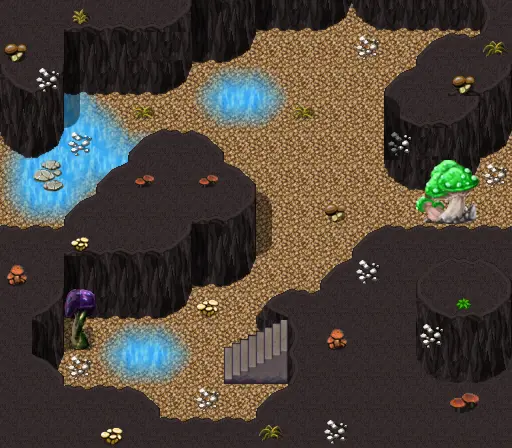
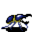

# Gamjee well 4 1

| | |
|---|---|
| **Map ID** | `gamjee_well_4_1` |
| **Type** | Indoors / underground |
| **Size** | 16×14 tiles |
| **World map** | [Gamjee well](index.md) |
| **Introduced** | [v0.8.12.1](../versions/0.8.12.1.md) |
| **NPCs** | 3 |
| **Enemy types** | 3 |
| **Quests** | 1 |

**Gamjee well 4 1** is an indoor map. It has 3 NPCs and 3 kinds of enemy. Exits lead to Gamjee well 2 1, Gamjee well 1 2.

## Map

<label class="lg"><input type="checkbox" data-t="spawn" checked><b>Red</b>&nbsp;Monsters / NPCs</label><label class="lg"><input type="checkbox" data-t="mapchange" checked><b>Blue</b>&nbsp;Exit to another map</label><label class="lg"><input type="checkbox" data-t="container" checked><b>Yellow</b>&nbsp;Container (click to see contents)</label><label class="lg"><input type="checkbox" data-t="sign" checked><b>Purple</b>&nbsp;Sign</label><label class="lg"><input type="checkbox" data-t="rest" checked><b>Green</b>&nbsp;Resting place</label><label class="lg"><input type="checkbox" data-t="key" checked><b>Orange dashed</b>&nbsp;Blocked until a quest step / item</label><label class="lg"><input type="checkbox" data-t="script"><b>Grey dotted</b>&nbsp;Scripted event</label><label class="lg"><input type="checkbox" data-t="replace"><b>White dotted</b>&nbsp;Changes during a quest</label><label class="lg"><input type="checkbox" data-t="pin" checked><b>Numbers</b>&nbsp;Numbered key points (see the key below the map)</label>

<a class="pin pin-exit" href="#key-1" style="left:3.125%;top:42.857%" title="Exit (west): to [Gamjee well 2 1](../gamjee_well_2_1.md)">1</a><a class="pin pin-exit" href="#key-2" style="left:53.125%;top:75.000%" title="Exit (stairs / passage): to [Gamjee well 1 2](../gamjee_well_1_2.md)">2</a><a class="pin pin-npc" href="#key-3" style="left:62.500%;top:25.000%" title="[Gamjee](../../monsters/gamjee.md): 1 quest">3</a><a class="pin pin-npc" href="#key-4" style="left:62.500%;top:46.429%" title="[Gamjee](../../monsters/gamjee_oc.md): 1 quest">4</a><a class="pin pin-npc" href="#key-5" style="left:78.125%;top:10.714%" title="[Percival](../../monsters/troll_hollow_percival.md): NPC">5</a><a class="pin pin-script" href="#key-6" style="left:56.250%;top:39.286%" title="Quest trigger: Scripted event: advances the quest: Echoes of enchantment to stage 9 (“I killed Gamjee and in doing so, I found a rope that I think might be helpful in freeing those people in that pit.”)">6</a>

??? abstract "Key to the numbers on the map"

    | # | What | Details |
    |---|---|---|
    | 1 | Exit (west) | to [Gamjee well 2 1](../gamjee_well_2_1.md) |
    | 2 | Exit (stairs / passage) | to [Gamjee well 1 2](../gamjee_well_1_2.md) |
    | 3 | [Gamjee](../monsters/gamjee.md) | 1 quest |
    | 4 | [Gamjee](../monsters/gamjee_oc.md) | 1 quest |
    | 5 | [Percival](../monsters/troll_hollow_percival.md) | NPC |
    | 6 | Quest trigger | Scripted event: advances the quest: Echoes of enchantment to stage 9 (“I killed Gamjee and in doing so, I found a rope that I think might be helpful in freeing those people in that pit.”) |

Verified against v0.8.18 map data.

## Connections

| Direction | Leads to | Region there | Map # |
|---|---|---|---|
| West | [Gamjee well 2 1](gamjee_well_2_1.md) | – | 1 |
| Stairs / passage | [Gamjee well 1 2](gamjee_well_1_2.md) | – | 2 |

## NPCs

- [Gamjee](../monsters/gamjee.md) — quests: [Echoes of enchantment](../quests/echoes_of_enchantment.md) (#3)
- [Gamjee](../monsters/gamjee_oc.md) — quests: [Echoes of enchantment](../quests/echoes_of_enchantment.md) (#4)
- [Percival](../monsters/troll_hollow_percival.md) (#5)

## Enemies

| Enemy | HP | Damage | Up to | Notes |
|---|---|---|---|---|
| [Gamjee](../monsters/gamjee_hidden.md) | 0 | 0–0 | 1 | – |
| [Hardershell beetle](../monsters/hardershell_beetle.md) | 54 | 1–7 | 1 | – |
| [Spotted tentaslime](../monsters/spotted_tentaslime.md) | 150 | 8–14 | 1 | – |

<small>“Up to” is the most that can be alive at once from the spawn areas on this map.</small>

## Quests

- [Echoes of enchantment](../quests/echoes_of_enchantment.md): [Gamjee](../monsters/gamjee.md) is involved; [Gamjee](../monsters/gamjee_oc.md) is involved; something on this map advances it; stepping on a trigger here sets stage 11; stepping on a trigger here sets stage 9
- [feygard_nondisplayed (hidden flag)](../quests/feygard_nondisplayed.md): [Gamjee](../monsters/gamjee.md) is involved; [Gamjee](../monsters/gamjee_oc.md) is involved

## Points of interest

- **Quest trigger** (#6): Scripted event: advances the quest: Echoes of enchantment to stage 9 (“I killed Gamjee and in doing so, I found a rope that I think might be helpful in freeing those people in that pit.”)

## Version history

| Version | Change |
|---|---|
| [v0.8.12.1](../versions/0.8.12.1.md) | Added |

Verified against v0.8.18 and every earlier release back to v0.7.0 (game data compared release by release).

## Community notes

<small>Written by players, not generated from game data. **Observations**: what players notice in-game · **Lore**: the in-world story · **Trivia**: real-world facts, references, development history · **Theory / speculation**: unconfirmed ideas; may just be unfinished content</small>

### Observations

*Nothing here yet. Know something? [Add it](https://github.com/asdfghjkl628/Andor-s-Trail-Wikiiii/new/main/notes/maps?filename=gamjee_well_4_1.md&value=%23%23%20Observations%0A%0A%3C%21--%20what%20players%20notice%20in-game%20--%3E%0A%0A%23%23%20Lore%0A%0A%3C%21--%20the%20in-world%20story%20--%3E%0A%0A%23%23%20Trivia%0A%0A%3C%21--%20real-world%20facts%2C%20references%2C%20development%20history%20--%3E%0A%0A%23%23%20Theory%20/%20speculation%0A%0A%3C%21--%20unconfirmed%20ideas%3B%20may%20just%20be%20unfinished%20content%20--%3E%0A).*

### Lore

*Nothing here yet. Know something? [Add it](https://github.com/asdfghjkl628/Andor-s-Trail-Wikiiii/new/main/notes/maps?filename=gamjee_well_4_1.md&value=%23%23%20Observations%0A%0A%3C%21--%20what%20players%20notice%20in-game%20--%3E%0A%0A%23%23%20Lore%0A%0A%3C%21--%20the%20in-world%20story%20--%3E%0A%0A%23%23%20Trivia%0A%0A%3C%21--%20real-world%20facts%2C%20references%2C%20development%20history%20--%3E%0A%0A%23%23%20Theory%20/%20speculation%0A%0A%3C%21--%20unconfirmed%20ideas%3B%20may%20just%20be%20unfinished%20content%20--%3E%0A).*

### Trivia

*Nothing here yet. Know something? [Add it](https://github.com/asdfghjkl628/Andor-s-Trail-Wikiiii/new/main/notes/maps?filename=gamjee_well_4_1.md&value=%23%23%20Observations%0A%0A%3C%21--%20what%20players%20notice%20in-game%20--%3E%0A%0A%23%23%20Lore%0A%0A%3C%21--%20the%20in-world%20story%20--%3E%0A%0A%23%23%20Trivia%0A%0A%3C%21--%20real-world%20facts%2C%20references%2C%20development%20history%20--%3E%0A%0A%23%23%20Theory%20/%20speculation%0A%0A%3C%21--%20unconfirmed%20ideas%3B%20may%20just%20be%20unfinished%20content%20--%3E%0A).*

### Theory / speculation

*Nothing here yet. Know something? [Add it](https://github.com/asdfghjkl628/Andor-s-Trail-Wikiiii/new/main/notes/maps?filename=gamjee_well_4_1.md&value=%23%23%20Observations%0A%0A%3C%21--%20what%20players%20notice%20in-game%20--%3E%0A%0A%23%23%20Lore%0A%0A%3C%21--%20the%20in-world%20story%20--%3E%0A%0A%23%23%20Trivia%0A%0A%3C%21--%20real-world%20facts%2C%20references%2C%20development%20history%20--%3E%0A%0A%23%23%20Theory%20/%20speculation%0A%0A%3C%21--%20unconfirmed%20ideas%3B%20may%20just%20be%20unfinished%20content%20--%3E%0A).*

??? info "Technical information"

    | | |
    |---|---|
    | Map ID | `gamjee_well_4_1` |
    | File | `res/xml/gamjee_well_4_1.tmx` |
    | Size | 16×14 tiles (512×448 px) |
    | outdoors property | – |
    | Layers drawn | base, ground, objects, above, top |
    | Tilesets | map_bed_1, map_border_1, map_bridge_1, map_bridge_2, map_broken_1, map_cavewall_1, map_cavewall_2, map_cavewall_3, map_cavewall_4, map_chair_table_1, map_chair_table_2, map_crate_1, map_cupboard_1, map_curtain_1, map_entrance_1, map_entrance_2, map_fence_1, map_fence_2, map_fence_3, map_fence_4, map_ground_1, map_ground_2, map_ground_3, map_ground_4, map_ground_5, map_ground_6, map_ground_7, map_ground_8, map_house_1, map_house_2, map_indoor_1, map_indoor_2, map_kitchen_1, map_outdoor_1, map_pillar_1, map_pillar_2, map_plant_1, map_plant_2, map_rock_1, map_rock_2, map_roof_1, map_roof_2, map_roof_3, map_shop_1, map_sign_ladder_1, map_table_1, map_trail_1, map_transition_1, map_transition_2, map_transition_3, map_transition_4, map_transition_5, map_tree_1, map_tree_2, map_tree_3, map_wall_1, map_wall_2, map_wall_3, map_wall_4, map_window_1, map_window_2 |
    | Map objects | spawn: 6, mapchange: 2, script: 1 |
    | World map position | segment `gamjee_well`, x -575, y -712 |

<small>Data from v0.8.18</small>
