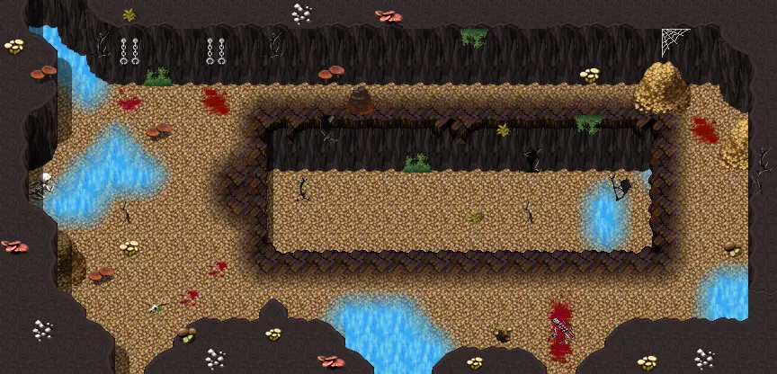
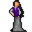
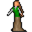
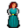
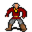

# Gamjee well jail cells

27×13 tiles · part of [Gamjee well](index.md)

<label class="lg"><input type="checkbox" data-t="spawn" checked><b>Red</b>&nbsp;Monsters / NPCs</label><label class="lg"><input type="checkbox" data-t="mapchange" checked><b>Blue</b>&nbsp;Exit to another map</label><label class="lg"><input type="checkbox" data-t="container" checked><b>Yellow</b>&nbsp;Container (click to see contents)</label><label class="lg"><input type="checkbox" data-t="sign" checked><b>Purple</b>&nbsp;Sign</label><label class="lg"><input type="checkbox" data-t="rest" checked><b>Green</b>&nbsp;Resting place</label><label class="lg"><input type="checkbox" data-t="key" checked><b>Orange dashed</b>&nbsp;Blocked until a quest step / item</label><label class="lg"><input type="checkbox" data-t="script"><b>Grey dotted</b>&nbsp;Scripted event</label><label class="lg"><input type="checkbox" data-t="replace"><b>White dotted</b>&nbsp;Changes during a quest</label>

## Containers

<b>Container 1</b><ul><li><a href="../../items/mysterious_coin/">Mysterious coin</a> <small>100% · ×3 to 5</small></li></ul>

## Exits

- [Gamjee well 2 1](gamjee_well_2_1.md)

## Monsters & NPCs here

| Name | HP |
|---|---|
| [Osric](../monsters/troll_hollow_osric.md) | 0 |
| [Odilia](../monsters/troll_hollow_odilia.md) | 0 |
| [Percival](../monsters/troll_hollow_percival.md) | 0 |
| [Theobald](../monsters/troll_hollow_theobald.md) | 0 |
| [Theodora](../monsters/troll_hollow_theodora.md) | 0 |
| [Philippa](../monsters/troll_hollow_philippa.md) | 0 |
| [Godelieve](../monsters/troll_hollow_godelieve.md) | 0 |
| [Godwin](../monsters/troll_hollow_godwin.md) | 0 |
| [Burrowing glow worm](../monsters/burrowing_glow_worm.md) | 48 |
| [Hardershell beetle](../monsters/hardershell_beetle.md) | 54 |

<small>Map ID: `gamjee_well_jail_cells` · Data from v0.8.18</small>
