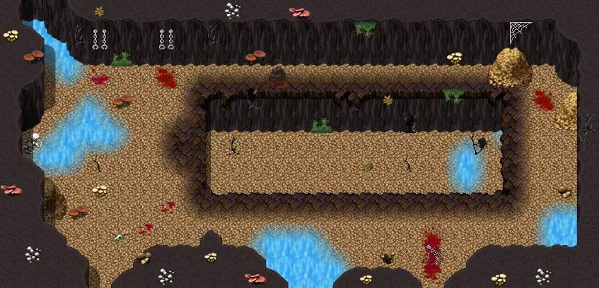
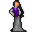

# Gamjee well jail cells

| | |
|---|---|
| **Map ID** | `gamjee_well_jail_cells` |
| **Type** | Indoors / underground |
| **Size** | 27×13 tiles |
| **World map** | [Gamjee well](index.md) |
| **Introduced** | [v0.8.12.1](../versions/0.8.12.1.md) |
| **NPCs** | 2 |
| **Enemy types** | 8 |
| **Quests** | 1 |
| **Containers** | 1 |

**Gamjee well jail cells** is an indoor map. It has 2 NPCs and 8 kinds of enemy. Exits lead to Gamjee well 2 1.

## Map

<label class="lg"><input type="checkbox" data-t="spawn" checked><b>Red</b>&nbsp;Monsters / NPCs</label><label class="lg"><input type="checkbox" data-t="mapchange" checked><b>Blue</b>&nbsp;Exit to another map</label><label class="lg"><input type="checkbox" data-t="container" checked><b>Yellow</b>&nbsp;Container (click to see contents)</label><label class="lg"><input type="checkbox" data-t="sign" checked><b>Purple</b>&nbsp;Sign</label><label class="lg"><input type="checkbox" data-t="rest" checked><b>Green</b>&nbsp;Resting place</label><label class="lg"><input type="checkbox" data-t="key" checked><b>Orange dashed</b>&nbsp;Blocked until a quest step / item</label><label class="lg"><input type="checkbox" data-t="script"><b>Grey dotted</b>&nbsp;Scripted event</label><label class="lg"><input type="checkbox" data-t="replace"><b>White dotted</b>&nbsp;Changes during a quest</label><label class="lg"><input type="checkbox" data-t="pin" checked><b>Numbers</b>&nbsp;Numbered key points (see the key below the map)</label>

<a class="pin pin-exit" href="#key-1" style="left:16.667%;top:96.154%" title="Exit (south): to [Gamjee well 2 1](gamjee_well_2_1.md)">1</a><a id="pin-npc-troll_hollow_osric" class="pin pin-npc" href="#key-2" style="left:68.519%;top:57.692%" title="[Osric](../../monsters/wexlow_osric.md#v-troll_hollow_osric): NPC">2</a><a id="pin-npc-troll_hollow_percival" class="pin pin-npc" href="#key-3" style="left:57.407%;top:57.692%" title="[Percival](../../monsters/village_percival.md#v-troll_hollow_percival): NPC">3</a><a class="pin pin-script" href="#key-4" style="left:51.852%;top:73.077%" title="Quest trigger: Scripted event: advances the quest: Echoes of enchantment to stage 6 (“I learned that these people are held captive by a troll and they need me to find a way to free them.”)">4</a><a class="pin pin-script" href="#key-5" style="left:42.593%;top:26.923%" title="Quest trigger: Scripted event: advances the quest: Echoes of enchantment to stage 10 (“The villagers have been freed. I should visit them back in their village of Wexlow.”)">5</a><a class="pin pin-container" href="#key-6" style="left:79.630%;top:50.000%" title="Container 1: Mysterious coin">6</a><a class="pin pin-key" href="#key-7" style="left:18.519%;top:80.769%" title="Blocked passage: Unlocked during the quest: Echoes of enchantment (stage 5: “Deep inside the well&#x27;s tunnels, I found eight people being held captive inside a very deep pit.”)">7</a><a class="pin pin-key" href="#key-8" style="left:46.296%;top:34.615%" title="Blocked passage: Unlocked during the quest: Echoes of enchantment (stage 10: “The villagers have been freed. I should visit them back in their village of Wexlow.”)">8</a><a class="pin pin-replace" href="#key-9" style="left:46.296%;top:42.308%" title="Changes during a quest: This area changes during the quest: Echoes of enchantment (stage 10: “The villagers have been freed. I should visit them back in their village of Wexlow.”)">9</a>

??? abstract "Key to the numbers on the map"

    | # | What | Details |
    |---|---|---|
    | 1 | Exit (south) | to [Gamjee well 2 1](gamjee_well_2_1.md) |
    | 2 | [Osric](../monsters/wexlow_osric.md#v-troll_hollow_osric) | NPC |
    | 3 | [Percival](../monsters/village_percival.md#v-troll_hollow_percival) | NPC |
    | 4 | Quest trigger | Scripted event: advances the quest: Echoes of enchantment to stage 6 (“I learned that these people are held captive by a troll and they need me to find a way to free them.”) |
    | 5 | Quest trigger | Scripted event: advances the quest: Echoes of enchantment to stage 10 (“The villagers have been freed. I should visit them back in their village of Wexlow.”) |
    | 6 | Container 1 | Mysterious coin |
    | 7 | Blocked passage | Unlocked during the quest: Echoes of enchantment (stage 5: “Deep inside the well's tunnels, I found eight people being held captive inside a very deep pit.”) |
    | 8 | Blocked passage | Unlocked during the quest: Echoes of enchantment (stage 10: “The villagers have been freed. I should visit them back in their village of Wexlow.”) |
    | 9 | Changes during a quest | This area changes during the quest: Echoes of enchantment (stage 10: “The villagers have been freed. I should visit them back in their village of Wexlow.”) |

Verified against v0.8.18 map data.

## Connections

| Direction | Leads to | Region there | Map # |
|---|---|---|---|
| South | [Gamjee well 2 1](gamjee_well_2_1.md) | – | 1 |

## NPCs

- [Osric](../monsters/wexlow_osric.md#v-troll_hollow_osric) (#2)
- [Percival](../monsters/village_percival.md#v-troll_hollow_percival) (#3)

## Enemies

| Enemy | HP | Damage | Up to | Notes |
|---|---|---|---|---|
| [Godelieve](../monsters/village_godelieve.md#v-troll_hollow_godelieve) | 0 | 0–0 | 1 | – |
| [Theodora](../monsters/village_theodora.md#v-troll_hollow_theodora) | 0 | 0–0 | 1 | – |
| [Godwin](../monsters/village_godwin.md#v-troll_hollow_godwin) | 0 | 0–0 | 1 | – |
| [Theobald](../monsters/village_theobald.md#v-troll_hollow_theobald) | 0 | 0–0 | 1 | – |
| [Philippa](../monsters/village_philippa.md#v-troll_hollow_philippa) | 0 | 0–0 | 1 | – |
| [Odilia](../monsters/village_odilia.md#v-troll_hollow_odilia) | 0 | 0–0 | 1 | – |
| [Burrowing glow worm](../monsters/burrowing_glow_worm.md) | 48 | 4–7 | 1 | – |
| [Hardershell beetle](../monsters/hardershell_beetle.md) | 54 | 1–7 | 3 | – |

<small>“Up to” is the most that can be alive at once from the spawn areas on this map.</small>

## Items & containers

<b>Container 1</b><ul><li><a href="../../items/mysterious_coin/">Mysterious coin</a> <small>100% · ×3 to 5</small></li></ul>

## Quests

- [Echoes of enchantment](../quests/echoes_of_enchantment.md): blocked passage opens at stage 10; blocked passage opens at stage 5; part of the map changes at stage 10; something on this map advances it; stepping on a trigger here sets stage 10; stepping on a trigger here sets stage 6

## Points of interest

- **Quest trigger** (#4): Scripted event: advances the quest: Echoes of enchantment to stage 6 (“I learned that these people are held captive by a troll and they need me to find a way to free them.”)
- **Quest trigger** (#5): Scripted event: advances the quest: Echoes of enchantment to stage 10 (“The villagers have been freed. I should visit them back in their village of Wexlow.”)
- **Blocked passage** (#7): Unlocked during the quest: Echoes of enchantment (stage 5: “Deep inside the well's tunnels, I found eight people being held captive inside a very deep pit.”)
- **Blocked passage** (#8): Unlocked during the quest: Echoes of enchantment (stage 10: “The villagers have been freed. I should visit them back in their village of Wexlow.”)
- **Changes during a quest** (#9): This area changes during the quest: Echoes of enchantment (stage 10: “The villagers have been freed. I should visit them back in their village of Wexlow.”)

## Version history

| Version | Change |
|---|---|
| [v0.8.12.1](../versions/0.8.12.1.md) | Added |

Verified against v0.8.18 and every earlier release back to v0.7.0 (game data compared release by release).

## Community notes

<small>Written by players, not generated from game data. **Observations**: what players notice in-game · **Lore**: the in-world story · **Trivia**: real-world facts, references, development history · **Theory / speculation**: unconfirmed ideas; may just be unfinished content</small>

### Observations

*No notes yet. Contributions are welcome: [add a note](https://github.com/asdfghjkl628/Andor-s-Trail-Wikiiii/new/main/notes/maps?filename=gamjee_well_jail_cells.md&value=%23%23%20Observations%0A%0A%3C%21--%20what%20players%20notice%20in-game%20--%3E%0A%0A%23%23%20Lore%0A%0A%3C%21--%20the%20in-world%20story%20--%3E%0A%0A%23%23%20Trivia%0A%0A%3C%21--%20real-world%20facts%2C%20references%2C%20development%20history%20--%3E%0A%0A%23%23%20Theory%20/%20speculation%0A%0A%3C%21--%20unconfirmed%20ideas%3B%20may%20just%20be%20unfinished%20content%20--%3E%0A).*

### Lore

*No notes yet. Contributions are welcome: [add a note](https://github.com/asdfghjkl628/Andor-s-Trail-Wikiiii/new/main/notes/maps?filename=gamjee_well_jail_cells.md&value=%23%23%20Observations%0A%0A%3C%21--%20what%20players%20notice%20in-game%20--%3E%0A%0A%23%23%20Lore%0A%0A%3C%21--%20the%20in-world%20story%20--%3E%0A%0A%23%23%20Trivia%0A%0A%3C%21--%20real-world%20facts%2C%20references%2C%20development%20history%20--%3E%0A%0A%23%23%20Theory%20/%20speculation%0A%0A%3C%21--%20unconfirmed%20ideas%3B%20may%20just%20be%20unfinished%20content%20--%3E%0A).*

### Trivia

*No notes yet. Contributions are welcome: [add a note](https://github.com/asdfghjkl628/Andor-s-Trail-Wikiiii/new/main/notes/maps?filename=gamjee_well_jail_cells.md&value=%23%23%20Observations%0A%0A%3C%21--%20what%20players%20notice%20in-game%20--%3E%0A%0A%23%23%20Lore%0A%0A%3C%21--%20the%20in-world%20story%20--%3E%0A%0A%23%23%20Trivia%0A%0A%3C%21--%20real-world%20facts%2C%20references%2C%20development%20history%20--%3E%0A%0A%23%23%20Theory%20/%20speculation%0A%0A%3C%21--%20unconfirmed%20ideas%3B%20may%20just%20be%20unfinished%20content%20--%3E%0A).*

### Theory / speculation

*No notes yet. Contributions are welcome: [add a note](https://github.com/asdfghjkl628/Andor-s-Trail-Wikiiii/new/main/notes/maps?filename=gamjee_well_jail_cells.md&value=%23%23%20Observations%0A%0A%3C%21--%20what%20players%20notice%20in-game%20--%3E%0A%0A%23%23%20Lore%0A%0A%3C%21--%20the%20in-world%20story%20--%3E%0A%0A%23%23%20Trivia%0A%0A%3C%21--%20real-world%20facts%2C%20references%2C%20development%20history%20--%3E%0A%0A%23%23%20Theory%20/%20speculation%0A%0A%3C%21--%20unconfirmed%20ideas%3B%20may%20just%20be%20unfinished%20content%20--%3E%0A).*

??? info "Technical information"

    | | |
    |---|---|
    | Map ID | `gamjee_well_jail_cells` |
    | File | `res/xml/gamjee_well_jail_cells.tmx` |
    | Size | 27×13 tiles (864×416 px) |
    | outdoors property | – |
    | Layers drawn | base, ground, objects, above, top |
    | Tilesets | map_bed_1, map_border_1, map_bridge_1, map_broken_1, map_cavewall_1, map_cavewall_2, map_cavewall_3, map_chair_table_1, map_crate_1, map_cupboard_1, map_curtain_1, map_entrance_1, map_fence_1, map_fence_2, map_ground_1, map_ground_2, map_ground_3, map_ground_4, map_ground_5, map_ground_6, map_ground_7, map_ground_8, map_indoor_1, map_indoor_2, map_kitchen_1, map_outdoor_1, map_pillar_1, map_plant_1, map_rock_1, map_roof_1, map_roof_2, map_shop_1, map_sign_ladder_1, map_table_1, map_trail_1, map_transition_1, map_transition_2, map_transition_5, map_tree_1, map_wall_1, map_wall_2, map_wall_3, map_window_1, map_window_2 |
    | Map objects | spawn: 12, script: 2, key: 2, mapchange: 1, container: 1, replace: 1 |
    | World map position | segment `gamjee_well`, x -599, y -726 |

<small>Data from v0.8.18</small>
