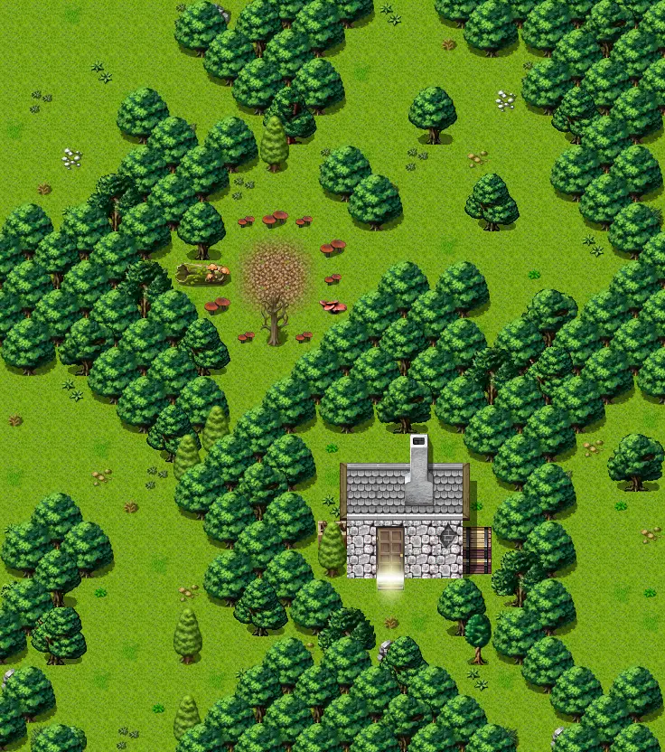

# Gapfiller2

| | |
|---|---|
| **Map ID** | `gapfiller2` |
| **Region** | Near Fallhaven (settlement) |
| **Type** | Outdoors |
| **Size** | 23×26 tiles |
| **World map** | [World1](index.md) |
| **Introduced** | v0.7.0 or earlier |
| **NPCs** | 2 |
| **Enemy types** | 4 |
| **Quests** | 3 |

**Gapfiller2** is an outdoor map, near Fallhaven (settlement). It has 2 NPCs and 4 kinds of enemy. Exits lead to Gapfiller4, Wild3, Fallhaven south-west, Wild9 and 2 more.

## Map

<label class="lg"><input type="checkbox" data-t="spawn" checked><b>Red</b>&nbsp;Monsters / NPCs</label><label class="lg"><input type="checkbox" data-t="mapchange" checked><b>Blue</b>&nbsp;Exit to another map</label><label class="lg"><input type="checkbox" data-t="container" checked><b>Yellow</b>&nbsp;Container (click to see contents)</label><label class="lg"><input type="checkbox" data-t="sign" checked><b>Purple</b>&nbsp;Sign</label><label class="lg"><input type="checkbox" data-t="rest" checked><b>Green</b>&nbsp;Resting place</label><label class="lg"><input type="checkbox" data-t="key" checked><b>Orange dashed</b>&nbsp;Blocked until a quest step / item</label><label class="lg"><input type="checkbox" data-t="script"><b>Grey dotted</b>&nbsp;Scripted event</label><label class="lg"><input type="checkbox" data-t="replace"><b>White dotted</b>&nbsp;Changes during a quest</label><label class="lg"><input type="checkbox" data-t="pin" checked><b>Numbers</b>&nbsp;Numbered key points (see the key below the map)</label>

<a class="pin pin-exit" href="#key-1" style="left:60.870%;top:1.923%" title="Exit (north): to [Gapfiller4](gapfiller4.md)">1</a><a class="pin pin-exit" href="#key-2" style="left:15.217%;top:1.923%" title="Exit (north): to [Wild3](wild3.md)">2</a><a class="pin pin-exit" href="#key-3" style="left:97.826%;top:78.846%" title="Exit (east): to [Fallhaven south-west](fallhaven_sw.md)">3</a><a class="pin pin-exit" href="#key-3" style="left:97.826%;top:57.692%" title="Exit (east): to [Fallhaven south-west](fallhaven_sw.md)">3</a><a class="pin pin-exit" href="#key-4" style="left:80.435%;top:98.077%" title="Exit (south): to [Wild9](wild9.md)">4</a><a class="pin pin-exit" href="#key-4" style="left:19.565%;top:98.077%" title="Exit (south): to [Wild9](wild9.md)">4</a><a class="pin pin-exit" href="#key-5" style="left:2.174%;top:17.308%" title="Exit (west): to [Wild5](wild5.md)">5</a><a class="pin pin-exit" href="#key-5" style="left:2.174%;top:61.538%" title="Exit (west): to [Wild5](wild5.md)">5</a><a class="pin pin-exit" href="#key-6" style="left:58.696%;top:75.000%" title="Exit (door): to [White house](white_house.md)">6</a><a id="pin-npc-lytwing_fallhaven" class="pin pin-npc" href="#key-7" style="left:45.652%;top:44.231%" title="[Lytwing](../../monsters/lytwing_fallhaven.md): 1 quest">7</a><a id="pin-npc-wild_berry" class="pin pin-npc" href="#key-8" style="left:89.130%;top:36.538%" title="[Wild berries](../../monsters/wild_berry.md): NPC">8</a><a class="pin pin-script" href="#key-9" style="left:63.063%;top:4.454%" title="Quest trigger: Scripted event: advances the quest: hidden story flag “fungi_panic_nondisplayed” to stage 110 (“110=Gardener gloves worn”)">9</a><a class="pin pin-sign" href="#key-10" style="left:41.304%;top:44.231%" title="Sign: A sign">10</a><a class="pin pin-key" href="#key-11" style="left:28.261%;top:90.385%" title="Blocked passage: Unlocked during the quest: Search for Andor (stage 1: “My father Mikhail says that Andor has not been home since yesterday. I should go look for him in the village.”)">11</a><a class="pin pin-key" href="#key-11" style="left:32.609%;top:86.538%" title="Blocked passage: Unlocked during the quest: Search for Andor (stage 1: “My father Mikhail says that Andor has not been home since yesterday. I should go look for him in the village.”)">11</a><a class="pin pin-key" href="#key-12" style="left:58.982%;top:72.116%" title="Blocked passage: Unlocked during the quest: Lost treasures (stage 90: “Nocmar told me to meet him at the glowing white house south of Fallhaven. He says the lock will no longer bar my entry, as he must prepare the forge and make sure the place is safe.”)">12</a>

??? abstract "Key to the numbers on the map"

    | # | What | Details |
    |---|---|---|
    | 1 | Exit (north) | to [Gapfiller4](gapfiller4.md) |
    | 2 | Exit (north) | to [Wild3](wild3.md) |
    | 3 | Exit (east) | to [Fallhaven south-west](fallhaven_sw.md) |
    | 4 | Exit (south) | to [Wild9](wild9.md) |
    | 5 | Exit (west) | to [Wild5](wild5.md) |
    | 6 | Exit (door) | to [White house](white_house.md) |
    | 7 | [Lytwing](../monsters/lytwing_fallhaven.md) | 1 quest |
    | 8 | [Wild berries](../monsters/wild_berry.md) | NPC |
    | 9 | Quest trigger | Scripted event: advances the quest: hidden story flag “fungi_panic_nondisplayed” to stage 110 (“110=Gardener gloves worn”) |
    | 10 | Sign | A sign |
    | 11 | Blocked passage | Unlocked during the quest: Search for Andor (stage 1: “My father Mikhail says that Andor has not been home since yesterday. I should go look for him in the village.”) |
    | 12 | Blocked passage | Unlocked during the quest: Lost treasures (stage 90: “Nocmar told me to meet him at the glowing white house south of Fallhaven. He says the lock will no longer bar my entry, as he must prepare the forge and make sure the place is safe.”) |

Verified against v0.8.18 map data.

## Connections

| Direction | Leads to | Region there | Map # |
|---|---|---|---|
| North | [Gapfiller4](gapfiller4.md) | Fallhaven | 1 |
| North | [Wild3](wild3.md) | Fallhaven | 2 |
| East | [Fallhaven south-west](fallhaven_sw.md) | Fallhaven | 3 |
| South | [Wild9](wild9.md) | Fallhaven | 4 |
| West | [Wild5](wild5.md) | Fallhaven | 5 |
| Door | [White house](white_house.md) | Fallhaven | 6 |

## NPCs

- [Lytwing](../monsters/lytwing_fallhaven.md) — quests: [It's knot funny](../quests/fallhaven_lytwings.md) (#7)
- [Wild berries](../monsters/wild_berry.md) (#8)

## Enemies

| Enemy | HP | Damage | Up to | Notes |
|---|---|---|---|---|
| [Forest ant](../monsters/forest_ant.md) | 4 | 1–2 | 2 | shares spawn with Yellow forest ant |
| [Yellow forest ant](../monsters/yellow_forest_ant.md) | 5 | 2–2 | 2 | shares spawn with Forest ant |
| [Forest beetle](../monsters/forest_beetle.md) | 14 | 2–4 | 2 | – |
| [Giant snake](../monsters/giant_snake.md) | 250 | 8–22 | 1 | appears later, during a quest |

<small>“Up to” is the most that can be alive at once from the spawn areas on this map.</small>

## Quests

- [It's knot funny](../quests/fallhaven_lytwings.md): [Lytwing](../monsters/lytwing_fallhaven.md) is involved; a scripted event can trigger here from stage 10; something on this map advances it
- [Lost treasures](../quests/nocmar.md): a scripted event can trigger here from stage 90; blocked passage opens at stage 90
- [Search for Andor](../quests/andor.md): blocked passage opens at stage 1
- [Fungi Panic - non displayed (hidden flag)](../quests/fungi_panic_nondisplayed.md): something on this map advances it; stepping on a trigger here sets stage 110

## Points of interest

- **Quest trigger** (#9): Scripted event: advances the quest: hidden story flag “fungi_panic_nondisplayed” to stage 110 (“110=Gardener gloves worn”)
- **Sign** (#10): A sign
- **Blocked passage** (#11): Unlocked during the quest: Search for Andor (stage 1: “My father Mikhail says that Andor has not been home since yesterday. I should go look for him in the village.”)
- **Blocked passage** (#12): Unlocked during the quest: Lost treasures (stage 90: “Nocmar told me to meet him at the glowing white house south of Fallhaven. He says the lock will no longer bar my entry, as he must prepare the forge and make sure the place is safe.”)

## Version history

| Version | Change |
|---|---|
| [v0.7.0](../versions/0.7.0.md) | Present in v0.7.0 (earliest release tracked) |
| [v0.7.1](../versions/0.7.1.md) | map layout or objects changed |
| [v0.7.2](../versions/0.7.2.md) | map layout or objects changed |
| [v0.7.13](../versions/0.7.13.md) | map layout or objects changed |
| [v0.8.12.1](../versions/0.8.12.1.md) | map layout or objects changed |
| [v0.8.18](../versions/0.8.18.md) | map layout or objects changed |

Verified against v0.8.18 and every earlier release back to v0.7.0 (game data compared release by release).

## Community notes

<small>Written by players, not generated from game data. **Observations**: what players notice in-game · **Lore**: the in-world story · **Trivia**: real-world facts, references, development history · **Theory / speculation**: unconfirmed ideas; may just be unfinished content</small>

### Observations

*No notes yet. Contributions are welcome: [add a note](https://github.com/asdfghjkl628/Andor-s-Trail-Wikiiii/new/main/notes/maps?filename=gapfiller2.md&value=%23%23%20Observations%0A%0A%3C%21--%20what%20players%20notice%20in-game%20--%3E%0A%0A%23%23%20Lore%0A%0A%3C%21--%20the%20in-world%20story%20--%3E%0A%0A%23%23%20Trivia%0A%0A%3C%21--%20real-world%20facts%2C%20references%2C%20development%20history%20--%3E%0A%0A%23%23%20Theory%20/%20speculation%0A%0A%3C%21--%20unconfirmed%20ideas%3B%20may%20just%20be%20unfinished%20content%20--%3E%0A).*

### Lore

*No notes yet. Contributions are welcome: [add a note](https://github.com/asdfghjkl628/Andor-s-Trail-Wikiiii/new/main/notes/maps?filename=gapfiller2.md&value=%23%23%20Observations%0A%0A%3C%21--%20what%20players%20notice%20in-game%20--%3E%0A%0A%23%23%20Lore%0A%0A%3C%21--%20the%20in-world%20story%20--%3E%0A%0A%23%23%20Trivia%0A%0A%3C%21--%20real-world%20facts%2C%20references%2C%20development%20history%20--%3E%0A%0A%23%23%20Theory%20/%20speculation%0A%0A%3C%21--%20unconfirmed%20ideas%3B%20may%20just%20be%20unfinished%20content%20--%3E%0A).*

### Trivia

*No notes yet. Contributions are welcome: [add a note](https://github.com/asdfghjkl628/Andor-s-Trail-Wikiiii/new/main/notes/maps?filename=gapfiller2.md&value=%23%23%20Observations%0A%0A%3C%21--%20what%20players%20notice%20in-game%20--%3E%0A%0A%23%23%20Lore%0A%0A%3C%21--%20the%20in-world%20story%20--%3E%0A%0A%23%23%20Trivia%0A%0A%3C%21--%20real-world%20facts%2C%20references%2C%20development%20history%20--%3E%0A%0A%23%23%20Theory%20/%20speculation%0A%0A%3C%21--%20unconfirmed%20ideas%3B%20may%20just%20be%20unfinished%20content%20--%3E%0A).*

### Theory / speculation

*No notes yet. Contributions are welcome: [add a note](https://github.com/asdfghjkl628/Andor-s-Trail-Wikiiii/new/main/notes/maps?filename=gapfiller2.md&value=%23%23%20Observations%0A%0A%3C%21--%20what%20players%20notice%20in-game%20--%3E%0A%0A%23%23%20Lore%0A%0A%3C%21--%20the%20in-world%20story%20--%3E%0A%0A%23%23%20Trivia%0A%0A%3C%21--%20real-world%20facts%2C%20references%2C%20development%20history%20--%3E%0A%0A%23%23%20Theory%20/%20speculation%0A%0A%3C%21--%20unconfirmed%20ideas%3B%20may%20just%20be%20unfinished%20content%20--%3E%0A).*

??? info "Technical information"

    | | |
    |---|---|
    | Map ID | `gapfiller2` |
    | File | `res/xml/gapfiller2.tmx` |
    | Size | 23×26 tiles (736×832 px) |
    | outdoors property | 1 |
    | Layers drawn | ground, objects, above |
    | Tilesets | map_bed_1, map_border_1, map_bridge_1, map_bridge_2, map_broken_1, map_cavewall_1, map_cavewall_2, map_cavewall_3, map_cavewall_4, map_chair_table_1, map_chair_table_2, map_crate_1, map_cupboard_1, map_curtain_1, map_entrance_1, map_entrance_2, map_fence_1, map_fence_2, map_fence_3, map_fence_4, map_ground_1, map_ground_2, map_ground_3, map_ground_4, map_ground_5, map_ground_6, map_ground_7, map_ground_8, map_house_1, map_house_2, map_indoor_1, map_indoor_2, map_kitchen_1, map_outdoor_1, map_pillar_1, map_pillar_2, map_plant_1, map_plant_2, map_rock_1, map_rock_2, map_roof_1, map_roof_2, map_roof_3, map_shop_1, map_sign_ladder_1, map_table_1, map_trail_1, map_transition_1, map_transition_2, map_transition_3, map_transition_4, map_transition_5, map_tree_1, map_tree_2, map_tree_3, map_wall_1, map_wall_2, map_wall_3, map_wall_4, map_window_1, map_window_2 |
    | Map objects | mapchange: 9, spawn: 5, script: 3, key: 3, sign: 1 |
    | World map position | segment `world1`, x 186, y 407 |

<small>Data from v0.8.18</small>
