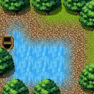

# Gapfillerhole

| | |
|---|---|
| **Map ID** | `gapfillerhole` |
| **Region** | In Fallhaven (settlement) |
| **Type** | Indoors / underground |
| **Size** | 6×6 tiles |
| **World map** | [World1](index.md) |
| **Introduced** | [v0.8.2](../versions/0.8.2.md) |
| **NPCs** | 2 |
| **Enemy types** | 3 |
| **Quests** | 1 |
| **Containers** | 1 |

**Gapfillerhole** is an indoor map, in Fallhaven (settlement). It has 2 NPCs and 3 kinds of enemy. Exits lead to Woodsettlement0.

## Map

<label class="lg"><input type="checkbox" data-t="spawn" checked><b>Red</b>&nbsp;Monsters / NPCs</label><label class="lg"><input type="checkbox" data-t="mapchange" checked><b>Blue</b>&nbsp;Exit to another map</label><label class="lg"><input type="checkbox" data-t="container" checked><b>Yellow</b>&nbsp;Container (click to see contents)</label><label class="lg"><input type="checkbox" data-t="sign" checked><b>Purple</b>&nbsp;Sign</label><label class="lg"><input type="checkbox" data-t="rest" checked><b>Green</b>&nbsp;Resting place</label><label class="lg"><input type="checkbox" data-t="key" checked><b>Orange dashed</b>&nbsp;Blocked until a quest step / item</label><label class="lg"><input type="checkbox" data-t="script"><b>Grey dotted</b>&nbsp;Scripted event</label><label class="lg"><input type="checkbox" data-t="replace"><b>White dotted</b>&nbsp;Changes during a quest</label><label class="lg"><input type="checkbox" data-t="pin" checked><b>Numbers</b>&nbsp;Numbered key points (see the key below the map)</label>

<a class="pin pin-exit" href="#key-1" style="left:91.667%;top:58.333%" title="Exit (east): to [Woodsettlement0](woodsettlement0.md)">1</a><a id="pin-npc-boat0" class="pin pin-npc" href="#key-2" style="left:8.333%;top:41.667%" title="[Beldric](../../monsters/boat0.md): NPC">2</a><a id="pin-npc-hungry_pig" class="pin pin-npc" href="#key-3" style="left:41.667%;top:25.000%" title="[Hungry pig](../../monsters/hungry_pig.md): 1 quest">3</a><a class="pin pin-container" href="#key-4" style="left:8.333%;top:25.000%" title="Container 1: Gold coins, Glass gem">4</a><a class="pin pin-script" href="#key-5" style="left:16.743%;top:52.635%" title="Quest trigger: Scripted event: advances the quest: hidden story flag “feygard_nondisplayed” to stage 30 (“boat0 clear”)">5</a><a class="pin pin-script" href="#key-6" style="left:25.000%;top:75.000%" title="Quest trigger: Scripted event: advances the quest: hidden story flag “feygard_nondisplayed” to stage 31 (“boat0 sunk”)">6</a><a class="pin pin-script" href="#key-7" style="left:58.333%;top:41.667%" title="Quest trigger: Scripted event: advances the quest: hidden story flag “feygard_nondisplayed” to stage 32 (“boat0 save”)">7</a><a class="pin pin-script" href="#key-7" style="left:75.000%;top:75.000%" title="Quest trigger: Scripted event: advances the quest: hidden story flag “feygard_nondisplayed” to stage 32 (“boat0 save”)">7</a><a class="pin pin-key" href="#key-8" style="left:16.973%;top:65.686%" title="Blocked passage: Unlocked during the quest: hidden story flag “feygard_nondisplayed” (stage 30: “boat0 clear”)">8</a>

??? abstract "Key to the numbers on the map"

    | # | What | Details |
    |---|---|---|
    | 1 | Exit (east) | to [Woodsettlement0](woodsettlement0.md) |
    | 2 | [Beldric](../monsters/boat0.md) | NPC |
    | 3 | [Hungry pig](../monsters/hungry_pig.md) | 1 quest |
    | 4 | Container 1 | Gold coins, Glass gem |
    | 5 | Quest trigger | Scripted event: advances the quest: hidden story flag “feygard_nondisplayed” to stage 30 (“boat0 clear”) |
    | 6 | Quest trigger | Scripted event: advances the quest: hidden story flag “feygard_nondisplayed” to stage 31 (“boat0 sunk”) |
    | 7 | Quest trigger | Scripted event: advances the quest: hidden story flag “feygard_nondisplayed” to stage 32 (“boat0 save”) |
    | 8 | Blocked passage | Unlocked during the quest: hidden story flag “feygard_nondisplayed” (stage 30: “boat0 clear”) |

Verified against v0.8.18 map data.

## Connections

| Direction | Leads to | Region there | Map # |
|---|---|---|---|
| East | [Woodsettlement0](woodsettlement0.md) | Fallhaven | 1 |

## NPCs

- [Beldric](../monsters/boat0.md) (#2)
- [Hungry pig](../monsters/hungry_pig.md) — quests: [Unusual experiences and achievements](../quests/achievements.md) (#3)

## Enemies

| Enemy | HP | Damage | Up to | Notes |
|---|---|---|---|---|
| [Roach](../monsters/vermin2.md) | 0 | 0–1 | 1 | shares spawn with Rat |
| [Rat](../monsters/vermin0.md#v-vermin1) | 0 | 0–1 | 1 | shares spawn with Rat, Roach |
| [Rat](../monsters/vermin0.md) | 0 | 0–1 | 1 | shares spawn with Rat, Roach |

<small>“Up to” is the most that can be alive at once from the spawn areas on this map.</small>

## Items & containers

<b>Container 1</b><ul><li><a href="../../items/gold/">Gold coins</a> <small>100% · ×10 to 100</small></li><li><a href="../../items/gem1/">Glass gem</a> <small>100% · ×1 to 2</small></li></ul>

## Quests

- [Unusual experiences and achievements](../quests/achievements.md): [Hungry pig](../monsters/hungry_pig.md) is involved
- [feygard_nondisplayed (hidden flag)](../quests/feygard_nondisplayed.md): blocked passage opens at stage 30; something on this map advances it; stepping on a trigger here sets stage 30; stepping on a trigger here sets stage 31; stepping on a trigger here sets stage 32
- [Placeholder for hidden quest stages (not displayed) (hidden flag)](../quests/nondisplay.md): [Hungry pig](../monsters/hungry_pig.md) is involved

## Points of interest

- **Quest trigger** (#5): Scripted event: advances the quest: hidden story flag “feygard_nondisplayed” to stage 30 (“boat0 clear”)
- **Quest trigger** (#6): Scripted event: advances the quest: hidden story flag “feygard_nondisplayed” to stage 31 (“boat0 sunk”)
- **Quest trigger** (#7): Scripted event: advances the quest: hidden story flag “feygard_nondisplayed” to stage 32 (“boat0 save”)
- **Blocked passage** (#8): Unlocked during the quest: hidden story flag “feygard_nondisplayed” (stage 30: “boat0 clear”)

## Version history

| Version | Change |
|---|---|
| [v0.8.2](../versions/0.8.2.md) | Added |
| [v0.8.11](../versions/0.8.11.md) | Map layout or objects changed |
| [v0.8.12.1](../versions/0.8.12.1.md) | Map layout or objects changed |

Verified against v0.8.18 and every earlier release back to v0.7.0 (game data compared release by release).

## Community notes

<small>Written by players, not generated from game data. **Observations**: what players notice in-game · **Lore**: the in-world story · **Trivia**: real-world facts, references, development history · **Theory / speculation**: unconfirmed ideas; may just be unfinished content</small>

### Observations

*No notes yet. Contributions are welcome: [add a note](https://github.com/asdfghjkl628/Andor-s-Trail-Wikiiii/new/main/notes/maps?filename=gapfillerhole.md&value=%23%23%20Observations%0A%0A%3C%21--%20what%20players%20notice%20in-game%20--%3E%0A%0A%23%23%20Lore%0A%0A%3C%21--%20the%20in-world%20story%20--%3E%0A%0A%23%23%20Trivia%0A%0A%3C%21--%20real-world%20facts%2C%20references%2C%20development%20history%20--%3E%0A%0A%23%23%20Theory%20/%20speculation%0A%0A%3C%21--%20unconfirmed%20ideas%3B%20may%20just%20be%20unfinished%20content%20--%3E%0A).*

### Lore

*No notes yet. Contributions are welcome: [add a note](https://github.com/asdfghjkl628/Andor-s-Trail-Wikiiii/new/main/notes/maps?filename=gapfillerhole.md&value=%23%23%20Observations%0A%0A%3C%21--%20what%20players%20notice%20in-game%20--%3E%0A%0A%23%23%20Lore%0A%0A%3C%21--%20the%20in-world%20story%20--%3E%0A%0A%23%23%20Trivia%0A%0A%3C%21--%20real-world%20facts%2C%20references%2C%20development%20history%20--%3E%0A%0A%23%23%20Theory%20/%20speculation%0A%0A%3C%21--%20unconfirmed%20ideas%3B%20may%20just%20be%20unfinished%20content%20--%3E%0A).*

### Trivia

*No notes yet. Contributions are welcome: [add a note](https://github.com/asdfghjkl628/Andor-s-Trail-Wikiiii/new/main/notes/maps?filename=gapfillerhole.md&value=%23%23%20Observations%0A%0A%3C%21--%20what%20players%20notice%20in-game%20--%3E%0A%0A%23%23%20Lore%0A%0A%3C%21--%20the%20in-world%20story%20--%3E%0A%0A%23%23%20Trivia%0A%0A%3C%21--%20real-world%20facts%2C%20references%2C%20development%20history%20--%3E%0A%0A%23%23%20Theory%20/%20speculation%0A%0A%3C%21--%20unconfirmed%20ideas%3B%20may%20just%20be%20unfinished%20content%20--%3E%0A).*

### Theory / speculation

*No notes yet. Contributions are welcome: [add a note](https://github.com/asdfghjkl628/Andor-s-Trail-Wikiiii/new/main/notes/maps?filename=gapfillerhole.md&value=%23%23%20Observations%0A%0A%3C%21--%20what%20players%20notice%20in-game%20--%3E%0A%0A%23%23%20Lore%0A%0A%3C%21--%20the%20in-world%20story%20--%3E%0A%0A%23%23%20Trivia%0A%0A%3C%21--%20real-world%20facts%2C%20references%2C%20development%20history%20--%3E%0A%0A%23%23%20Theory%20/%20speculation%0A%0A%3C%21--%20unconfirmed%20ideas%3B%20may%20just%20be%20unfinished%20content%20--%3E%0A).*

??? info "Technical information"

    | | |
    |---|---|
    | Map ID | `gapfillerhole` |
    | File | `res/xml/gapfillerhole.tmx` |
    | Size | 6×6 tiles (192×192 px) |
    | outdoors property | – |
    | Layers drawn | base, ground, objects, above, top |
    | Tilesets | map_bed_1, map_boats_1, map_border_1, map_bridge_1, map_bridge_2, map_broken_1, map_cavewall_1, map_cavewall_2, map_cavewall_3, map_cavewall_4, map_chair_table_1, map_chair_table_2, map_crate_1, map_cupboard_1, map_curtain_1, map_entrance_1, map_entrance_2, map_fence_1, map_fence_2, map_fence_3, map_fence_4, map_ground_1, map_ground_2, map_ground_3, map_ground_4, map_ground_5, map_ground_6, map_ground_7, map_ground_8, map_guynmart, map_house_1, map_house_2, map_indoor_1, map_indoor_2, map_kitchen_1, map_outdoor_1, map_pillar_1, map_pillar_2, map_plant_1, map_plant_2, map_rock_1, map_rock_2, map_roof_1, map_roof_2, map_roof_3, map_shop_1, map_sign_ladder_1, map_table_1, map_trail_1, map_transition_1, map_transition_2, map_transition_3, map_transition_4, map_transition_5, map_tree_1, map_tree_2, map_wall_1, map_wall_2, map_wall_3, map_wall_4, map_window_1, map_window_2 |
    | Map objects | replace: 9, script: 6, spawn: 3, mapchange: 1, container: 1, key: 1 |
    | World map position | segment `world1`, x 194, y 375 |

<small>Data from v0.8.18</small>
