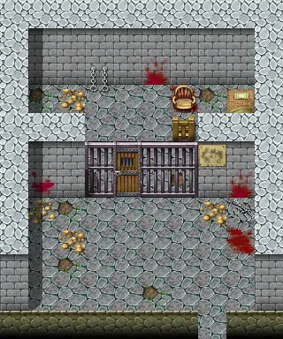

# Guildbrig2

| | |
|---|---|
| **Map ID** | `guildbrig2` |
| **Region** | In Fallhaven (settlement) |
| **Type** | Indoors / underground |
| **Size** | 10×12 tiles |
| **Introduced** | [v0.7.8](../versions/0.7.8.md) |
| **Enemy types** | 5 |
| **Quests** | 1 |
| **Containers** | 1 |

**Guildbrig2** is an indoor map, in Fallhaven (settlement). It has no NPCs and 5 kinds of enemy. Exits lead to Guildbrig1.

## Map

<label class="lg"><input type="checkbox" data-t="spawn" checked><b>Red</b>&nbsp;Monsters / NPCs</label><label class="lg"><input type="checkbox" data-t="mapchange" checked><b>Blue</b>&nbsp;Exit to another map</label><label class="lg"><input type="checkbox" data-t="container" checked><b>Yellow</b>&nbsp;Container (click to see contents)</label><label class="lg"><input type="checkbox" data-t="sign" checked><b>Purple</b>&nbsp;Sign</label><label class="lg"><input type="checkbox" data-t="rest" checked><b>Green</b>&nbsp;Resting place</label><label class="lg"><input type="checkbox" data-t="key" checked><b>Orange dashed</b>&nbsp;Blocked until a quest step / item</label><label class="lg"><input type="checkbox" data-t="script"><b>Grey dotted</b>&nbsp;Scripted event</label><label class="lg"><input type="checkbox" data-t="replace"><b>White dotted</b>&nbsp;Changes during a quest</label><label class="lg"><input type="checkbox" data-t="pin" checked><b>Numbers</b>&nbsp;Numbered key points (see the key below the map)</label>

<a class="pin pin-exit" href="#key-1" style="left:75.000%;top:95.833%" title="Exit (south): to [Guildbrig1](guildbrig1.md)">1</a><a class="pin pin-container" href="#key-2" style="left:85.000%;top:62.500%" title="Container 1: Rotten meat, Gold coins">2</a><a class="pin pin-script" href="#key-3" style="left:45.000%;top:62.500%" title="Quest trigger: Scripted event: advances the quest: Immaculate kidnapping to stage 65 (“I gave the bread to Ambelie. I should report Troublemaker that I completed the job.”)">3</a><a class="pin pin-key" href="#key-4" style="left:45.658%;top:56.251%" title="Blocked passage: Unlocked during the quest: Immaculate kidnapping (stage 55: “I left Ambelie in that ugly, dark, and cold place. I should go back.”)">4</a>

??? abstract "Key to the numbers on the map"

    | # | What | Details |
    |---|---|---|
    | 1 | Exit (south) | to [Guildbrig1](guildbrig1.md) |
    | 2 | Container 1 | Rotten meat, Gold coins |
    | 3 | Quest trigger | Scripted event: advances the quest: Immaculate kidnapping to stage 65 (“I gave the bread to Ambelie. I should report Troublemaker that I completed the job.”) |
    | 4 | Blocked passage | Unlocked during the quest: Immaculate kidnapping (stage 55: “I left Ambelie in that ugly, dark, and cold place. I should go back.”) |

Verified against v0.8.18 map data.

## Connections

| Direction | Leads to | Region there | Map # |
|---|---|---|---|
| South | [Guildbrig1](guildbrig1.md) | Fallhaven | 1 |

## Enemies

| Enemy | HP | Damage | Up to | Notes |
|---|---|---|---|---|
| [Alaric](../monsters/aidem_base_alaric.md#v-aidem_jail_alaric) | 0 | 0–0 | 1 | appears later, during a quest |
| [Zachlanny](../monsters/aidem_camp_zachlanny.md#v-aidem_jail_zachlanny) | 0 | 0–0 | 1 | appears later, during a quest |
| [Greedy](../monsters/aidem_camp_greedy.md#v-aidem_jail_greedy) | 0 | 0–0 | 1 | appears later, during a quest |
| [Defy](../monsters/g04_defy.md#v-aidem_jail_defy) | 0 | 0–0 | 1 | appears later, during a quest |
| [Grabby](../monsters/aidem_camp_grabby.md#v-aidem_jail_grabby) | 0 | 0–0 | 1 | appears later, during a quest |

<small>“Up to” is the most that can be alive at once from the spawn areas on this map.</small>

## Items & containers

<b>Container 1</b><ul><li><a href="../../items/meat2/">Rotten meat</a> <small>100% · ×1 to 3</small></li><li><a href="../../items/gold/">Gold coins</a> <small>100% · ×1 to 10</small></li></ul>

## Quests

- [Immaculate kidnapping](../quests/Thieves02.md): blocked passage opens at stage 55; something on this map advances it; stepping on a trigger here sets stage 65

## Points of interest

- **Quest trigger** (#3): Scripted event: advances the quest: Immaculate kidnapping to stage 65 (“I gave the bread to Ambelie. I should report Troublemaker that I completed the job.”)
- **Blocked passage** (#4): Unlocked during the quest: Immaculate kidnapping (stage 55: “I left Ambelie in that ugly, dark, and cold place. I should go back.”)

## Version history

| Version | Change |
|---|---|
| [v0.7.8](../versions/0.7.8.md) | Added |
| [v0.7.13](../versions/0.7.13.md) | map layout or objects changed |
| [v0.8.8](../versions/0.8.8.md) | map layout or objects changed |

Verified against v0.8.18 and every earlier release back to v0.7.0 (game data compared release by release).

## Community notes

<small>Written by players, not generated from game data. **Observations**: what players notice in-game · **Lore**: the in-world story · **Trivia**: real-world facts, references, development history · **Theory / speculation**: unconfirmed ideas; may just be unfinished content</small>

### Observations

*No notes yet. Contributions are welcome: [add a note](https://github.com/asdfghjkl628/Andor-s-Trail-Wikiiii/new/main/notes/maps?filename=guildbrig2.md&value=%23%23%20Observations%0A%0A%3C%21--%20what%20players%20notice%20in-game%20--%3E%0A%0A%23%23%20Lore%0A%0A%3C%21--%20the%20in-world%20story%20--%3E%0A%0A%23%23%20Trivia%0A%0A%3C%21--%20real-world%20facts%2C%20references%2C%20development%20history%20--%3E%0A%0A%23%23%20Theory%20/%20speculation%0A%0A%3C%21--%20unconfirmed%20ideas%3B%20may%20just%20be%20unfinished%20content%20--%3E%0A).*

### Lore

*No notes yet. Contributions are welcome: [add a note](https://github.com/asdfghjkl628/Andor-s-Trail-Wikiiii/new/main/notes/maps?filename=guildbrig2.md&value=%23%23%20Observations%0A%0A%3C%21--%20what%20players%20notice%20in-game%20--%3E%0A%0A%23%23%20Lore%0A%0A%3C%21--%20the%20in-world%20story%20--%3E%0A%0A%23%23%20Trivia%0A%0A%3C%21--%20real-world%20facts%2C%20references%2C%20development%20history%20--%3E%0A%0A%23%23%20Theory%20/%20speculation%0A%0A%3C%21--%20unconfirmed%20ideas%3B%20may%20just%20be%20unfinished%20content%20--%3E%0A).*

### Trivia

*No notes yet. Contributions are welcome: [add a note](https://github.com/asdfghjkl628/Andor-s-Trail-Wikiiii/new/main/notes/maps?filename=guildbrig2.md&value=%23%23%20Observations%0A%0A%3C%21--%20what%20players%20notice%20in-game%20--%3E%0A%0A%23%23%20Lore%0A%0A%3C%21--%20the%20in-world%20story%20--%3E%0A%0A%23%23%20Trivia%0A%0A%3C%21--%20real-world%20facts%2C%20references%2C%20development%20history%20--%3E%0A%0A%23%23%20Theory%20/%20speculation%0A%0A%3C%21--%20unconfirmed%20ideas%3B%20may%20just%20be%20unfinished%20content%20--%3E%0A).*

### Theory / speculation

*No notes yet. Contributions are welcome: [add a note](https://github.com/asdfghjkl628/Andor-s-Trail-Wikiiii/new/main/notes/maps?filename=guildbrig2.md&value=%23%23%20Observations%0A%0A%3C%21--%20what%20players%20notice%20in-game%20--%3E%0A%0A%23%23%20Lore%0A%0A%3C%21--%20the%20in-world%20story%20--%3E%0A%0A%23%23%20Trivia%0A%0A%3C%21--%20real-world%20facts%2C%20references%2C%20development%20history%20--%3E%0A%0A%23%23%20Theory%20/%20speculation%0A%0A%3C%21--%20unconfirmed%20ideas%3B%20may%20just%20be%20unfinished%20content%20--%3E%0A).*

??? info "Technical information"

    | | |
    |---|---|
    | Map ID | `guildbrig2` |
    | File | `res/xml/guildbrig2.tmx` |
    | Size | 10×12 tiles (320×384 px) |
    | outdoors property | – |
    | Layers drawn | ground, objects, above |
    | Tilesets | map_bed_1, map_border_1, map_bridge_1, map_bridge_2, map_broken_1, map_cavewall_1, map_cavewall_2, map_cavewall_3, map_cavewall_4, map_chair_table_1, map_chair_table_2, map_crate_1, map_cupboard_1, map_curtain_1, map_entrance_1, map_entrance_2, map_fence_1, map_fence_2, map_fence_3, map_fence_4, map_ground_1, map_ground_2, map_ground_3, map_ground_4, map_ground_5, map_ground_6, map_ground_7, map_ground_8, map_house_1, map_house_2, map_indoor_1, map_indoor_2, map_kitchen_1, map_outdoor_1, map_pillar_1, map_pillar_2, map_plant_1, map_plant_2, map_rock_1, map_rock_2, map_roof_1, map_roof_2, map_roof_3, map_shop_1, map_sign_ladder_1, map_table_1, map_trail_1, map_transition_1, map_transition_2, map_transition_3, map_transition_4, map_transition_5, map_tree_1, map_tree_2, map_wall_1, map_wall_2, map_wall_3, map_wall_4, map_window_1, map_window_2 |
    | Map objects | spawn: 6, container: 1, mapchange: 1, script: 1, key: 1 |
    | World map position | – |

<small>Data from v0.8.18</small>
