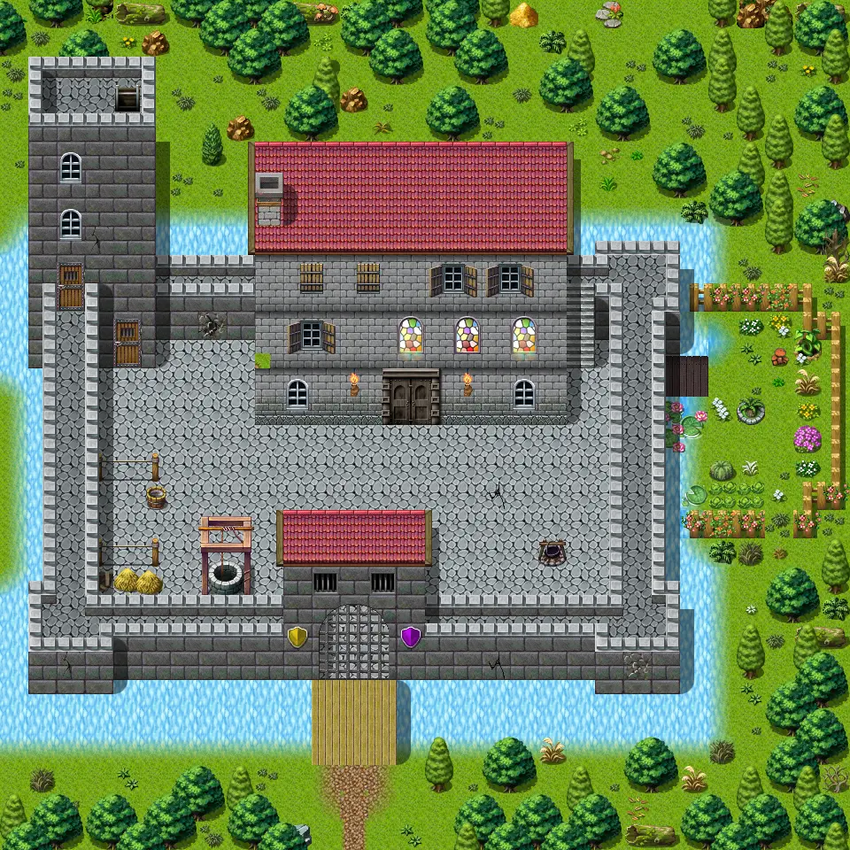
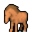

# Guynmart

30×30 tiles · outdoors · part of [World1](index.md)

<label class="lg"><input type="checkbox" data-t="spawn" checked><b>Red</b>&nbsp;Monsters / NPCs</label><label class="lg"><input type="checkbox" data-t="mapchange" checked><b>Blue</b>&nbsp;Exit to another map</label><label class="lg"><input type="checkbox" data-t="container" checked><b>Yellow</b>&nbsp;Container (click to see contents)</label><label class="lg"><input type="checkbox" data-t="sign" checked><b>Purple</b>&nbsp;Sign</label><label class="lg"><input type="checkbox" data-t="rest" checked><b>Green</b>&nbsp;Resting place</label><label class="lg"><input type="checkbox" data-t="key" checked><b>Orange dashed</b>&nbsp;Blocked until a quest step / item</label><label class="lg"><input type="checkbox" data-t="script"><b>Grey dotted</b>&nbsp;Scripted event</label><label class="lg"><input type="checkbox" data-t="replace"><b>White dotted</b>&nbsp;Changes during a quest</label>

## Exits

- [Guynmart gate 2](guynmart_gate_2.md)
- [Guynmart main 1](guynmart_main_1.md)
- [Guynmart main 2](guynmart_main_2.md)
- [Guynmart tower 1](guynmart_tower_1.md)
- [Guynmart tower 2](guynmart_tower_2.md)
- [Guynmart tower 4](guynmart_tower_4.md)
- [Guynmart wood 1](guynmart_wood_1.md)
- [Guynmart wood 2](guynmart_wood_2.md)
- [Guynmart wood 6](guynmart_wood_6.md)
- [Guynmart wood 8](guynmart_wood_8.md)
- [Guynmart wood 9](guynmart_wood_9.md)

## Monsters & NPCs here

| Name | HP |
|---|---|
| [Guynmart guard](../monsters/guynmart_guard_guide.md) | 0 |
| [Guynmart elite guard](../monsters/guynmart_pguard.md) | 0 |
| [Horse](../monsters/guynmart_horse.md) | 0 |
| [Nuik](../monsters/guynmart_nuik.md) | 0 |
| [Unkorh](../monsters/guynmart_steward3.md) | 0 |
| [Hannah](../monsters/guynmart_hannah.md) | 0 |
| [Olav](../monsters/guynmart_olav.md) | 0 |
| [Guynmart guard](../monsters/guynmart_wguard.md) | 0 |
| [Rob](../monsters/guynmart_rob2.md) | 0 |
| [Guynmart guard](../monsters/guynmart_player.md) | 0 |
| [Guynmart guard](../monsters/guynmart_gguard.md) | 0 |
| [Vicious hound](../monsters/vicious_hound.md) | 31 |
| [Rabid hound](../monsters/rabid_hound.md) | 40 |
| [Guynmart guard](../monsters/guynmart_wguard1.md) | 120 |
| [Guynmart guard](../monsters/guynmart_wguard9a.md) | 120 |

<small>Map ID: `guynmart` · Data from v0.8.18</small>
