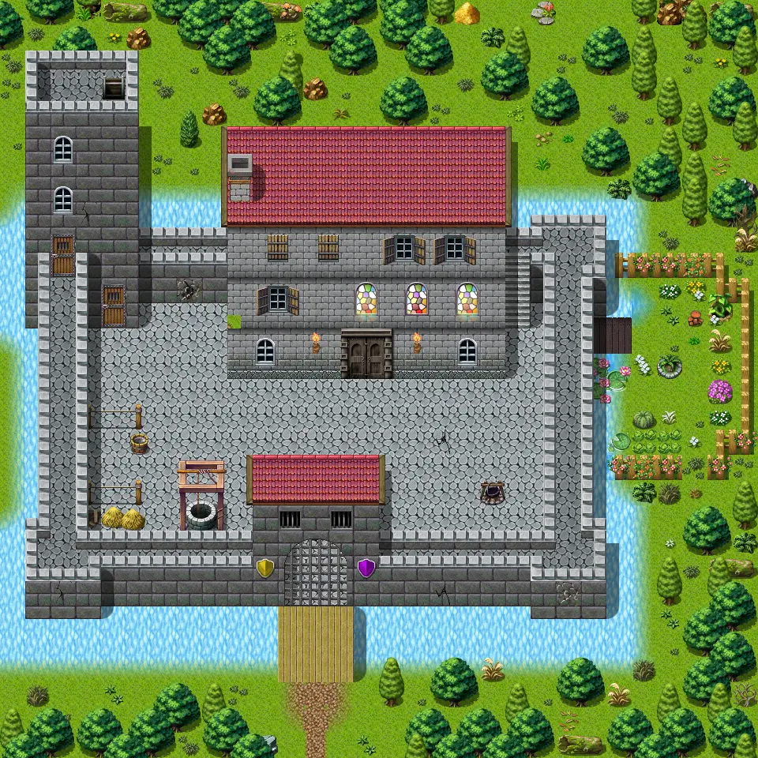

# Guynmart

| | |
|---|---|
| **Map ID** | `guynmart` |
| **Region** | In Guynmart Castle (other) |
| **Type** | Outdoors |
| **Size** | 30×30 tiles |
| **World map** | [World 1](index.md) |
| **Introduced** | [v0.7.2](../versions/0.7.2.md) |
| **NPCs** | 11 |
| **Enemy types** | 4 |
| **Quests** | 1 |

**Guynmart** is an outdoor map, in Guynmart Castle (other). It has 11 NPCs and 4 kinds of enemy. Exits lead to Guynmart wood 2, Guynmart wood 9, Guynmart wood 1, Guynmart wood 6 and 7 more.

## Map

<label class="lg"><input type="checkbox" data-t="spawn" checked><b>Red</b>&nbsp;Monsters / NPCs</label><label class="lg"><input type="checkbox" data-t="mapchange" checked><b>Blue</b>&nbsp;Exit to another map</label><label class="lg"><input type="checkbox" data-t="container" checked><b>Yellow</b>&nbsp;Container (click to see contents)</label><label class="lg"><input type="checkbox" data-t="sign" checked><b>Purple</b>&nbsp;Sign</label><label class="lg"><input type="checkbox" data-t="rest" checked><b>Green</b>&nbsp;Resting place</label><label class="lg"><input type="checkbox" data-t="key" checked><b>Orange dashed</b>&nbsp;Blocked until a quest step / item</label><label class="lg"><input type="checkbox" data-t="script"><b>Grey dotted</b>&nbsp;Scripted event</label><label class="lg"><input type="checkbox" data-t="replace"><b>White dotted</b>&nbsp;Changes during a quest</label><label class="lg"><input type="checkbox" data-t="pin" checked><b>Numbers</b>&nbsp;Numbered key points (see the key below the map)</label>

<a class="pin pin-exit" href="#key-1" style="left:50.000%;top:1.667%" title="Exit (north): to [Guynmart wood 2](guynmart_wood_2.md)">1</a><a class="pin pin-exit" href="#key-2" style="left:98.333%;top:13.333%" title="Exit (east): to [Guynmart wood 9](guynmart_wood_9.md)">2</a><a class="pin pin-exit" href="#key-3" style="left:45.000%;top:98.333%" title="Exit (south): to [Guynmart wood 1](guynmart_wood_1.md)">3</a><a class="pin pin-exit" href="#key-4" style="left:1.667%;top:46.667%" title="Exit (west): to [Guynmart wood 6](guynmart_wood_6.md)">4</a><a class="pin pin-exit" href="#key-5" style="left:1.667%;top:91.667%" title="Exit (west): to [Guynmart wood 8](guynmart_wood_8.md)">5</a><a class="pin pin-exit" href="#key-5" style="left:1.667%;top:65.000%" title="Exit (west): to [Guynmart wood 8](guynmart_wood_8.md)">5</a><a class="pin pin-exit" href="#key-6" style="left:31.667%;top:71.667%" title="Exit (door): to [Guynmart gate 2](guynmart_gate_2.md)">6</a><a class="pin pin-exit" href="#key-7" style="left:48.333%;top:48.333%" title="Exit (door): to [Guynmart main 1](guynmart_main_1.md)">7</a><a class="pin pin-exit" href="#key-8" style="left:28.333%;top:31.667%" title="Exit (door): to [Guynmart main 2](guynmart_main_2.md)">8</a><a class="pin pin-exit" href="#key-9" style="left:15.000%;top:41.667%" title="Exit (door): to [Guynmart tower 1](guynmart_tower_1.md)">9</a><a class="pin pin-exit" href="#key-10" style="left:18.333%;top:31.667%" title="Exit (door): to [Guynmart tower 2](guynmart_tower_2.md)">10</a><a class="pin pin-exit" href="#key-10" style="left:8.333%;top:35.000%" title="Exit (door): to [Guynmart tower 2](guynmart_tower_2.md)">10</a><a class="pin pin-exit" href="#key-11" style="left:15.000%;top:11.667%" title="Exit (door): to [Guynmart tower 4](guynmart_tower_4.md)">11</a><a id="pin-npc-guynmart_pguard" class="pin pin-npc" href="#key-12" style="left:31.667%;top:58.333%" title="[Guynmart elite guard](../../monsters/guynmart_pguard.md): NPC">12</a><a id="pin-npc-guynmart_guard_guide" class="pin pin-npc" href="#key-13" style="left:45.000%;top:81.667%" title="[Guynmart guard](../../monsters/guynmart_gguard.md#v-guynmart_guard_guide): 1 quest">13</a><a id="pin-npc-guynmart_gguard" class="pin pin-npc" href="#key-14" style="left:81.667%;top:41.667%" title="[Guynmart guard](../../monsters/guynmart_gguard.md): shopkeeper, 1 quest">14</a><a id="pin-npc-guynmart_wguard" class="pin pin-npc" href="#key-15" style="left:28.333%;top:45.000%" title="[Guynmart guard](../../monsters/guynmart_gguard.md#v-guynmart_wguard): NPC">15</a><a id="pin-npc-guynmart_player" class="pin pin-npc" href="#key-16" style="left:61.667%;top:68.333%" title="[Guynmart guard](../../monsters/guynmart_gguard.md#v-guynmart_player): NPC">16</a><a id="pin-npc-guynmart_hannah" class="pin pin-npc" href="#key-17" style="left:8.333%;top:8.333%" title="[Hannah](../../monsters/guynmart_hannah.md): 1 quest">17</a><a id="pin-npc-guynmart_horse" class="pin pin-npc" href="#key-18" style="left:15.000%;top:58.333%" title="[Horse](../../monsters/stn_horse.md#v-guynmart_horse): NPC">18</a><a id="pin-npc-guynmart_nuik" class="pin pin-npc" href="#key-19" style="left:88.333%;top:51.667%" title="[Nuik](../../monsters/guynmart_nuik.md): NPC">19</a><a id="pin-npc-guynmart_olav" class="pin pin-npc" href="#key-20" style="left:18.333%;top:51.667%" title="[Olav](../../monsters/guynmart_olav.md): NPC">20</a><a id="pin-npc-guynmart_rob2" class="pin pin-npc" href="#key-21" style="left:75.000%;top:38.333%" title="[Rob](../../monsters/guynmart_rob.md#v-guynmart_rob2): NPC">21</a><a id="pin-npc-guynmart_steward3" class="pin pin-npc" href="#key-22" style="left:51.667%;top:51.667%" title="[Unkorh](../../monsters/guynmart_steward.md#v-guynmart_steward3): 1 quest">22</a><a class="pin pin-sign" href="#key-23" style="left:91.667%;top:38.333%" title="Sign: “My hellebori! Can&#x27;t you be careful?”">23</a><a class="pin pin-sign" href="#key-24" style="left:95.000%;top:55.000%" title="Sign: “No! Get away from my cerastii!”">24</a><a class="pin pin-sign" href="#key-25" style="left:95.000%;top:48.333%" title="Sign: “Watch it! Don&#x27;t step on my precious buphtalmum!”">25</a><a class="pin pin-sign" href="#key-26" style="left:88.333%;top:38.333%" title="Sign: “My arenaria! Don&#x27;t step on my arenaria!”">26</a><a class="pin pin-sign" href="#key-27" style="left:88.333%;top:55.000%" title="Sign: “Watch it! Don&#x27;t step on my strelitzia reginae!”">27</a><a class="pin pin-script" href="#key-28" style="left:68.333%;top:35.000%" title="Quest trigger: Scripted event: advances the quest: hidden story flag “guynmart_qRpl_main” to stage 1 (“1=ground”)">28</a><a class="pin pin-script" href="#key-28" style="left:48.333%;top:51.667%" title="Quest trigger: Scripted event: advances the quest: hidden story flag “guynmart_qRpl_main” to stage 1 (“1=ground”)">28</a><a class="pin pin-script" href="#key-28" style="left:16.667%;top:45.000%" title="Quest trigger: Scripted event: advances the quest: hidden story flag “guynmart_qRpl_main” to stage 1 (“1=ground”)">28</a><a class="pin pin-script" href="#key-28" style="left:18.333%;top:68.333%" title="Quest trigger: Scripted event: advances the quest: hidden story flag “guynmart_qRpl_main” to stage 1 (“1=ground”)">28</a><a class="pin pin-script" href="#key-29" style="left:75.000%;top:35.000%" title="Quest trigger: Scripted event: advances the quest: hidden story flag “guynmart_qRpl_main” to stage 22 (“22=wall2”)">29</a><a class="pin pin-script" href="#key-30" style="left:25.000%;top:31.667%" title="Quest trigger: Scripted event: advances the quest: hidden story flag “guynmart_qRpl_main” to stage 2 (“2=wall”)">30</a><a class="pin pin-script" href="#key-30" style="left:8.333%;top:38.333%" title="Quest trigger: Scripted event: advances the quest: hidden story flag “guynmart_qRpl_main” to stage 2 (“2=wall”)">30</a><a class="pin pin-script" href="#key-31" style="left:68.333%;top:48.333%" title="Quest trigger: Scripted event: advances the quest: hidden story flag “guynmart_quest_olav” to stage 7 (“7 olav-”)">31</a><a class="pin pin-script" href="#key-32" style="left:88.333%;top:48.333%" title="Quest trigger: Scripted event: advances the quest: hidden story flag “guynmart_quest_olav” to stage 1 (“1”)">32</a><a class="pin pin-script" href="#key-33" style="left:68.333%;top:28.333%" title="Quest trigger: Scripted event: advances the quest: hidden story flag “guynmart_quest_olav” to stage 71 (“71 wall”)">33</a><a class="pin pin-script" href="#key-34" style="left:70.000%;top:25.000%" title="Quest trigger: Scripted event: advances the quest: Roses to stage 180 (“When I got to the castle on the next day, I saw Hannah and Lovis in the throne room. The castle was decorated for a wedding and there had been a merry feast.”) (+1 more quest(s))">34</a><a class="pin pin-sign" href="#key-35" style="left:51.667%;top:71.667%" title="Sign: “There is no door to the gate house on this side.”">35</a><a class="pin pin-script" href="#key-36" style="left:1.886%;top:44.167%" title="Quest trigger: Scripted event: advances the quest: hidden story flag “guynmart_nondisplay” to stage 51 (“51=Clearing_winter”)">36</a><a class="pin pin-key" href="#key-37" style="left:81.667%;top:45.000%" title="Blocked passage: Unlocked during the quest: hidden story flag “guynmart_quest_gguard” (stage 1: “1=unblocked”)">37</a><a class="pin pin-key" href="#key-38" style="left:38.333%;top:48.333%" title="Blocked passage: Unlocked during the quest: hidden story flag “guynmart_quest_olav” (stage 1: “1”)">38</a><a class="pin pin-key" href="#key-39" style="left:70.015%;top:30.527%" title="Blocked passage: Unlocked during the quest: hidden story flag “guynmart_quest_olav” (stage 7: “7 olav-”)">39</a><a class="pin pin-key" href="#key-38" style="left:40.000%;top:55.000%" title="Blocked passage: Unlocked during the quest: hidden story flag “guynmart_quest_olav” (stage 1: “1”)">38</a><a class="pin pin-key" href="#key-38" style="left:71.667%;top:41.667%" title="Blocked passage: Unlocked during the quest: hidden story flag “guynmart_quest_olav” (stage 1: “1”)">38</a><a class="pin pin-key" href="#key-40" style="left:15.219%;top:39.167%" title="Blocked passage: Unlocked during the quest: Roses (stage 170: “I went to Rhodita the farmer and stayed there for the night.”)">40</a><a class="pin pin-key" href="#key-41" style="left:18.553%;top:65.834%" title="Blocked passage: Unlocked during the quest: Roses (stage 163: “The guards let me through to the wall.”)">41</a><a class="pin pin-replace" href="#key-42" style="left:41.667%;top:75.000%" title="Changes during a quest: This area changes during the quest: hidden story flag “guynmart_nondisplay” (stage 2: “2=Gate open”)">42</a><a class="pin pin-replace" href="#key-43" style="left:41.886%;top:72.500%" title="Changes during a quest: This area changes back during the quest: hidden story flag “guynmart_nondisplay” (stage 2: “2=Gate open”)">43</a>

??? abstract "Key to the numbers on the map"

    | # | What | Details |
    |---|---|---|
    | 1 | Exit (north) | to [Guynmart wood 2](guynmart_wood_2.md) |
    | 2 | Exit (east) | to [Guynmart wood 9](guynmart_wood_9.md) |
    | 3 | Exit (south) | to [Guynmart wood 1](guynmart_wood_1.md) |
    | 4 | Exit (west) | to [Guynmart wood 6](guynmart_wood_6.md) |
    | 5 | Exit (west) | to [Guynmart wood 8](guynmart_wood_8.md) |
    | 6 | Exit (door) | to [Guynmart gate 2](guynmart_gate_2.md) |
    | 7 | Exit (door) | to [Guynmart main 1](guynmart_main_1.md) |
    | 8 | Exit (door) | to [Guynmart main 2](guynmart_main_2.md) |
    | 9 | Exit (door) | to [Guynmart tower 1](guynmart_tower_1.md) |
    | 10 | Exit (door) | to [Guynmart tower 2](guynmart_tower_2.md) |
    | 11 | Exit (door) | to [Guynmart tower 4](guynmart_tower_4.md) |
    | 12 | [Guynmart elite guard](../monsters/guynmart_pguard.md) | NPC |
    | 13 | [Guynmart guard](../monsters/guynmart_gguard.md#v-guynmart_guard_guide) | 1 quest |
    | 14 | [Guynmart guard](../monsters/guynmart_gguard.md) | shopkeeper, 1 quest |
    | 15 | [Guynmart guard](../monsters/guynmart_gguard.md#v-guynmart_wguard) | NPC |
    | 16 | [Guynmart guard](../monsters/guynmart_gguard.md#v-guynmart_player) | NPC |
    | 17 | [Hannah](../monsters/guynmart_hannah.md) | 1 quest |
    | 18 | [Horse](../monsters/stn_horse.md#v-guynmart_horse) | NPC |
    | 19 | [Nuik](../monsters/guynmart_nuik.md) | NPC |
    | 20 | [Olav](../monsters/guynmart_olav.md) | NPC |
    | 21 | [Rob](../monsters/guynmart_rob.md#v-guynmart_rob2) | NPC |
    | 22 | [Unkorh](../monsters/guynmart_steward.md#v-guynmart_steward3) | 1 quest |
    | 23 | Sign | “My hellebori! Can't you be careful?” |
    | 24 | Sign | “No! Get away from my cerastii!” |
    | 25 | Sign | “Watch it! Don't step on my precious buphtalmum!” |
    | 26 | Sign | “My arenaria! Don't step on my arenaria!” |
    | 27 | Sign | “Watch it! Don't step on my strelitzia reginae!” |
    | 28 | Quest trigger | Scripted event: advances the quest: hidden story flag “guynmart_qRpl_main” to stage 1 (“1=ground”) |
    | 29 | Quest trigger | Scripted event: advances the quest: hidden story flag “guynmart_qRpl_main” to stage 22 (“22=wall2”) |
    | 30 | Quest trigger | Scripted event: advances the quest: hidden story flag “guynmart_qRpl_main” to stage 2 (“2=wall”) |
    | 31 | Quest trigger | Scripted event: advances the quest: hidden story flag “guynmart_quest_olav” to stage 7 (“7 olav-”) |
    | 32 | Quest trigger | Scripted event: advances the quest: hidden story flag “guynmart_quest_olav” to stage 1 (“1”) |
    | 33 | Quest trigger | Scripted event: advances the quest: hidden story flag “guynmart_quest_olav” to stage 71 (“71 wall”) |
    | 34 | Quest trigger | Scripted event: advances the quest: Roses to stage 180 (“When I got to the castle on the next day, I saw Hannah and Lovis in the throne room. The castle was decorated for a wedding and there had been a merry feast.”) (+1 more quest(s)) |
    | 35 | Sign | “There is no door to the gate house on this side.” |
    | 36 | Quest trigger | Scripted event: advances the quest: hidden story flag “guynmart_nondisplay” to stage 51 (“51=Clearing_winter”) |
    | 37 | Blocked passage | Unlocked during the quest: hidden story flag “guynmart_quest_gguard” (stage 1: “1=unblocked”) |
    | 38 | Blocked passage | Unlocked during the quest: hidden story flag “guynmart_quest_olav” (stage 1: “1”) |
    | 39 | Blocked passage | Unlocked during the quest: hidden story flag “guynmart_quest_olav” (stage 7: “7 olav-”) |
    | 40 | Blocked passage | Unlocked during the quest: Roses (stage 170: “I went to Rhodita the farmer and stayed there for the night.”) |
    | 41 | Blocked passage | Unlocked during the quest: Roses (stage 163: “The guards let me through to the wall.”) |
    | 42 | Changes during a quest | This area changes during the quest: hidden story flag “guynmart_nondisplay” (stage 2: “2=Gate open”) |
    | 43 | Changes during a quest | This area changes back during the quest: hidden story flag “guynmart_nondisplay” (stage 2: “2=Gate open”) |

Verified against v0.8.18 map data.

## Connections

| Direction | Leads to | Region there | Map # |
|---|---|---|---|
| North | [Guynmart wood 2](guynmart_wood_2.md) | Guynmart Castle | 1 |
| East | [Guynmart wood 9](guynmart_wood_9.md) | Guynmart Castle | 2 |
| South | [Guynmart wood 1](guynmart_wood_1.md) | Guynmart Castle | 3 |
| West | [Guynmart wood 6](guynmart_wood_6.md) | Guynmart Castle | 4 |
| West | [Guynmart wood 8](guynmart_wood_8.md) | Guynmart Castle | 5 |
| Door | [Guynmart gate 2](guynmart_gate_2.md) | Guynmart Castle | 6 |
| Door | [Guynmart main 1](guynmart_main_1.md) | Guynmart Castle | 7 |
| Door | [Guynmart main 2](guynmart_main_2.md) | Guynmart Castle | 8 |
| Door | [Guynmart tower 1](guynmart_tower_1.md) | Guynmart Castle | 9 |
| Door | [Guynmart tower 2](guynmart_tower_2.md) | Guynmart Castle | 10 |
| Door | [Guynmart tower 4](guynmart_tower_4.md) | Guynmart Castle | 11 |

## NPCs

- [Guynmart elite guard](../monsters/guynmart_pguard.md) (#12)
- [Guynmart guard](../monsters/guynmart_gguard.md#v-guynmart_guard_guide) — quests: [Roses](../quests/guynmart.md) (#13)
- [Guynmart guard](../monsters/guynmart_gguard.md) — shopkeeper — quests: [Roses](../quests/guynmart.md) (#14)
- [Guynmart guard](../monsters/guynmart_gguard.md#v-guynmart_wguard) (#15)
- [Guynmart guard](../monsters/guynmart_gguard.md#v-guynmart_player) (#16)
- [Hannah](../monsters/guynmart_hannah.md) — quests: [Roses](../quests/guynmart.md) (#17)
- [Horse](../monsters/stn_horse.md#v-guynmart_horse) (#18)
- [Nuik](../monsters/guynmart_nuik.md) (#19)
- [Olav](../monsters/guynmart_olav.md) (#20)
- [Rob](../monsters/guynmart_rob.md#v-guynmart_rob2) (#21)
- [Unkorh](../monsters/guynmart_steward.md#v-guynmart_steward3) — quests: [Roses](../quests/guynmart.md) (#22)

## Enemies

| Enemy | HP | Damage | Up to | Notes |
|---|---|---|---|---|
| [Vicious hound](../monsters/vicious_hound.md) | 31 | 3–9 | 2 | – |
| [Rabid hound](../monsters/rabid_hound.md) | 40 | 3–9 | 2 | – |
| [Guynmart guard](../monsters/guynmart_gguard.md#v-guynmart_wguard9a) | 120 | 5–20 | 5 | appears later, during a quest |
| [Guynmart guard](../monsters/guynmart_gguard.md#v-guynmart_wguard1) | 120 | 5–20 | 3 | – |

<small>“Up to” is the most that can be alive at once from the spawn areas on this map.</small>

## Items & containers

**Shops:** [Guynmart guard](../monsters/guynmart_gguard.md)

## Quests

- [Roses](../quests/guynmart.md): [Guynmart guard](../monsters/guynmart_gguard.md) is involved; [Guynmart guard](../monsters/guynmart_gguard.md#v-guynmart_guard_guide) is involved; [Hannah](../monsters/guynmart_hannah.md) is involved; [Unkorh](../monsters/guynmart_steward.md#v-guynmart_steward3) is involved; blocked passage opens at stage 163; blocked passage opens at stage 170; something on this map advances it; stepping on a trigger here sets stage 180; stepping on a trigger here sets stage 181
- [Guest tour (hidden flag)](../quests/guynmart_quest_olav.md): [Hannah](../monsters/guynmart_hannah.md) is involved; a scripted event can trigger here from stage 7; blocked passage opens at stage 1; blocked passage opens at stage 7; something on this map advances it; stepping on a trigger here sets stage 1; stepping on a trigger here sets stage 7; stepping on a trigger here sets stage 71
- [Guynmart Castle shutters (hidden flag)](../quests/guynmart_qRpl_shutters.md): [Hannah](../monsters/guynmart_hannah.md) is involved
- [Guynmart Castle step 1 (hidden flag)](../quests/guynmart_q1.md): [Guynmart guard](../monsters/guynmart_gguard.md#v-guynmart_player) is involved
- [Guynmart Castle step 2 (hidden flag)](../quests/guynmart_q2.md): [Guynmart guard](../monsters/guynmart_gguard.md#v-guynmart_player) is involved
- [Guynmart Castle walkable areas (hidden flag)](../quests/guynmart_qRpl_main.md): something on this map advances it; stepping on a trigger here sets stage 1; stepping on a trigger here sets stage 11; stepping on a trigger here sets stage 12; stepping on a trigger here sets stage 2; stepping on a trigger here sets stage 21; stepping on a trigger here sets stage 22; stepping on a trigger here sets stage 31
- [Guynmart garden guard (hidden flag)](../quests/guynmart_quest_gguard.md): [Guynmart guard](../monsters/guynmart_gguard.md) is involved; blocked passage opens at stage 1
- [Guynmart story flags (hidden flag)](../quests/guynmart_nondisplay.md): [Hannah](../monsters/guynmart_hannah.md) is involved; part of the map changes at stage 2; something on this map advances it; stepping on a trigger here sets stage 51; stepping on a trigger here sets stage 52; stepping on a trigger here sets stage 53; stepping on a trigger here sets stage 54; stepping on a trigger here sets stage 55; stepping on a trigger here sets stage 59; stepping on a trigger here sets stage 60

## Points of interest

- **Sign** (#23): “My hellebori! Can't you be careful?”
- **Sign** (#24): “No! Get away from my cerastii!”
- **Sign** (#25): “Watch it! Don't step on my precious buphtalmum!”
- **Sign** (#26): “My arenaria! Don't step on my arenaria!”
- **Sign** (#27): “Watch it! Don't step on my strelitzia reginae!”
- **Quest trigger** (#28): Scripted event: advances the quest: hidden story flag “guynmart_qRpl_main” to stage 1 (“1=ground”)
- **Quest trigger** (#29): Scripted event: advances the quest: hidden story flag “guynmart_qRpl_main” to stage 22 (“22=wall2”)
- **Quest trigger** (#30): Scripted event: advances the quest: hidden story flag “guynmart_qRpl_main” to stage 2 (“2=wall”)
- **Quest trigger** (#31): Scripted event: advances the quest: hidden story flag “guynmart_quest_olav” to stage 7 (“7 olav-”)
- **Quest trigger** (#32): Scripted event: advances the quest: hidden story flag “guynmart_quest_olav” to stage 1 (“1”)
- **Quest trigger** (#33): Scripted event: advances the quest: hidden story flag “guynmart_quest_olav” to stage 71 (“71 wall”)
- **Quest trigger** (#34): Scripted event: advances the quest: Roses to stage 180 (“When I got to the castle on the next day, I saw Hannah and Lovis in the throne room. The castle was decorated for a wedding and there had been a merry feast.”) (+1 more quest(s))
- **Sign** (#35): “There is no door to the gate house on this side.”
- **Quest trigger** (#36): Scripted event: advances the quest: hidden story flag “guynmart_nondisplay” to stage 51 (“51=Clearing_winter”)
- **Blocked passage** (#37): Unlocked during the quest: hidden story flag “guynmart_quest_gguard” (stage 1: “1=unblocked”)
- **Blocked passage** (#38): Unlocked during the quest: hidden story flag “guynmart_quest_olav” (stage 1: “1”)
- **Blocked passage** (#39): Unlocked during the quest: hidden story flag “guynmart_quest_olav” (stage 7: “7 olav-”)
- **Blocked passage** (#40): Unlocked during the quest: Roses (stage 170: “I went to Rhodita the farmer and stayed there for the night.”)
- **Blocked passage** (#41): Unlocked during the quest: Roses (stage 163: “The guards let me through to the wall.”)
- **Changes during a quest** (#42): This area changes during the quest: hidden story flag “guynmart_nondisplay” (stage 2: “2=Gate open”)
- **Changes during a quest** (#43): This area changes back during the quest: hidden story flag “guynmart_nondisplay” (stage 2: “2=Gate open”)

## Version history

| Version | Change |
|---|---|
| [v0.7.2](../versions/0.7.2.md) | Added |
| [v0.7.4](../versions/0.7.4.md) | Map layout or objects changed |
| [v0.7.8](../versions/0.7.8.md) | Map layout or objects changed |
| [v0.7.12](../versions/0.7.12.md) | Map layout or objects changed |
| [v0.8.8](../versions/0.8.8.md) | Map layout or objects changed |
| [v0.8.12.1](../versions/0.8.12.1.md) | Map layout or objects changed |

Verified against v0.8.18 and every earlier release back to v0.7.0 (game data compared release by release).

## Community notes

<small>Written by players, not generated from game data. **Observations**: what players notice in-game · **Lore**: the in-world story · **Trivia**: real-world facts, references, development history · **Theory / speculation**: unconfirmed ideas; may just be unfinished content</small>

### Observations

*No notes yet. Contributions are welcome: [add a note](https://github.com/asdfghjkl628/Andor-s-Trail-Wikiiii/new/main/notes/maps?filename=guynmart.md&value=%23%23%20Observations%0A%0A%3C%21--%20what%20players%20notice%20in-game%20--%3E%0A%0A%23%23%20Lore%0A%0A%3C%21--%20the%20in-world%20story%20--%3E%0A%0A%23%23%20Trivia%0A%0A%3C%21--%20real-world%20facts%2C%20references%2C%20development%20history%20--%3E%0A%0A%23%23%20Theory%20/%20speculation%0A%0A%3C%21--%20unconfirmed%20ideas%3B%20may%20just%20be%20unfinished%20content%20--%3E%0A).*

### Lore

*No notes yet. Contributions are welcome: [add a note](https://github.com/asdfghjkl628/Andor-s-Trail-Wikiiii/new/main/notes/maps?filename=guynmart.md&value=%23%23%20Observations%0A%0A%3C%21--%20what%20players%20notice%20in-game%20--%3E%0A%0A%23%23%20Lore%0A%0A%3C%21--%20the%20in-world%20story%20--%3E%0A%0A%23%23%20Trivia%0A%0A%3C%21--%20real-world%20facts%2C%20references%2C%20development%20history%20--%3E%0A%0A%23%23%20Theory%20/%20speculation%0A%0A%3C%21--%20unconfirmed%20ideas%3B%20may%20just%20be%20unfinished%20content%20--%3E%0A).*

### Trivia

*No notes yet. Contributions are welcome: [add a note](https://github.com/asdfghjkl628/Andor-s-Trail-Wikiiii/new/main/notes/maps?filename=guynmart.md&value=%23%23%20Observations%0A%0A%3C%21--%20what%20players%20notice%20in-game%20--%3E%0A%0A%23%23%20Lore%0A%0A%3C%21--%20the%20in-world%20story%20--%3E%0A%0A%23%23%20Trivia%0A%0A%3C%21--%20real-world%20facts%2C%20references%2C%20development%20history%20--%3E%0A%0A%23%23%20Theory%20/%20speculation%0A%0A%3C%21--%20unconfirmed%20ideas%3B%20may%20just%20be%20unfinished%20content%20--%3E%0A).*

### Theory / speculation

*No notes yet. Contributions are welcome: [add a note](https://github.com/asdfghjkl628/Andor-s-Trail-Wikiiii/new/main/notes/maps?filename=guynmart.md&value=%23%23%20Observations%0A%0A%3C%21--%20what%20players%20notice%20in-game%20--%3E%0A%0A%23%23%20Lore%0A%0A%3C%21--%20the%20in-world%20story%20--%3E%0A%0A%23%23%20Trivia%0A%0A%3C%21--%20real-world%20facts%2C%20references%2C%20development%20history%20--%3E%0A%0A%23%23%20Theory%20/%20speculation%0A%0A%3C%21--%20unconfirmed%20ideas%3B%20may%20just%20be%20unfinished%20content%20--%3E%0A).*

??? info "Technical information"

    | | |
    |---|---|
    | Map ID | `guynmart` |
    | File | `res/xml/guynmart.tmx` |
    | Size | 30×30 tiles (960×960 px) |
    | outdoors property | 1 |
    | Layers drawn | ground, objects, above, top |
    | Tilesets | map_bed_1, map_border_1, map_bridge_1, map_bridge_2, map_broken_1, map_cavewall_1, map_cavewall_2, map_cavewall_3, map_cavewall_4, map_chair_table_1, map_chair_table_2, map_crate_1, map_cupboard_1, map_curtain_1, map_entrance_1, map_entrance_2, map_fence_1, map_fence_2, map_fence_3, map_fence_4, map_ground_1, map_ground_2, map_ground_3, map_ground_4, map_ground_5, map_ground_6, map_ground_7, map_ground_8, map_guynmart, map_house_1, map_house_2, map_indoor_1, map_indoor_2, map_kitchen_1, map_outdoor_1, map_pillar_1, map_pillar_2, map_plant_1, map_plant_2, map_rock_1, map_rock_2, map_roof_1, map_roof_2, map_roof_3, map_shop_1, map_sign_ladder_1, map_table_1, map_trail_1, map_transition_1, map_transition_2, map_transition_3, map_transition_4, map_tree_1, map_tree_2, map_wall_1, map_wall_2, map_wall_3, map_wall_4, map_window_1, map_window_2 |
    | Map objects | replace: 20, spawn: 18, mapchange: 13, script: 13, key: 7, sign: 6 |
    | World map position | segment `world1`, x 86, y 175 |

<small>Data from v0.8.18</small>
