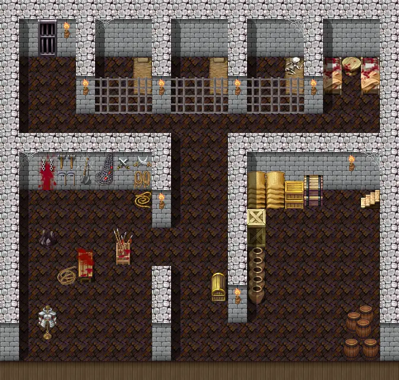

# Guynmart main 0

| | |
|---|---|
| **Map ID** | `guynmart_main_0` |
| **Region** | In Guynmart Castle (other) |
| **Type** | Indoors / underground |
| **Size** | 21×20 tiles |
| **Introduced** | [v0.7.2](../versions/0.7.2.md) |
| **NPCs** | 4 |
| **Enemy types** | 2 |
| **Quests** | 2 |
| **Containers** | 2 |

**Guynmart main 0** is an indoor map, in Guynmart Castle (other). It has 4 NPCs and 2 kinds of enemy. Exits lead to Guynmart main 1, Guynmart passage.

## Map

<label class="lg"><input type="checkbox" data-t="spawn" checked><b>Red</b>&nbsp;Monsters / NPCs</label><label class="lg"><input type="checkbox" data-t="mapchange" checked><b>Blue</b>&nbsp;Exit to another map</label><label class="lg"><input type="checkbox" data-t="container" checked><b>Yellow</b>&nbsp;Container (click to see contents)</label><label class="lg"><input type="checkbox" data-t="sign" checked><b>Purple</b>&nbsp;Sign</label><label class="lg"><input type="checkbox" data-t="rest" checked><b>Green</b>&nbsp;Resting place</label><label class="lg"><input type="checkbox" data-t="key" checked><b>Orange dashed</b>&nbsp;Blocked until a quest step / item</label><label class="lg"><input type="checkbox" data-t="script"><b>Grey dotted</b>&nbsp;Scripted event</label><label class="lg"><input type="checkbox" data-t="replace"><b>White dotted</b>&nbsp;Changes during a quest</label><label class="lg"><input type="checkbox" data-t="pin" checked><b>Numbers</b>&nbsp;Numbered key points (see the key below the map)</label>

<a class="pin pin-exit" href="#key-1" style="left:92.857%;top:52.500%" title="Exit (east): to [Guynmart main 1](guynmart_main_1.md)">1</a><a class="pin pin-exit" href="#key-2" style="left:11.905%;top:12.500%" title="Exit (stairs / passage): to [Guynmart passage](guynmart_passage.md)">2</a><a id="pin-npc-guynmart" class="pin pin-npc" href="#key-3" style="left:26.190%;top:27.500%" title="[Guynmart](../../monsters/guynmart.md): 2 quests">3</a><a id="pin-npc-guynmart_lovis2" class="pin pin-npc" href="#key-4" style="left:45.238%;top:17.500%" title="[Lovis](../../monsters/guynmart_lovis.md#v-guynmart_lovis2): 1 quest">4</a><a id="pin-npc-guynmart_cguard2" class="pin pin-npc" href="#key-5" style="left:50.000%;top:22.500%" title="[Norgothla](../../monsters/guynmart_cguard.md#v-guynmart_cguard2): NPC">5</a><a id="pin-npc-guynmart_steward4" class="pin pin-npc" href="#key-6" style="left:40.476%;top:32.500%" title="[Unkorh](../../monsters/guynmart_steward.md#v-guynmart_steward4): 2 quests">6</a><a class="pin pin-container" href="#key-7" style="left:92.857%;top:77.500%" title="Container 1: Wine, Red apple">7</a><a class="pin pin-container" href="#key-8" style="left:64.286%;top:57.500%" title="Container 2: Bonemeal potion">8</a><a class="pin pin-key" href="#key-9" style="left:83.333%;top:20.000%" title="Blocked passage: Unlocked during the quest: Roses (stage 666)">9</a><a class="pin pin-key" href="#key-9" style="left:92.857%;top:20.000%" title="Blocked passage: Unlocked during the quest: Roses (stage 666)">9</a>

??? abstract "Key to the numbers on the map"

    | # | What | Details |
    |---|---|---|
    | 1 | Exit (east) | to [Guynmart main 1](guynmart_main_1.md) |
    | 2 | Exit (stairs / passage) | to [Guynmart passage](guynmart_passage.md) |
    | 3 | [Guynmart](../monsters/guynmart.md) | 2 quests |
    | 4 | [Lovis](../monsters/guynmart_lovis.md#v-guynmart_lovis2) | 1 quest |
    | 5 | [Norgothla](../monsters/guynmart_cguard.md#v-guynmart_cguard2) | NPC |
    | 6 | [Unkorh](../monsters/guynmart_steward.md#v-guynmart_steward4) | 2 quests |
    | 7 | Container 1 | Wine, Red apple |
    | 8 | Container 2 | Bonemeal potion |
    | 9 | Blocked passage | Unlocked during the quest: Roses (stage 666) |

Verified against v0.8.18 map data.

## Connections

| Direction | Leads to | Region there | Map # |
|---|---|---|---|
| East | [Guynmart main 1](guynmart_main_1.md) | Guynmart Castle | 1 |
| Stairs / passage | [Guynmart passage](guynmart_passage.md) | Guynmart Castle | 2 |

## NPCs

- [Guynmart](../monsters/guynmart.md) — quests: [Roses](../quests/guynmart.md), [Search for Andor](../quests/andor.md) (#3)
- [Lovis](../monsters/guynmart_lovis.md#v-guynmart_lovis2) — quests: [Roses](../quests/guynmart.md) (#4)
- [Norgothla](../monsters/guynmart_cguard.md#v-guynmart_cguard2) (#5)
- [Unkorh](../monsters/guynmart_steward.md#v-guynmart_steward4) — quests: [Roses](../quests/guynmart.md), [Search for Andor](../quests/andor.md) (#6)

## Enemies

| Enemy | HP | Damage | Up to | Notes |
|---|---|---|---|---|
| [Lost soul](../monsters/lost_soul.md) | 15 | 1–2 | 4 | – |
| [Assistant torturer](../monsters/guynmart_tort2.md) | 120 | 5–20 | 2 | – |

<small>“Up to” is the most that can be alive at once from the spawn areas on this map.</small>

## Items & containers

<b>Container 1</b><ul><li><a href="../../items/guynmart_wine/">Wine</a> <small>80% · ×1 to 2</small></li><li><a href="../../items/apple_red/">Red apple</a> <small>100% · ×2 to 5</small></li></ul>

<b>Container 2</b><ul><li><a href="../../items/bonemeal_potion/">Bonemeal potion</a> <small>100% · ×1 to 3</small></li></ul>

## Quests

- [Roses](../quests/guynmart.md): [Guynmart](../monsters/guynmart.md) is involved; [Lovis](../monsters/guynmart_lovis.md#v-guynmart_lovis2) is involved; [Unkorh](../monsters/guynmart_steward.md#v-guynmart_steward4) is involved; a scripted event can trigger here from stage 161; blocked passage opens at stage 666
- [Search for Andor](../quests/andor.md): [Guynmart](../monsters/guynmart.md) is involved; [Unkorh](../monsters/guynmart_steward.md#v-guynmart_steward4) is involved
- [Guynmart story flags (hidden flag)](../quests/guynmart_nondisplay.md): [Lovis](../monsters/guynmart_lovis.md#v-guynmart_lovis2) is involved

## Points of interest

- **Blocked passage** (#9): Unlocked during the quest: Roses (stage 666)

## Version history

| Version | Change |
|---|---|
| [v0.7.2](../versions/0.7.2.md) | Added |

Verified against v0.8.18 and every earlier release back to v0.7.0 (game data compared release by release).

## Community notes

<small>Written by players, not generated from game data. **Observations**: what players notice in-game · **Lore**: the in-world story · **Trivia**: real-world facts, references, development history · **Theory / speculation**: unconfirmed ideas; may just be unfinished content</small>

### Observations

*No notes yet. Contributions are welcome: [add a note](https://github.com/asdfghjkl628/Andor-s-Trail-Wikiiii/new/main/notes/maps?filename=guynmart_main_0.md&value=%23%23%20Observations%0A%0A%3C%21--%20what%20players%20notice%20in-game%20--%3E%0A%0A%23%23%20Lore%0A%0A%3C%21--%20the%20in-world%20story%20--%3E%0A%0A%23%23%20Trivia%0A%0A%3C%21--%20real-world%20facts%2C%20references%2C%20development%20history%20--%3E%0A%0A%23%23%20Theory%20/%20speculation%0A%0A%3C%21--%20unconfirmed%20ideas%3B%20may%20just%20be%20unfinished%20content%20--%3E%0A).*

### Lore

*No notes yet. Contributions are welcome: [add a note](https://github.com/asdfghjkl628/Andor-s-Trail-Wikiiii/new/main/notes/maps?filename=guynmart_main_0.md&value=%23%23%20Observations%0A%0A%3C%21--%20what%20players%20notice%20in-game%20--%3E%0A%0A%23%23%20Lore%0A%0A%3C%21--%20the%20in-world%20story%20--%3E%0A%0A%23%23%20Trivia%0A%0A%3C%21--%20real-world%20facts%2C%20references%2C%20development%20history%20--%3E%0A%0A%23%23%20Theory%20/%20speculation%0A%0A%3C%21--%20unconfirmed%20ideas%3B%20may%20just%20be%20unfinished%20content%20--%3E%0A).*

### Trivia

*No notes yet. Contributions are welcome: [add a note](https://github.com/asdfghjkl628/Andor-s-Trail-Wikiiii/new/main/notes/maps?filename=guynmart_main_0.md&value=%23%23%20Observations%0A%0A%3C%21--%20what%20players%20notice%20in-game%20--%3E%0A%0A%23%23%20Lore%0A%0A%3C%21--%20the%20in-world%20story%20--%3E%0A%0A%23%23%20Trivia%0A%0A%3C%21--%20real-world%20facts%2C%20references%2C%20development%20history%20--%3E%0A%0A%23%23%20Theory%20/%20speculation%0A%0A%3C%21--%20unconfirmed%20ideas%3B%20may%20just%20be%20unfinished%20content%20--%3E%0A).*

### Theory / speculation

*No notes yet. Contributions are welcome: [add a note](https://github.com/asdfghjkl628/Andor-s-Trail-Wikiiii/new/main/notes/maps?filename=guynmart_main_0.md&value=%23%23%20Observations%0A%0A%3C%21--%20what%20players%20notice%20in-game%20--%3E%0A%0A%23%23%20Lore%0A%0A%3C%21--%20the%20in-world%20story%20--%3E%0A%0A%23%23%20Trivia%0A%0A%3C%21--%20real-world%20facts%2C%20references%2C%20development%20history%20--%3E%0A%0A%23%23%20Theory%20/%20speculation%0A%0A%3C%21--%20unconfirmed%20ideas%3B%20may%20just%20be%20unfinished%20content%20--%3E%0A).*

??? info "Technical information"

    | | |
    |---|---|
    | Map ID | `guynmart_main_0` |
    | File | `res/xml/guynmart_main_0.tmx` |
    | Size | 21×20 tiles (672×640 px) |
    | outdoors property | 0 |
    | Layers drawn | ground, objects, above |
    | Tilesets | map_bed_1, map_border_1, map_bridge_1, map_bridge_2, map_broken_1, map_cavewall_1, map_cavewall_2, map_cavewall_3, map_cavewall_4, map_chair_table_1, map_chair_table_2, map_crate_1, map_cupboard_1, map_curtain_1, map_entrance_1, map_entrance_2, map_fence_1, map_fence_2, map_fence_3, map_fence_4, map_ground_1, map_ground_2, map_ground_3, map_ground_4, map_ground_5, map_ground_6, map_ground_7, map_ground_8, map_guynmart, map_house_1, map_house_2, map_indoor_1, map_indoor_2, map_kitchen_1, map_outdoor_1, map_pillar_1, map_pillar_2, map_plant_1, map_plant_2, map_rock_1, map_rock_2, map_roof_1, map_roof_2, map_roof_3, map_shop_1, map_sign_ladder_1, map_table_1, map_trail_1, map_transition_1, map_transition_2, map_transition_3, map_transition_4, map_tree_1, map_tree_2, map_wall_1, map_wall_2, map_wall_3, map_wall_4, map_window_1, map_window_2 |
    | Map objects | spawn: 7, mapchange: 2, container: 2, key: 2, script: 1, replace: 1 |
    | World map position | – |

<small>Data from v0.8.18</small>
