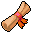

# Guynmart main 1

21×20 tiles

<label class="lg"><input type="checkbox" data-t="spawn" checked><b>Red</b>&nbsp;Monsters / NPCs</label><label class="lg"><input type="checkbox" data-t="mapchange" checked><b>Blue</b>&nbsp;Exit to another map</label><label class="lg"><input type="checkbox" data-t="container" checked><b>Yellow</b>&nbsp;Container (click to see contents)</label><label class="lg"><input type="checkbox" data-t="sign" checked><b>Purple</b>&nbsp;Sign</label><label class="lg"><input type="checkbox" data-t="rest" checked><b>Green</b>&nbsp;Resting place</label><label class="lg"><input type="checkbox" data-t="key" checked><b>Orange dashed</b>&nbsp;Blocked until a quest step / item</label><label class="lg"><input type="checkbox" data-t="script"><b>Grey dotted</b>&nbsp;Scripted event</label><label class="lg"><input type="checkbox" data-t="replace"><b>White dotted</b>&nbsp;Changes during a quest</label>

## Containers

<b>Container 1</b><ul><li><a href="../../items/gem5/">Polished sparkling gem</a> <small>100%</small></li></ul>

<b>Container 2</b><ul><li><a href="../../items/dagger0/">Iron dagger</a> <small>100%</small></li></ul>

## Exits

- [Guynmart](guynmart.md)
- [Guynmart main 0](guynmart_main_0.md)
- [Guynmart main 2](guynmart_main_2.md)

## Monsters & NPCs here

| Name | HP |
|---|---|
| [Wisdom](../monsters/guynmart_reward2.md) | 0 |
| [Guynmart guard](../monsters/guynmart_guard_store.md) | 0 |
| [Armor](../monsters/guynmart_reward3.md) | 0 |
| [Shepherd](../monsters/guynmart_shephard2.md) | 0 |
| [Lovis](../monsters/guynmart_lovis2.md) | 0 |
| [Guynmart guard](../monsters/guynmart_guard_arms.md) | 0 |
| [Gold](../monsters/guynmart_reward1.md) | 0 |
| [Unkorh](../monsters/guynmart_steward5.md) | 0 |
| [Hannah](../monsters/guynmart_hannah3.md) | 0 |
| [Guynmart guard](../monsters/guynmart_tguard2.md) | 0 |
| [Herald](../monsters/guynmart_herold.md) | 0 |
| [Unkorh](../monsters/guynmart_steward.md) | 0 |
| [Norgothla](../monsters/guynmart_cguard2.md) | 0 |
| [Guynmart guard](../monsters/guynmart_tguard.md) | 0 |
| [Hannah](../monsters/guynmart_hannah2.md) | 0 |
| [Guynmart guard](../monsters/guynmart_guard_storea2.md) | 120 |
| [Guynmart guard](../monsters/guynmart_guard_storea.md) | 120 |

<small>Map ID: `guynmart_main_1` · Data from v0.8.18</small>
