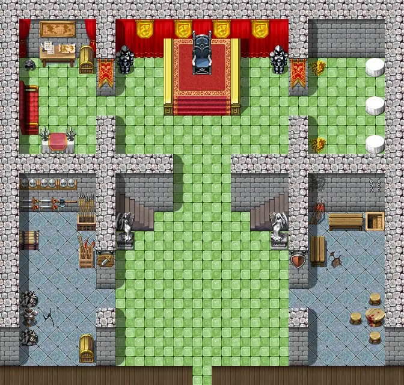

# Guynmart main 1

| | |
|---|---|
| **Map ID** | `guynmart_main_1` |
| **Region** | In Guynmart Castle (other) |
| **Type** | Indoors / underground |
| **Size** | 21×20 tiles |
| **Introduced** | [v0.7.2](../versions/0.7.2.md) |
| **NPCs** | 15 |
| **Enemy types** | 2 |
| **Quests** | 1 |
| **Containers** | 2 |

**Guynmart main 1** is an indoor map, in Guynmart Castle (other). It has 15 NPCs and 2 kinds of enemy. Exits lead to Guynmart main 0, Guynmart, Guynmart main 2.

## Map

<label class="lg"><input type="checkbox" data-t="spawn" checked><b>Red</b>&nbsp;Monsters / NPCs</label><label class="lg"><input type="checkbox" data-t="mapchange" checked><b>Blue</b>&nbsp;Exit to another map</label><label class="lg"><input type="checkbox" data-t="container" checked><b>Yellow</b>&nbsp;Container (click to see contents)</label><label class="lg"><input type="checkbox" data-t="sign" checked><b>Purple</b>&nbsp;Sign</label><label class="lg"><input type="checkbox" data-t="rest" checked><b>Green</b>&nbsp;Resting place</label><label class="lg"><input type="checkbox" data-t="key" checked><b>Orange dashed</b>&nbsp;Blocked until a quest step / item</label><label class="lg"><input type="checkbox" data-t="script"><b>Grey dotted</b>&nbsp;Scripted event</label><label class="lg"><input type="checkbox" data-t="replace"><b>White dotted</b>&nbsp;Changes during a quest</label><label class="lg"><input type="checkbox" data-t="pin" checked><b>Numbers</b>&nbsp;Numbered key points (see the key below the map)</label>

<a class="pin pin-exit" href="#key-1" style="left:92.857%;top:57.500%" title="Exit (east): to [Guynmart main 0](../guynmart_main_0.md)">1</a><a class="pin pin-exit" href="#key-2" style="left:50.000%;top:97.500%" title="Exit (south): to [Guynmart](../guynmart.md)">2</a><a class="pin pin-exit" href="#key-3" style="left:30.952%;top:52.500%" title="Exit (stairs / passage): to [Guynmart main 2](../guynmart_main_2.md)">3</a><a class="pin pin-exit" href="#key-3" style="left:69.048%;top:52.500%" title="Exit (stairs / passage): to [Guynmart main 2](../guynmart_main_2.md)">3</a><a class="pin pin-npc" href="#key-4" style="left:92.857%;top:37.500%" title="[Armor](../../monsters/guynmart_reward3.md): 1 quest">4</a><a class="pin pin-npc" href="#key-5" style="left:92.857%;top:17.500%" title="[Gold](../../monsters/guynmart_reward1.md): 1 quest">5</a><a class="pin pin-npc" href="#key-6" style="left:78.571%;top:22.500%" title="[Guynmart guard](../../monsters/guynmart_tguard2.md): NPC">6</a><a class="pin pin-npc" href="#key-7" style="left:21.429%;top:62.500%" title="[Guynmart guard](../../monsters/guynmart_guard_arms.md): NPC">7</a><a class="pin pin-npc" href="#key-8" style="left:78.571%;top:87.500%" title="[Guynmart guard](../../monsters/guynmart_guard_store.md): NPC">8</a><a class="pin pin-npc" href="#key-9" style="left:73.810%;top:27.500%" title="[Guynmart guard](../../monsters/guynmart_tguard.md): NPC">9</a><a class="pin pin-npc" href="#key-10" style="left:45.238%;top:22.500%" title="[Hannah](../../monsters/guynmart_hannah2.md): 1 quest">10</a><a class="pin pin-npc" href="#key-11" style="left:16.667%;top:32.500%" title="[Hannah](../../monsters/guynmart_hannah3.md): 1 quest">11</a><a class="pin pin-npc" href="#key-12" style="left:45.238%;top:52.500%" title="[Herald](../../monsters/guynmart_herold.md): NPC">12</a><a class="pin pin-npc" href="#key-13" style="left:54.762%;top:22.500%" title="[Lovis](../../monsters/guynmart_lovis2.md): 1 quest">13</a><a class="pin pin-npc" href="#key-14" style="left:92.857%;top:77.500%" title="[Norgothla](../../monsters/guynmart_cguard2.md): NPC">14</a><a class="pin pin-npc" href="#key-15" style="left:64.286%;top:22.500%" title="[Shepherd](../../monsters/guynmart_shephard2.md): NPC">15</a><a class="pin pin-npc" href="#key-16" style="left:50.000%;top:22.500%" title="[Unkorh](../../monsters/guynmart_steward5.md): 1 quest">16</a><a class="pin pin-npc" href="#key-17" style="left:40.476%;top:37.500%" title="[Unkorh](../../monsters/guynmart_steward.md): 1 quest">17</a><a class="pin pin-npc" href="#key-18" style="left:92.857%;top:27.500%" title="[Wisdom](../../monsters/guynmart_reward2.md): 1 quest">18</a><a class="pin pin-script" href="#key-19" style="left:50.000%;top:92.500%" title="Quest trigger: Scripted event: advances the quest: Roses to stage 180 (“When I got to the castle on the next day, I saw Hannah and Lovis in the throne room. The castle was decorated for a wedding and there had been a merry feast.”) (+1 more quest(s))">19</a><a class="pin pin-script" href="#key-20" style="left:50.000%;top:52.500%" title="Quest trigger: Scripted event: advances the quest: hidden story flag “guynmart_nondisplay” to stage 31 (“31=Hero in throne room”)">20</a><a class="pin pin-container" href="#key-21" style="left:7.143%;top:37.500%" title="Container 1: Polished sparkling gem">21</a><a class="pin pin-container" href="#key-22" style="left:21.742%;top:58.750%" title="Container 2: Iron dagger">22</a><a class="pin pin-script" href="#key-23" style="left:30.952%;top:27.500%" title="Quest trigger: Scripted event: advances the quest: hidden story flag “guynmart_nondisplay” to stage 61 (“61=Hannah rant 1”)">23</a><a class="pin pin-key" href="#key-24" style="left:93.171%;top:53.750%" title="Blocked passage: Unlocked during the quest: Roses (stage 164: “I got the main gate open.”)">24</a><a class="pin pin-key" href="#key-25" style="left:26.190%;top:27.500%" title="Blocked passage: Unlocked during the quest: hidden story flag “guynmart_nondisplay” (stage 34: “34=Alone in throne room”)">25</a>

??? abstract "Key to the numbers on the map"

    | # | What | Details |
    |---|---|---|
    | 1 | Exit (east) | to [Guynmart main 0](../guynmart_main_0.md) |
    | 2 | Exit (south) | to [Guynmart](../guynmart.md) |
    | 3 | Exit (stairs / passage) | to [Guynmart main 2](../guynmart_main_2.md) |
    | 4 | [Armor](../monsters/guynmart_reward3.md) | 1 quest |
    | 5 | [Gold](../monsters/guynmart_reward1.md) | 1 quest |
    | 6 | [Guynmart guard](../monsters/guynmart_tguard2.md) | NPC |
    | 7 | [Guynmart guard](../monsters/guynmart_guard_arms.md) | NPC |
    | 8 | [Guynmart guard](../monsters/guynmart_guard_store.md) | NPC |
    | 9 | [Guynmart guard](../monsters/guynmart_tguard.md) | NPC |
    | 10 | [Hannah](../monsters/guynmart_hannah2.md) | 1 quest |
    | 11 | [Hannah](../monsters/guynmart_hannah3.md) | 1 quest |
    | 12 | [Herald](../monsters/guynmart_herold.md) | NPC |
    | 13 | [Lovis](../monsters/guynmart_lovis2.md) | 1 quest |
    | 14 | [Norgothla](../monsters/guynmart_cguard2.md) | NPC |
    | 15 | [Shepherd](../monsters/guynmart_shephard2.md) | NPC |
    | 16 | [Unkorh](../monsters/guynmart_steward5.md) | 1 quest |
    | 17 | [Unkorh](../monsters/guynmart_steward.md) | 1 quest |
    | 18 | [Wisdom](../monsters/guynmart_reward2.md) | 1 quest |
    | 19 | Quest trigger | Scripted event: advances the quest: Roses to stage 180 (“When I got to the castle on the next day, I saw Hannah and Lovis in the throne room. The castle was decorated for a wedding and there had been a merry feast.”) (+1 more quest(s)) |
    | 20 | Quest trigger | Scripted event: advances the quest: hidden story flag “guynmart_nondisplay” to stage 31 (“31=Hero in throne room”) |
    | 21 | Container 1 | Polished sparkling gem |
    | 22 | Container 2 | Iron dagger |
    | 23 | Quest trigger | Scripted event: advances the quest: hidden story flag “guynmart_nondisplay” to stage 61 (“61=Hannah rant 1”) |
    | 24 | Blocked passage | Unlocked during the quest: Roses (stage 164: “I got the main gate open.”) |
    | 25 | Blocked passage | Unlocked during the quest: hidden story flag “guynmart_nondisplay” (stage 34: “34=Alone in throne room”) |

Verified against v0.8.18 map data.

## Connections

| Direction | Leads to | Region there | Map # |
|---|---|---|---|
| East | [Guynmart main 0](guynmart_main_0.md) | Guynmart Castle | 1 |
| South | [Guynmart](guynmart.md) | Guynmart Castle | 2 |
| Stairs / passage | [Guynmart main 2](guynmart_main_2.md) | Guynmart Castle | 3 |

## NPCs

- [Armor](../monsters/guynmart_reward3.md) — quests: [Roses](../quests/guynmart.md) (#4)
- [Gold](../monsters/guynmart_reward1.md) — quests: [Roses](../quests/guynmart.md) (#5)
- [Guynmart guard](../monsters/guynmart_tguard2.md) (#6)
- [Guynmart guard](../monsters/guynmart_guard_arms.md) (#7)
- [Guynmart guard](../monsters/guynmart_guard_store.md) (#8)
- [Guynmart guard](../monsters/guynmart_tguard.md) (#9)
- [Hannah](../monsters/guynmart_hannah2.md) — quests: [Roses](../quests/guynmart.md) (#10)
- [Hannah](../monsters/guynmart_hannah3.md) — quests: [Roses](../quests/guynmart.md) (#11)
- [Herald](../monsters/guynmart_herold.md) (#12)
- [Lovis](../monsters/guynmart_lovis2.md) — quests: [Roses](../quests/guynmart.md) (#13)
- [Norgothla](../monsters/guynmart_cguard2.md) (#14)
- [Shepherd](../monsters/guynmart_shephard2.md) (#15)
- [Unkorh](../monsters/guynmart_steward5.md) — quests: [Roses](../quests/guynmart.md) (#16)
- [Unkorh](../monsters/guynmart_steward.md) — quests: [Roses](../quests/guynmart.md) (#17)
- [Wisdom](../monsters/guynmart_reward2.md) — quests: [Roses](../quests/guynmart.md) (#18)

## Enemies

| Enemy | HP | Damage | Up to | Notes |
|---|---|---|---|---|
| [Guynmart guard](../monsters/guynmart_guard_storea2.md) | 120 | 5–20 | 2 | appears later, during a quest |
| [Guynmart guard](../monsters/guynmart_guard_storea.md) | 120 | 5–20 | 2 | appears later, during a quest |

<small>“Up to” is the most that can be alive at once from the spawn areas on this map.</small>

## Items & containers

<b>Container 1</b><ul><li><a href="../../items/gem5/">Polished sparkling gem</a> <small>100%</small></li></ul>

<b>Container 2</b><ul><li><a href="../../items/dagger0/">Iron dagger</a> <small>100%</small></li></ul>

## Quests

- [Roses](../quests/guynmart.md): [Armor](../monsters/guynmart_reward3.md) is involved; [Gold](../monsters/guynmart_reward1.md) is involved; [Hannah](../monsters/guynmart_hannah2.md) is involved; [Hannah](../monsters/guynmart_hannah3.md) is involved; [Lovis](../monsters/guynmart_lovis2.md) is involved; [Unkorh](../monsters/guynmart_steward.md) is involved; [Unkorh](../monsters/guynmart_steward5.md) is involved; [Wisdom](../monsters/guynmart_reward2.md) is involved; blocked passage opens at stage 164; something on this map advances it; stepping on a trigger here sets stage 180; stepping on a trigger here sets stage 181
- [Guest tour (hidden flag)](../quests/guynmart_quest_olav.md): [Hannah](../monsters/guynmart_hannah3.md) is involved
- [guynmart nondisplay (hidden flag)](../quests/guynmart_nondisplay.md): [Armor](../monsters/guynmart_reward3.md) is involved; [Gold](../monsters/guynmart_reward1.md) is involved; [Hannah](../monsters/guynmart_hannah2.md) is involved; [Hannah](../monsters/guynmart_hannah3.md) is involved; [Lovis](../monsters/guynmart_lovis2.md) is involved; [Unkorh](../monsters/guynmart_steward5.md) is involved; [Wisdom](../monsters/guynmart_reward2.md) is involved; blocked passage opens at stage 34; something on this map advances it; stepping on a trigger here sets stage 30; stepping on a trigger here sets stage 31; stepping on a trigger here sets stage 60; stepping on a trigger here sets stage 61; stepping on a trigger here sets stage 62; stepping on a trigger here sets stage 63
- [shutters open (hidden flag)](../quests/guynmart_qRpl_shutters.md): [Hannah](../monsters/guynmart_hannah3.md) is involved

## Points of interest

- **Quest trigger** (#19): Scripted event: advances the quest: Roses to stage 180 (“When I got to the castle on the next day, I saw Hannah and Lovis in the throne room. The castle was decorated for a wedding and there had been a merry feast.”) (+1 more quest(s))
- **Quest trigger** (#20): Scripted event: advances the quest: hidden story flag “guynmart_nondisplay” to stage 31 (“31=Hero in throne room”)
- **Quest trigger** (#23): Scripted event: advances the quest: hidden story flag “guynmart_nondisplay” to stage 61 (“61=Hannah rant 1”)
- **Blocked passage** (#24): Unlocked during the quest: Roses (stage 164: “I got the main gate open.”)
- **Blocked passage** (#25): Unlocked during the quest: hidden story flag “guynmart_nondisplay” (stage 34: “34=Alone in throne room”)

## Version history

| Version | Change |
|---|---|
| [v0.7.2](../versions/0.7.2.md) | Added |
| [v0.8.6](../versions/0.8.6.md) | map layout or objects changed |

Verified against v0.8.18 and every earlier release back to v0.7.0 (game data compared release by release).

## Community notes

<small>Written by players, not generated from game data. **Observations**: what players notice in-game · **Lore**: the in-world story · **Trivia**: real-world facts, references, development history · **Theory / speculation**: unconfirmed ideas; may just be unfinished content</small>

### Observations

*Nothing here yet. Know something? [Add it](https://github.com/asdfghjkl628/Andor-s-Trail-Wikiiii/new/main/notes/maps?filename=guynmart_main_1.md&value=%23%23%20Observations%0A%0A%3C%21--%20what%20players%20notice%20in-game%20--%3E%0A%0A%23%23%20Lore%0A%0A%3C%21--%20the%20in-world%20story%20--%3E%0A%0A%23%23%20Trivia%0A%0A%3C%21--%20real-world%20facts%2C%20references%2C%20development%20history%20--%3E%0A%0A%23%23%20Theory%20/%20speculation%0A%0A%3C%21--%20unconfirmed%20ideas%3B%20may%20just%20be%20unfinished%20content%20--%3E%0A).*

### Lore

*Nothing here yet. Know something? [Add it](https://github.com/asdfghjkl628/Andor-s-Trail-Wikiiii/new/main/notes/maps?filename=guynmart_main_1.md&value=%23%23%20Observations%0A%0A%3C%21--%20what%20players%20notice%20in-game%20--%3E%0A%0A%23%23%20Lore%0A%0A%3C%21--%20the%20in-world%20story%20--%3E%0A%0A%23%23%20Trivia%0A%0A%3C%21--%20real-world%20facts%2C%20references%2C%20development%20history%20--%3E%0A%0A%23%23%20Theory%20/%20speculation%0A%0A%3C%21--%20unconfirmed%20ideas%3B%20may%20just%20be%20unfinished%20content%20--%3E%0A).*

### Trivia

*Nothing here yet. Know something? [Add it](https://github.com/asdfghjkl628/Andor-s-Trail-Wikiiii/new/main/notes/maps?filename=guynmart_main_1.md&value=%23%23%20Observations%0A%0A%3C%21--%20what%20players%20notice%20in-game%20--%3E%0A%0A%23%23%20Lore%0A%0A%3C%21--%20the%20in-world%20story%20--%3E%0A%0A%23%23%20Trivia%0A%0A%3C%21--%20real-world%20facts%2C%20references%2C%20development%20history%20--%3E%0A%0A%23%23%20Theory%20/%20speculation%0A%0A%3C%21--%20unconfirmed%20ideas%3B%20may%20just%20be%20unfinished%20content%20--%3E%0A).*

### Theory / speculation

*Nothing here yet. Know something? [Add it](https://github.com/asdfghjkl628/Andor-s-Trail-Wikiiii/new/main/notes/maps?filename=guynmart_main_1.md&value=%23%23%20Observations%0A%0A%3C%21--%20what%20players%20notice%20in-game%20--%3E%0A%0A%23%23%20Lore%0A%0A%3C%21--%20the%20in-world%20story%20--%3E%0A%0A%23%23%20Trivia%0A%0A%3C%21--%20real-world%20facts%2C%20references%2C%20development%20history%20--%3E%0A%0A%23%23%20Theory%20/%20speculation%0A%0A%3C%21--%20unconfirmed%20ideas%3B%20may%20just%20be%20unfinished%20content%20--%3E%0A).*

??? info "Technical information"

    | | |
    |---|---|
    | Map ID | `guynmart_main_1` |
    | File | `res/xml/guynmart_main_1.tmx` |
    | Size | 21×20 tiles (672×640 px) |
    | outdoors property | – |
    | Layers drawn | base, ground, objects, above |
    | Tilesets | map_bed_1, map_border_1, map_bridge_1, map_bridge_2, map_broken_1, map_cavewall_1, map_cavewall_2, map_cavewall_3, map_cavewall_4, map_chair_table_1, map_chair_table_2, map_crate_1, map_cupboard_1, map_curtain_1, map_entrance_1, map_entrance_2, map_fence_1, map_fence_2, map_fence_3, map_fence_4, map_ground_1, map_ground_2, map_ground_3, map_ground_4, map_ground_5, map_ground_6, map_ground_7, map_ground_8, map_guynmart, map_house_1, map_house_2, map_indoor_1, map_indoor_2, map_kitchen_1, map_outdoor_1, map_pillar_1, map_pillar_2, map_plant_1, map_plant_2, map_rock_1, map_rock_2, map_roof_1, map_roof_2, map_roof_3, map_shop_1, map_sign_ladder_1, map_table_1, map_trail_1, map_transition_1, map_transition_2, map_transition_3, map_transition_4, map_tree_1, map_tree_2, map_wall_1, map_wall_2, map_wall_3, map_wall_4, map_window_1, map_window_2 |
    | Map objects | spawn: 17, mapchange: 4, script: 4, replace: 3, container: 2, key: 2 |
    | World map position | – |

<small>Data from v0.8.18</small>
