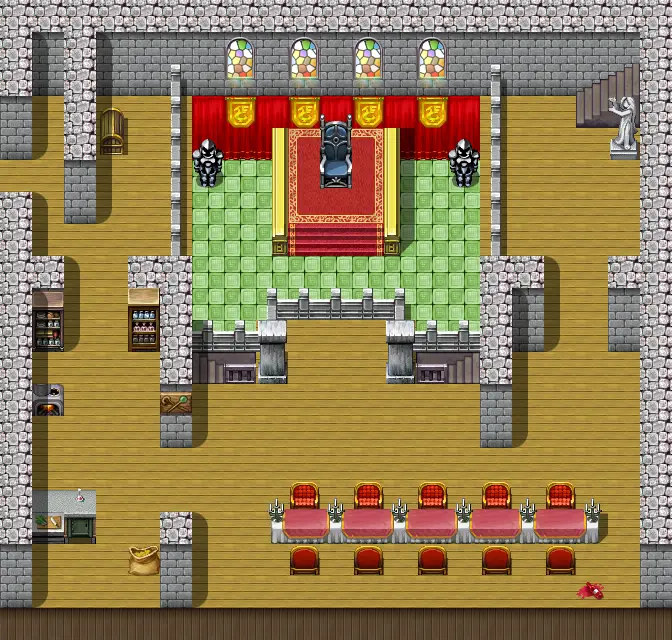

# Guynmart main 2

21×20 tiles

<label class="lg"><input type="checkbox" data-t="spawn" checked><b>Red</b>&nbsp;Monsters / NPCs</label><label class="lg"><input type="checkbox" data-t="mapchange" checked><b>Blue</b>&nbsp;Exit to another map</label><label class="lg"><input type="checkbox" data-t="container" checked><b>Yellow</b>&nbsp;Container (click to see contents)</label><label class="lg"><input type="checkbox" data-t="sign" checked><b>Purple</b>&nbsp;Sign</label><label class="lg"><input type="checkbox" data-t="rest" checked><b>Green</b>&nbsp;Resting place</label><label class="lg"><input type="checkbox" data-t="key" checked><b>Orange dashed</b>&nbsp;Blocked until a quest step / item</label><label class="lg"><input type="checkbox" data-t="script"><b>Grey dotted</b>&nbsp;Scripted event</label><label class="lg"><input type="checkbox" data-t="replace"><b>White dotted</b>&nbsp;Changes during a quest</label>

## Containers

<b>Container 1</b><ul><li><a href="../../items/apple_green/">Green apple</a> <small>100%</small></li><li><a href="../../items/apple_red/">Red apple</a> <small>33%</small></li><li><a href="../../items/strawberry/">Strawberry</a> <small>33% · ×2 to 5</small></li><li><a href="../../items/eggs/">Eggs</a> <small>20% · ×1 to 2</small></li></ul>

## Exits

- [Guynmart](guynmart.md)
- [Guynmart main 1](guynmart_main_1.md)
- [Guynmart main 3](guynmart_main_3.md)

## Monsters & NPCs here

| Name | HP |
|---|---|
| [Lovis](../monsters/guynmart_lovis2.md) | 0 |
| [Guynmart guard](../monsters/guynmart_mguard.md) | 0 |
| [Unkorh](../monsters/guynmart_steward2.md) | 0 |
| [Fjoerkard](../monsters/guynmart_drunkard5.md) | 0 |
| [Fjoerkard](../monsters/guynmart_drunkard1.md) | 0 |
| [Hannah](../monsters/guynmart_hannah2.md) | 0 |
| [Hofala](../monsters/guynmart_cook.md) | 0 |
| [Guynmart guard](../monsters/guynmart_wguard9a.md) | 120 |

<small>Map ID: `guynmart_main_2` · Data from v0.8.18</small>
